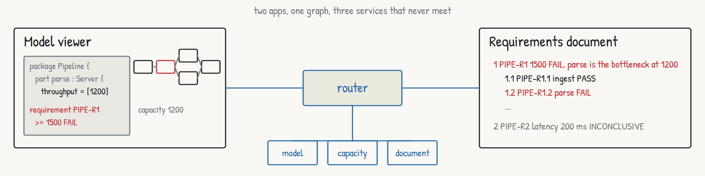

# The missing integration layer for open MBSE?

*Roar Georgsen, 27 August 2026*

The goal of this project is to make SysML v2 models easier to integrate with the domain models of the organisation's other tools. The proposal is to adopt federation. The model's owners publish a small projection of it (SysML Views and Viewpoints), and other services attach their own data to its objects by agreeing on an identifier.

So far this is a proof of concept, a SysML v2 adapter behind a Cosmo router with one worked example. Next is a larger example and an adapter driven by SysML v2's own views and viewpoints.



*Two apps, one graph, three services that never meet.*

One container image holds all of it, and the two pages below are what it serves on port 8080. Neither of them works anything out for itself. The wiring, the arithmetic and the document ordering come from three services that share no code, joined only by the router in front of them.


*The model viewer. The sketch is drawn from the model's own connect statements, parse holds the pipeline to 1200, and PIPE-R1 fails against its limit of 1500.*


*The requirements document. Its numbering, headings and prose belong to a service that computes nothing, and the verdict on each row comes from one that has never read a model file.*

1. [Why federate a systems model](articles/00-why-federate-a-systems-model.md)  
   The integration problem MBSE never solved, what SysML v2 changes, and the claim this repository makes.
2. [The architecture in one sitting](articles/01-the-architecture-in-one-sitting.md)  
   Three services, one router, two apps and one container, with the twelve decisions that shaped them.
3. [How the design was run](articles/02-how-the-design-was-run.md)  
   Four gates before any code, every document read back against its sources before approval, and the repository rules that held throughout.
4. [What the research overturned](articles/03-what-the-research-overturned.md)  
   Six topics investigated, every load-bearing claim checked against its primary sources, and four of them refuted.
5. [Twelve use cases and one moving bottleneck](articles/04-twelve-use-cases-and-one-moving-bottleneck.md)  
   The brief, the personas, the example model and the storyboard, and what the first review changed.
6. [From use cases to requirements](articles/05-from-use-cases-to-requirements.md)  
   Constraints, 45 requirements, traceability and the capacity model, with the three findings that reached back into the design.
7. [Five views and twenty-six decisions](articles/06-five-views-and-twenty-six-decisions.md)  
   The architecture description, its viewpoints, the decision records and the review that changed mechanisms without changing decisions.
8. [An A3 sheet for a fifteen-minute reader](articles/07-an-a3-sheet-for-a-fifteen-minute-reader.md)  
   Why the overview is a printed sheet, the method it follows, and the two sheets drafted.
9. [Planning the build](articles/08-planning-the-build.md)  
   Five phases, one pull request each, test first, and the decisions the plan had to make on its own.
10. [Five spikes before the first line](articles/09-five-spikes-before-the-first-line.md)  
    The syntax the reference tools accept, nested requires through the router, a router with no config file whose readiness lies, and cross-platform copying.
11. [The demo as it shipped](articles/10-the-demo-being-built.md)  
    What it does once it runs, package by package and service by service, and what a visitor sees in fifteen minutes.
12. [What shipped, and what did not](articles/11-what-shipped-and-what-did-not.md)  
    What the image weighs, the version tag that returns nothing, the checks nobody has run, and the one claim the running container does settle.

## Documents

- [Architecture views](architecture/architecture-views.pdf), the five views and the overview board as one PDF, one page per board.
- [L0, Federating a systems model](a3/L0-federating-a-systems-model.pdf), an A3 sheet for the reader asking "What does this demo claim, what is in the box, and what would I keep or replace if I adopted it?"
- [L2b, Pipeline example: capacity and verdicts](a3/L2b-pipeline-example-capacity-and-verdicts.pdf), an A3 sheet for the reader asking "Why does raising one server change nothing and raising another change everything?"
- [Use cases](stories/use-cases.pdf), the storyboard as one PDF, one page per use case after the overview.
- [Decision records](decisions/README.md), the 28 decisions with their alternatives and consequences.

## The repository

The code is at https://github.com/Roarge/sysml-federation, under the Apache 2.0 licence. The same articles are rendered as a site at https://sysml-federation.org/.

The demo starts with one command:

```
docker run --rm -p 8080:8080 ghcr.io/roarge/sysml-federation
```

The package is public, so a host holding no registry account pulls it, and the index behind that name carries a `linux/amd64` manifest and a `linux/arm64` one. Leave the name untagged as it stands above. The release is tagged `v0.1.0` in git and the image is tagged `0.1.0` in the registry, so a pull of `:v0.1.0` finds nothing.
