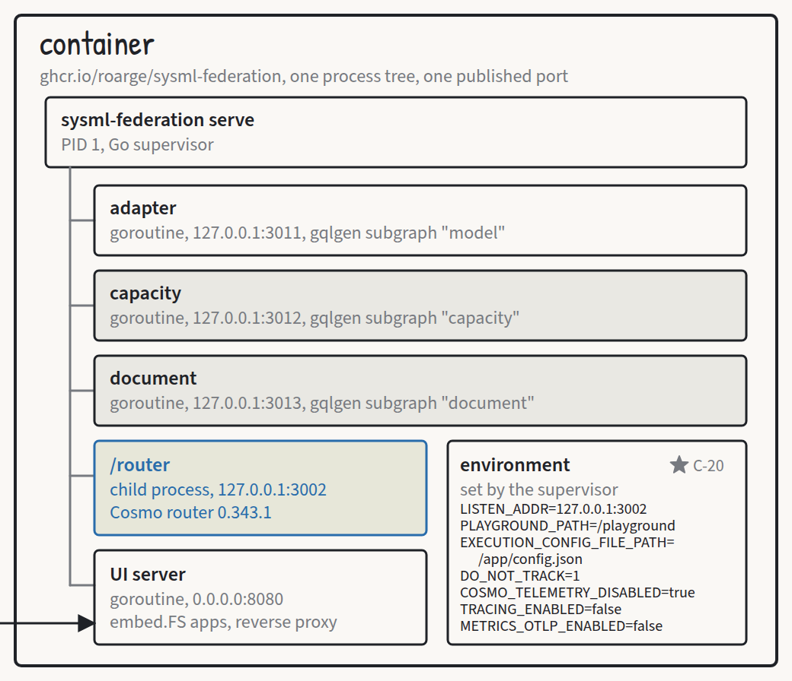
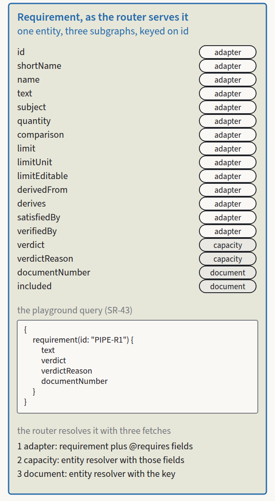
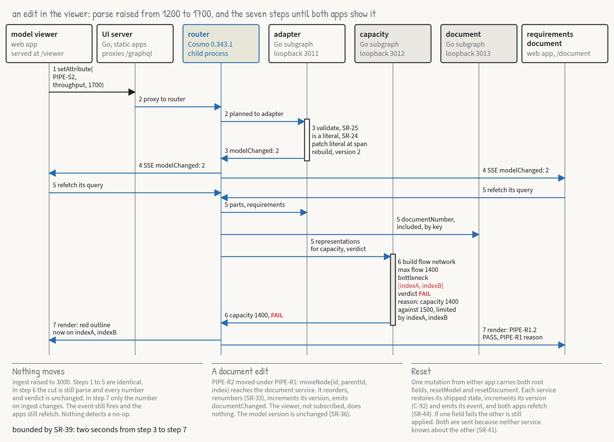
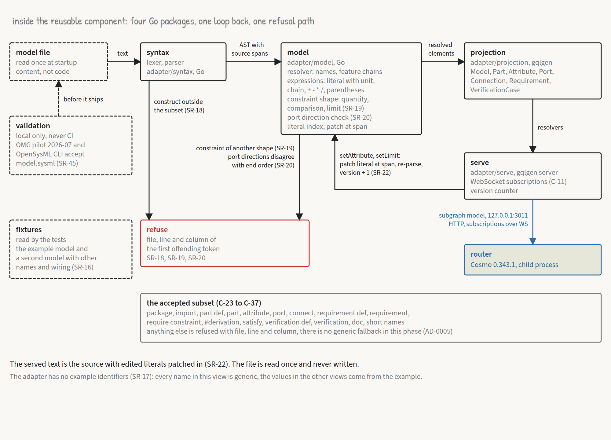

# The architecture in one sitting

*Roar Georgsen, 27 August 2026*

Part 2 of 12 in [Federating a systems model](../README.md).

The demo publishes a SysML v2 model of a five-server query pipeline through a federated GraphQL router, so that a capacity analysis and a requirements document, neither of which has ever read a line of SysML, can attach their own data to the model's parts and requirements. All of it runs in one container.


*The L0 sheet: the argument in eight steps, what is agreed, and what is in the box. Cut from the [L0 A3 sheet](../a3/L0-federating-a-systems-model.pdf).*

## What is in the box

One command starts it, and the first tagged release published the image it names. The image carries a manifest for amd64 and one for arm64, the package is public, and a host holding no registry credential pulls it. The untagged form below resolves to `latest`.

```
docker run --rm -p 8080:8080 ghcr.io/roarge/sysml-federation
```

Inside, one Go binary runs as PID 1 and supervises everything else. Three subgraphs, each a GraphQL service that owns one slice of a merged schema, run as goroutines of that binary on loopback ports 3011, 3012 and 3013. The Cosmo router, the process that merges the three schemas into one and plans every incoming query across them, runs as a child process on loopback port 3002 from a binary copied out of the vendor's image. A UI server on port 8080 is the only listener the outside can reach. It serves the two web apps at `/viewer` and `/document` from embedded assets, the client module both apps import and the drag library vendored beside it at `/shared`, proxies `/graphql` and `/playground` to the router, and redirects `/` to the viewer. Five paths on one port, and the router is never addressable on its own.



*One container, one process tree. Cut from the [architecture views](../architecture/architecture-views.pdf).*

The supervisor fixes the order of startup. The subgraphs come up first and are polled on their own health endpoints, the router is then started with its configuration path and telemetry variables in its environment, the supervisor waits on the router's `/health/ready`, and only after that does it open port 8080. A `healthcheck` subcommand probes the router's readiness path and `/viewer` on behalf of the image's HEALTHCHECK, because the distroless base has no shell and no curl for it to call. Four further subcommands, `adapter`, `capacity`, `document` and `ui`, run one component each on a given address for anyone who wants to see the services apart. The router is about 40 MB compressed, the demo binary a few MB and the base image 2 MB, against a budget of 80 MB.

## Three services and what each owns

The adapter owns the model. It publishes parts with their attributes, ports, connections and the requirements they satisfy, the requirements themselves with their text, subject, constrained quantity, comparison, limit and derivation links, verification cases, and the model's own text and version number. It is generic. Nothing in its schema or its code names the example, and a second fixture model with other names and wiring is part of its tests. Its schema carries three mutations, which are the whole of the model's edit path.

```graphql
setAttribute(partId: ID!, name: String!, value: Float!): Part!
setLimit(requirementId: ID!, value: Float!): Requirement!
resetModel: Model!
```

The capacity service owns four fields and nothing else: `capacity` and `bottleneck` on a part, `verdict` and `verdictReason` on a requirement. It computes all four on every read from fields the router carries in through its `@requires` declaration, which is a federation directive that says "before you ask me for this field, fetch these other fields from whoever owns them and hand them to me". The service holds no copy of the model. It is configured with two names, `capacity` for the quantity it computes and `throughput` for the attribute it reads from each child part, and it never sees the words "server" or "pipeline". The verdict, the service's answer for a requirement, is one of PASS, FAIL, INCONCLUSIVE and ERROR, the four words of the SysML v2 Systems Library, so a reader of the model meets the same four in the analysis.

The document service owns an ordered tree and its numbering. It ships one structure: `PIPE-R1`, the model requirement that the pipeline shall sustain the required query rate, with its five derived requirements nested beneath it in server order and numbered 1.1 to 1.5, then `PIPE-R2`, the latency requirement, as 2, and above them an unnumbered prose paragraph explaining why an allocated limit on a server can fail while the pipeline as a whole passes. The tree names those seven requirement ids in a configuration file, which is the one place the example's identifiers legitimately enter a service. The document service never reads the model. For an id it has never heard of, its entity resolver answers that the requirement is not included and has no number.

The three share one thing, the entity key, which is the field by which two subgraphs agree they are describing the same object. Here it is `id` on `Part`, `Requirement` and `VerificationCase`, and its value is the SysML short name. The adoption contract is one sentence: the agreement between services is the entity key (a SysML short name), the `@requires` field set the capacity service declares, and its two configured names. An organisation adopting the approach keeps the adapter, the compose step and the supervisor, and replaces the model file, the two example services, the two apps and the shipped document tree. If two services define the same field, or a `@requires` names a field the adapter no longer projects, composition fails in the pipeline of whoever pushed the change.

## One query, three fetches

Composition merges the three schemas into one in which a requirement carries its text and limit from the adapter, its verdict and reason from the capacity service, and its document number and inclusion from the document service. The query a visitor runs in the playground asks for fields from all three, two of them from the capacity service.

```graphql
{
  requirement(id: "PIPE-R1") {
    text
    verdict
    verdictReason
    documentNumber
  }
}
```



*Requirement as the router serves it, each field chipped with the service that resolves it.*

The router plans it as three fetches. The first goes to the adapter for the requirement and for every field the capacity service's `@requires` names, which for a verdict means the subject part, its children with their names and attributes, and the connections between them. The second goes to the capacity service's entity resolver with those fields packed as the representation. The third goes to the document service's entity resolver with nothing but the key. The shipped answer is the text "The pipeline shall sustain the required query rate", the verdict FAIL, the reason "capacity 1200 against 1500, limited by parse", and the document number "1". Asking the same endpoint for the pipeline part's capacity and bottleneck gives 1200 and `parse`.

The reason string is worth a second look. The words "capacity" and "parse" both come from the model, and neither is written into the template. One arrives as the service's configured quantity name, the other as a part name the router carried in.

## One edit, seven steps

The bottleneck moving is the demo's one memorable moment.



*One edit, seven steps.*

The visitor raises `parse` from 1200 to 1700 in the viewer, and the app sends `setAttribute` for part `PIPE-S2`, attribute `throughput`, value 1700 to `/graphql`. The UI server proxies it to the router, which plans it to the adapter. The adapter checks that the value is a finite non-negative number and that the attribute is a literal in the source, replaces the literal at its recorded span in the in-memory text, rebuilds the projection, which is the plainly typed GraphQL view of the model it serves, increments the version and emits `modelChanged: 2` on its subscription. The router holds the one upstream subscription and fans the event out to every subscribed browser over server-sent events, through the UI server's reverse proxy, which flushes on `text/event-stream`. Both apps refetch their own query, and the router plans the document's across all three services with representations built from the adapter's answer. The capacity service builds the flow network from each representation, runs the flow, finds the cut, which is the cheapest set of servers that limits it, and answers capacity 1400, bottleneck `indexA` and `indexB`, verdict FAIL, reason "capacity 1400 against 1500, limited by indexA, indexB". Both apps render. The viewer moves its red outline from `parse` to the index pair, and the document flips `PIPE-R1.2` to PASS and rewrites the reason under `PIPE-R1`. From the edit to the last render is bounded by two seconds.

Neither app renders from the mutation's response. The mutation is sent, and the event that follows triggers the same refetch as any other event, so there is one rendering path. Neither app computes anything. The viewer's red block, its capacity figure and its highlighted bottleneck, and the document's reason text, all arrive through the router.

Raise `ingest` to 3000 instead and the same seven steps run. The cut is still `parse`, every number and verdict is unchanged, and the only visible change is the figure on `ingest`. The event still fires and both apps still refetch. The demo detects "nothing changed" nowhere, and does not try to.

Reset from either app sends one mutation document carrying both root fields, `resetModel` and `resetDocument`. The router plans the two fields to the two services, each restores its shipped state, bumps its own counter and emits its own event. The apps ask for both because neither service knows the other exists.

## Inside the adapter



*Inside the adapter.*

The adapter is a pipeline of four packages, `syntax` to `model` to `projection` to `serve`, with a patch path from a mutation back to the syntax tree. Every node carries its byte range in the source, which is what lets an edit replace one literal in place and rebuild the served text and the projection together. [Five views and twenty-six decisions](06-five-views-and-twenty-six-decisions.md) takes the four packages apart.

What is worth having here is the refusal path, which runs in both directions. At start, a construct outside the subset stops the load with a file, line and column rather than being served generically, a numeric literal the parser cannot read as a number included. At runtime, a mutation against a value bound by an expression is refused with an error saying the value is not a literal in the source, and a negative or non-finite number is refused with an error saying the value must be a finite, non-negative number. Neither refusal emits an event. A derived limit cannot be set through the playground, and nonsense typed into a field leaves the previous value in place.

## The decisions that shaped it

Twenty-six decision records stand behind the design. The dozen linked below explain most of the picture above.

Choosing [federation over a single service](../decisions/AD-0001-federation-over-single-service.md) put three independently owned subgraphs behind one router rather than one GraphQL service with everything behind it, and the rest of the argument rests on it. A single service is the central integration component every team has to change together, which is what federation exists to avoid. The service bus tradition lost on the audience, since a canonical data model needs an owner and organisations with fewer than 25 engineers do not employ one. The merged schema is computed rather than authored, so nobody owns it, and the only thing anyone has to agree on is keys.

[Cosmo](../decisions/AD-0002-cosmo-as-platform.md) is the platform, pinned to router 0.343.1 and wgc 0.130.1 and bumped together. Everything checked is Apache-2.0, and the router runs from a static configuration with no control plane and no graph token. The main alternative was rejected on licence alone, one the OSI does not recognise as open source. The vendor's own caveat travels with the choice: the compose page says "it is recommended to not use this for production", and the router logs "Not recommended for Production" at every start without a token. The demo has no control plane to fetch from, so the static path is the only one, and what it does about the caveat is to commit the configuration and test it for drift.

[One binary, one process tree, one port](../decisions/AD-0011-one-binary-one-port.md) lost Docker Compose, which the vendor's own demos use and which shows every subgraph as a visibly separate service. "One command" would then be `docker compose up` after obtaining a file, and the routing URLs would need a second configuration. Two published ports, the router beside the apps, lost on the launch line and on the cross-origin rules a single origin avoids. s6-overlay and supervisord need a userland the distroless base does not have. The cost is that a crash anywhere takes the whole demo down, and that nothing on port 8080 shows where the router's responsibility ends and the UI server's begins.

The router runs as a [child process from the copied binary](../decisions/AD-0010-router-as-child-process.md) rather than as a Go library. Embedding is possible in principle, and it lost on footing: the module has only commit pseudo-versions, needs a block of `replace` directives, broke its API at 0.188.0 and 0.278.0, has a rewrite announced, and offers no stability promise, while pulling message broker clients into a dependency graph that never uses them. The router's own extension mechanism would have let it supervise the subgraphs itself, and that route does not support subscriptions.

For the rollup the choice is [maximum flow with the source-side minimum cut](../decisions/AD-0007-rollup-as-maximum-flow.md). Each server becomes an in-node and an out-node joined by an edge of its throughput, each connection an unlimited edge, and the capacity is the maximum flow from the servers nobody feeds to the servers that feed nobody. The bottleneck is a minimum cut, the cheapest set of servers whose removal would sever every path from entry to exit, and because several minimum cuts can exist the reported one is defined as the source-side canonical cut, which is the same for every maximum flow. Rollup in the adapter would have turned a projection into an expression evaluator. Rollup in the apps would have meant two copies of the logic and no sharing story. The simpler arithmetic, minimum over serial stages and sum over parallel ones, survives as the explanation a reader can check by hand and as the differential test that checks the flow against it.

The projection is a [curated set of plainly typed GraphQL types](../decisions/AD-0005-curated-generic-projection.md), chosen by what the services downstream need, rather than a few hundred types generated from KerML. Generated types would be correct and complete, and would hand every consumer the abstract syntax the projection exists to spare them. A generic type for elements nobody has projected yet would be the escape hatch, and it is not built. A construct outside the subset is refused instead, which is the smaller first cut, and the record's status says the question is open.

Polling was the obvious alternative, and it lost because latency then equals the poll interval. Subscriptions carry a [version number and nothing else](../decisions/AD-0014-version-events.md), and each app refetches its whole query when one arrives. A payload carrying verdicts would need the router to resolve another subgraph's entity fields inside a subscription response, which nobody had verified, and a version event sidesteps the question because the refetch is an ordinary query. A broker with Cosmo Streams would have added a process. The honest side is that a refetch costs a full query per event per open tab, which suits a demo and not a fleet of tabs.

Composition is a [maintainer step whose output is committed](../decisions/AD-0012-composition-committed.md), copied into the image, and guarded by a Go test that parses the configuration and compares each embedded schema with the schema file it came from. Composing at container start died when the Go composition library was removed from Cosmo, and a Node stage in the Dockerfile would put a tool that declares no Node range into every build. CI stays Go only, and a schema change without a recompose fails on the pull request. The drift test is the whole evidence for the third condition a projection has to meet, that the contract between producer and consumer is checked mechanically before deployment rather than discovered in production.

Where two subgraphs have to agree they are describing the same requirement, the key is a [SysML short name](../decisions/AD-0018-short-names-as-keys.md), with the qualified name as fallback where an element declares none. The API-level `elementId` is a UUID the tool assigns, no tool stands behind the adapter, and a key nobody writes down cannot be quoted in the document service's configuration or typed into the playground. Renaming a short name breaks every service that stores it, and the demo does not handle renames.

The adapter [reads files](../decisions/AD-0003-adapter-reads-files.md) rather than fronting a SysML v2 repository over the standard API, which a real deployment would do. Standing one up means a JVM, a database and a second runtime inside an image whose whole promise is one command. A counter stands in for commits, and every edit is lost when the container stops. [Editing through the projection](../decisions/AD-0004-editing-as-scaffolding.md) contradicts the project's own position that a projection should be read-only, and the record says so: it is scaffolding, needed because nothing would move without it, and a real deployment writes through the API instead. Rewriting the file on disk lost because persistence is a non-goal and the launch line uses `--rm` in any case.

The parser is [hand-written in Go as a strict subset](../decisions/AD-0015-hand-written-subset-parser.md). Three Go parsers for the notation exist and none of them can be used here: one keeps its code under `internal/`, one was too new to depend on and carries a grammar descended from a much older release, one is GPL-3.0. A tree-sitter binding needs cgo, which would end the `CGO_ENABLED=0` cross-compilation the image depends on. The OMG JSON serialisation lost because it needs Java 17 at build time and hands back the flat metamodel the adapter exists to hide. The record carries its own replacement condition: when OpenSysML exposes a public package or freezes its gRPC contract, the hand-written parser is the part of the adapter to retire first.

One thing in this design had not been exercised when the architecture was written. Whether Cosmo composition and gqlgen accept `@requires` over nested lists of objects, which the capacity service's schema depends on, was left to the first spike of the build, with a flat JSON scalar on the part as the fallback. [Five spikes before the first line](09-five-spikes-before-the-first-line.md) is where that story is told.

## Where to go next

The capacity model in full, with its assumptions, edge cases and the requirements it drove, is [From use cases to requirements](05-from-use-cases-to-requirements.md). The five architecture views and all twenty-six decisions, including the fourteen not touched here, are [Five views and twenty-six decisions](06-five-views-and-twenty-six-decisions.md). What the build produced, against the design described here, is [The demo as it shipped](10-the-demo-being-built.md).

---

Previous: [Why federate a systems model](00-why-federate-a-systems-model.md) · Index: [Federating a systems model](../README.md) · Next: [How the design was run](02-how-the-design-was-run.md)
