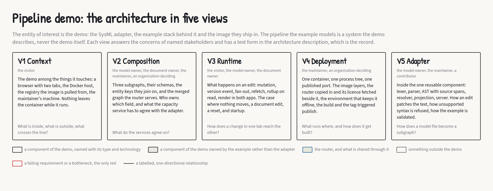

# How the design was run

*Roar Georgsen, 27 August 2026*

Part 3 of 11 in [Federating a systems model](../README.md).

The demo publishes a SysML v2 model of a five-server query pipeline through a federated router, the component that merges the services' schema fragments and plans a query across them. Two services that have never parsed a model file attach a throughput verdict (the analysis service's judgement on one requirement) and a requirements document to it. [The architecture in one sitting](01-the-architecture-in-one-sitting.md) describes the result.

## Why design before code

At the start the repository held a Go module, a Makefile, an allowlist gitignore and a set of coding rules, and no product code. The design was run before the first line of product code, in a fixed order: use cases as a storyboard rather than a list, requirements derived from those use cases and from the technical constraints of the platform, an architecture in views with a decision record behind each choice, and a design for the A3 sheets that give a reader the whole thing on one page.

The order did more work than the documents. Requirements written before the use cases would have described an adapter someone imagined rather than a demo someone would watch. The throughput rollup, the pipeline-wide figure computed from the servers, is the only global function in the system, and working out what it needs became a section of the plan rather than a detail of the analysis service. Its inputs fix the minimum projection the adapter must publish (a projection being the small, plainly typed view of the model that the adapter serves), put the analysis on the read path with no copy of the model, and leave capacity declared in the model without a value so that every requirement is a constraint over it. [Maximum flow](../decisions/AD-0007-rollup-as-maximum-flow.md) beat series-parallel reduction in the same working out, because flow handles any wiring and explains the bottleneck through the cut.

## Four gates

Gate 1 produced the design brief, twelve use cases as text and a storyboard of one board per use case plus an overview, which [Twelve use cases and one moving bottleneck](04-twelve-use-cases-and-one-moving-bottleneck.md) treats board by board. The brief fixed the values of the example model, the shipped structure of the requirements document and the editable set of six numbers. Approval meant the storyboard was what the demo would show.

Before that approval the README, the plan, the brief and the use cases were read against each other. Every arithmetic claim held, and what came back were gaps rather than errors. The one that mattered most was a tie. The pipeline runs ingest into parse, parse into indexA and indexB in parallel, and both index servers into serve, so a cut across the index pair carries the sum of the two. With parse raised to 1600 and indexA to 900, parse and the index pair each stood at 1600 queries per second, so the minimum cut (the set of servers whose combined throughput bounds the pipeline, which is what the demo calls the bottleneck) was not unique, and the board would have highlighted whatever the implementation happened to pick. Use case 4, raise the bottleneck, now raises parse to 1700 so the cut stays at the index pair. The brief had also promised a pass on the first raise, which the chosen limit cannot deliver, and named no subject on any requirement. A second reading of the thirteen boards found no wrong number.

Out of gate 2 came four documents: a constraints card of 95 entries, each with a source and a confidence, the requirements, a traceability table generated from them by a script that checks coverage both ways, and the capacity model page. Each was read against its own sources, then all four were read against each other, and a second reading re-examined everything the first had called serious. All of it held.

Three things the reading turned up said the design was wrong, and went back to the brief as new decisions rather than being patched in the requirements. Both the throughput requirement and the latency requirement have the pipeline as their subject, so a verdict rule keyed on the subject would have passed the latency requirement at a capacity of 1200 queries per second against a limit of 200 ms. The adapter now reads the [quantity, comparison and limit from the constraint itself](../decisions/AD-0008-quantity-from-constraint.md), and the analysis returns an inconclusive verdict for any quantity it does not compute. A SysML v2 `connect` has ordered ends and no direction of its own, so direction became [the order of the ends](../decisions/AD-0009-connection-direction.md), and a wiring whose port directions disagree with it is refused as a model error. And the verdict's reason strings are [built from fixed templates](../decisions/AD-0024-reason-templates.md) that avoid the model's words, because the analysis cannot know that a requirement is derived.

The rest changed the documents. Nine requirements named two obligations in one statement and were split, and four use case criteria that had no requirement behind them gained one each, which together took the count from thirty-one to forty-five. A second cross-document pass over the revised set found two gaps the first fix had opened, one being that a derived requirement's constraint must read its server's capacity, so the model gained an abstract part definition shared by the pipeline and its servers. [From use cases to requirements](05-from-use-cases-to-requirements.md) covers the requirements and the capacity model.

By the end of gate 3 the architecture description existed in the five views that [Five views and twenty-six decisions](06-five-views-and-twenty-six-decisions.md) walks through, context, composition, runtime, deployment and adapter, with draft schemas for the three subgraphs, a subgraph being the fragment of the merged schema that one service owns. The same gate produced the decision records and the architecture boards, one per view.

*The five views, each with its stakeholders and its question. Cut from the [architecture views](../architecture/architecture-views.pdf).*

Twenty-four records came from decisions already in the brief, the plan and the log. The traceability then showed six requirements with no decision behind them, and two more records followed: the [document's own structure](../decisions/AD-0025-document-owns-its-structure.md) and the [viewer's text beside a sketch of its wiring](../decisions/AD-0026-viewer-shows-text-and-wiring.md) were real decisions never written down. Nothing in the reading of the description overturned a decision, and every fix was local to a mechanism. The checks on the records corrected a run of misattributions, among them a claim that the whole analysis service is a few dozen lines when only the flow algorithm is.

Gate 4 produced the A3 design, which [An A3 sheet for a fifteen-minute reader](07-an-a3-sheet-for-a-fifteen-minute-reader.md) covers, and drafts of two of the four sheets, the one that carries the argument and the one that carries the moving bottleneck. Reading the design back against the research corrected its method paragraph, which had presented placements from the A3 cookbook the design draws on as rules where [the research](03-what-the-research-overturned.md) records them as guidance. The safeguard on the sheet's numbers became a unit test that reads the shipped model through the adapter, runs the rollup and checks every number in the table against the SVG.

Approval of gate 4 closed the design phase. The implementation plan came next, in phases from the approved record: a top-level document with one line per task and one detail document per phase. Each phase is one pull request. [Planning the build](08-planning-the-build.md) describes it.

## Working documents and the record

The engineering log is append-only, one entry per gate, and every entry has the same parts: what was done, the decisions taken with the alternatives that lost, the findings that changed the design, the open questions and what comes next. It is the narrative the gates leave behind.

The brief is the ledger. Every decision has a number and a row, and the alternatives that lost are carried into the decision records, so a reader who wants to know why polling lost to [live push](../decisions/AD-0014-version-events.md) can find the argument. A row and a record are not one to one. Some rows settle a question too small to publish, some records gather several rows, and three of the records exist because the reading at gate 2 forced a decision the ledger had never had to make.

Public form goes to the decision records, in the Nygard shape: context, decision, alternatives considered, consequences, then the requirements affected and the sources. A number is never reused, and a decision that replaces an earlier one gets its own number.

One rule holds the three together: a working document stops being the record once its content is promoted. The same rule fixes the [Markdown architecture description as the record and the A3 sheets as the overview](../decisions/AD-0021-architecture-record.md), so a sheet that disagrees with the description is wrong by definition.

## One identifier scheme, kept light

Two systems of interest share every page: the demo, with its adapter, its services and its image, and the pipeline inside the example model, whose requirements are declared in the `.sysml` file with short names. A mix-up has to be visible from the shape of the identifier alone.

The [light scheme](../decisions/AD-0023-light-requirements-scheme.md) gives the repository's own artefacts a short prefix and a two-digit number, one prefix each for use cases, system requirements, design constraints and entries on the constraints list, and a four-digit number for decision records. A requirement inside the model keeps its SysML short name, in code font, and is always called a model requirement: model requirement `PIPE-R1` is the pipeline's throughput requirement, and nothing about the demo is ever written that way. Traceability is one hop per table, generated once at gate 2 and hand-maintained in Markdown since.

A fuller systems engineering methodology, with its own identifier shapes and file rules, lost twice: used throughout it would have shown on every page of a repository whose reader is judging a SysML adapter and not a way of working, and used privately it would have left two schemes to drift. A single shared prefix for both kinds of requirement lost because a shared shape hides the mix-up a distinct shape shows.

## Rules the repository enforces on itself

The gitignore is an allowlist. Nothing is committed unless a rule names it, which is why [tracking the two test helper packages](../decisions/AD-0022-track-internal-helpers.md) needed a decision: a tracked test that imports one would otherwise fail on a fresh clone and in CI.

No empty interface may appear in a value position in hand-written Go, not `interface{}` and not `any`, with `any` permitted only as a type-parameter constraint. [Generated code](../decisions/AD-0016-generated-code-exempt.md) is exempt, because the only credible Go library for federated subgraphs with subscriptions emits code full of `interface{}`, and an allowance inside a file that the next regeneration rewrites does not survive. The exemption rests on a one-line header, which is a weaker guarantee than the rule has anywhere else.

Tests come first, with the test as the specification. `make cover` enforces a floor of 70 per cent, and commits reach `main` only through a pull request. `make check` runs the rest in one command, formatting through to the tests under the race detector.

## What the method cost and bought

It cost requirements. The plan targeted 20 to 25 and gate 2 produced forty-five, because a statement that names two obligations is two requirements, and the count was accepted for that reason.

It bought misattributions caught before they became the public account of anything, and three design errors caught in the requirements rather than in the code. It also bought a broken pass criterion. The first spike of the implementation phase ran a probe model through the OMG pilot implementation, and the criterion the plan had written for a clean pass, a grep for error lines, could not see an error the pilot printed on the interactive shell's leading `1> ` line. One deliberate breakage produced exactly one such error, the grep printed nothing, and that was the plan's own pass signal. [Five spikes before the first line](09-five-spikes-before-the-first-line.md) has the rest.

I still think the gates were the right shape for a repository one person maintains. What I would change is the plan's shape. One detail document per phase should have been the first draft's form rather than its repair.

---

Previous: [The architecture in one sitting](01-the-architecture-in-one-sitting.md) · Index: [Federating a systems model](../README.md) · Next: [What the research overturned](03-what-the-research-overturned.md)
