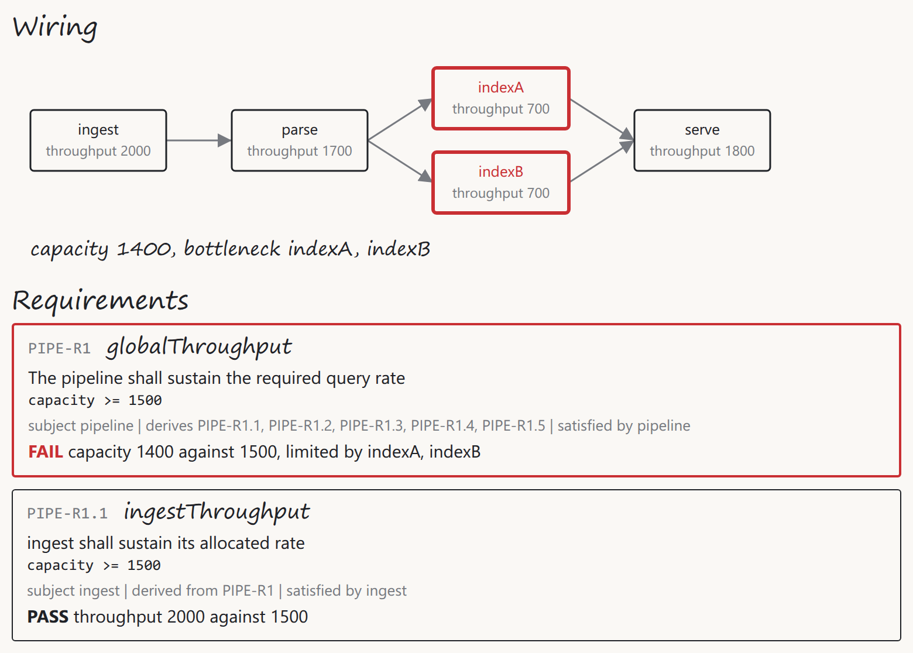

# Twelve use cases and one moving bottleneck

*Roar Georgsen, 27 August 2026*

Part 5 of 13 in [Federating a systems model](../README.md), written for release v0.3.0.

> [!IMPORTANT]
> **The story so far**
>
> The demo is a SysML v2 model of a five-server query pipeline, published through a federated GraphQL router to a capacity service, a document service and two web apps. You can watch a requirement's verdict change in a requirements document served by a service that has never parsed a model file. Part 4 covered the research the design phase began with. This part is the first gate's output: the brief, the example model, and the twelve use cases that say what a visitor should see.

## The brief

The design brief opens by quoting the claim I make for the whole project, that federation is the missing integration layer for open MBSE. Then it says what the demo has to do about that claim. Every later document was measured against these words:

> A SysML v2 model is published as a live, joinable, mechanically checked projection, so that services which know nothing about SysML can attach their own data to the model's objects. The demo has to make that argument visible in under fifteen minutes to someone who has Docker installed and has never seen SysML. Its one memorable moment is a bottleneck moving.

A <span class="term" data-term="projection">projection</span>, throughout this series, is the model as it appears through a GraphQL schema. Its parts, attributes, connections and requirements are answered from the source files on every query, and never from an export taken at some earlier moment.

The memorable moment goes like this. Raise the throughput of a server that isn't the bottleneck and nothing moves. Raise the bottleneck and the capacity rises, but the bottleneck itself moves to the next weakest place in the wiring. Only a raise there makes the requirement pass.

Three services stand behind one router. Each is a <span class="term" data-term="subgraph">subgraph</span>, a GraphQL service that contributes its own part of one shared schema. The router composes those parts and answers a query by asking each service for the fields it owns.

- The **adapter** reads the model from files and publishes parts, attributes, connections and requirements.
- The **capacity service** computes a rollup over the wiring and returns a verdict for each requirement, with a reason string alongside. A verdict is one of PASS, FAIL, INCONCLUSIVE or ERROR, the four words of `VerdictKind` in the SysML v2 Systems Library.
- The **document service** holds the editorial structure of a requirements document.

None of the three imports or calls another. [The architecture in one sitting](01-the-architecture-in-one-sitting.md) covers that shape in full.

### Who it's for

The brief aims the repository at engineering organisations with fewer than 25 engineers. It calls them the place where most engineering happens, and where the existing integration answers are unaffordable. Three personas carry the use cases:

- **The visitor** is a developer or architect at such a firm, evaluating whether federation could connect the tools they already have. "They have Docker, a browser and fifteen minutes, and they will not read a manual."
- **The model owner** is a systems engineer who writes the SysML v2 model and wants it to stay the source of truth. They want to see that an edit made anywhere lands in the served model, and not in a copy.
- **The document owner** is a requirements engineer who owns the ordering, numbering and inclusion decisions of a requirements document. This person "has never seen SysML, and must never need to".


*The three personas as they appear on the storyboard, cut from [the use-case PDF](../stories/use-cases.pdf).*

### What success looks like

The success criteria are four sentences, quoted whole:

> One command launches it on Linux, macOS and Windows with nothing but Docker installed. The bottleneck moving is visible in both apps within two seconds of the edit. A visitor can run one query in the playground that returns text from the adapter, a verdict from the capacity service and a document number from the document service for the same requirement. The whole repository can be read in an afternoon.

That first sentence is what the brief asked for. I build and test on Ubuntu under WSL, and [What shipped, and what did not](11-what-shipped-and-what-did-not.md) says how far the other platforms have been checked.

The non-goals fit in one sentence: "Not a product, not a SysML v2 API implementation, no persistence across restarts, no authentication, no multi-user editing, no queueing model, no full language coverage in the adapter."

## The example model

The example is a query processing pipeline of five servers. It has one requirement on the whole pipeline, one requirement derived from it for each server, and one latency requirement with a verification case. Values are in queries per second unless stated.

Each element has a short name, and those short names are the entity keys. An entity key is the value by which every service agrees it is talking about the same object. It's what lets a verdict from one service and a document number from another attach to the same requirement ([short names as keys](../decisions/AD-0018-short-names-as-keys.md)).

| Short name | Element | Subject and value | Satisfied by |
|---|---|---|---|
| `PIPE-S1` | ingest, a Server | throughput 2000 | |
| `PIPE-S2` | parse, a Server | throughput 1200 | |
| `PIPE-S3` | indexA, a Server | throughput 700 | |
| `PIPE-S4` | indexB, a Server | throughput 700 | |
| `PIPE-S5` | serve, a Server | throughput 1800 | |
| `PIPE-P1` | pipeline, the part that owns the servers and the wiring | capacity and latency declared, no value | |
| `PIPE-R1` | the pipeline shall sustain the required query rate | subject pipeline, limit 1500, editable | pipeline |
| `PIPE-R1.1` | derived: ingest shall sustain its allocated rate | subject ingest, limit bound to the limit of `PIPE-R1` | ingest |
| `PIPE-R1.2` | derived: parse shall sustain its allocated rate | subject parse, limit bound to the limit of `PIPE-R1` | parse |
| `PIPE-R1.3` | derived: indexA shall sustain its allocated rate | subject indexA, limit bound to half the limit of `PIPE-R1` | indexA |
| `PIPE-R1.4` | derived: indexB shall sustain its allocated rate | subject indexB, limit bound to half the limit of `PIPE-R1` | indexB |
| `PIPE-R1.5` | derived: serve shall sustain its allocated rate | subject serve, limit bound to the limit of `PIPE-R1` | serve |
| `PIPE-R2` | end-to-end latency shall not exceed a limit | subject pipeline, 200 ms, read-only in both apps | pipeline |
| `PIPE-VC1` | a verification case that verifies `PIPE-R2` | | |

The wiring runs from ingest to parse, from parse to indexA and to indexB, and from both index servers to serve. With the starting values the capacity is min(2000, 1200, 700 + 700, 1800) = 1200. So the model requirement `PIPE-R1` fails against its limit of 1500, and the bottleneck is parse. The derived limits follow from the global one. Each serial server gets 1500, and each index server gets 750, since the pair shares the load.

> [!NOTE]
> **Bottleneck**
>
> The server, or set of servers, that holds the whole pipeline's capacity down. Where stages run one after another, it's the slowest stage. Where a stage is split across parallel servers, those servers count together, so two index servers at 700 each act as one stage of 1400. The capacity service finds the bottleneck as a minimum cut, the cheapest set of servers that, taken away, would leave no path from the start of the pipeline to the end. Where several sets tie, it reports the one nearest the entry.

Three edits are the whole script:

| Edit | Capacity | `PIPE-R1` | Bottleneck |
|---|---|---|---|
| as shipped | 1200 | FAIL | parse |
| raise ingest to 3000 | 1200 | FAIL | parse |
| raise parse to 1700 | 1400 | FAIL | indexA and indexB |
| then raise indexA to 900 | 1600 | PASS | indexA and indexB |

After the last edit, 1600 is below parse's 1700, so the bottleneck stays uniquely at the index pair and `PIPE-R1` passes. `PIPE-R1.4` on indexB still fails its allocated 750. A paragraph of prose in the document explains how a derived requirement can fail while the global one passes.

The model never carries the rollup arithmetic. An abstract part definition, shared by the pipeline and the servers, declares `capacity : Real` without a value. So every throughput requirement, global or derived, constrains `<subject>.capacity`, and the same rule evaluates all six. The pipeline also declares `latency` as an ISQ duration without a value, which `PIPE-R2` constrains, and each server declares `throughput : Real` with a literal value. The derived limits are bound by expressions in the model, so they follow the limit of `PIPE-R1` and can't be edited.

Where the number comes from is the capacity service's business. It treats the wiring as a flow network with a capacity on each node, and reports the bottleneck as the set of servers on the source side that limits the flow, the minimum cut ([rollup as maximum flow](../decisions/AD-0007-rollup-as-maximum-flow.md)). That arithmetic is idealised, and says so ([an idealised capacity model](../decisions/AD-0006-idealised-capacity-model.md)). The demo is about where the number is computed. In that record I describe the arithmetic as chosen to make a point about federation, and not a performance model anyone should plan capacity with.

## The two apps

The **model viewer** shows the SysML v2 model as its own text, beside a sketch of the pipeline drawn from the model's connections. In the sketch you see each server's throughput, the rolled-up capacity and the current bottleneck, with a failing requirement in red ([the viewer shows text beside wiring](../decisions/AD-0026-viewer-shows-text-and-wiring.md)). I'd meant the editable numbers to be inputs inside that text, and they didn't survive. Later on they moved to a panel above the text, as [Planning the build](08-planning-the-build.md) describes, and the decision record was amended to match.

The **requirements document** shows the same requirements as a numbered document whose numbering is its own. In it, the document owner reorders, nests, adds headings and prose, and hides and restores requirements. Every requirement still shows the relationships that come from the model, the verdict and reason from the analysis, and the current value it is checked against, which can be edited in place ([the document owns its structure](../decisions/AD-0025-document-owns-its-structure.md)).

Exactly six numbers can be edited: the five server throughputs and the limit of `PIPE-R1`. Everything else is read-only in both apps. The adapter's mutation does accept any literal in the source, though, including the 200 ms of `PIPE-R2`, and the playground can reach that. Edits land in the served model text and its version counter, never on disk. I admit that's a stand-in, and the brief records it as an assumption ([editing as scaffolding](../decisions/AD-0004-editing-as-scaffolding.md)).

## The twelve use cases


*The twelve use cases in the order a visitor meets them, from the overview board of [the use-case PDF](../stories/use-cases.pdf).*

Each use case is written persona first, with a "when" clause where the situation changes the behaviour. Its criteria say what is observed, not which control is used.

### 1. Launch with one command

This one belongs to the visitor. Given the image is already pulled, the line the first release published

```
docker run --rm -p 8080:8080 ghcr.io/roarge/sysml-federation
```

renders the viewer at `http://localhost:8080/viewer/` and the document at `http://localhost:8080/document/` within ten seconds. The image pull is deliberately left out of the ten seconds.

For a private network, the second criterion is the one to read. With no route to the internet, either app renders fully, and every request it makes goes to the one published port ([one binary, one port](../decisions/AD-0011-one-binary-one-port.md)).

### 2. Read the model

The viewer's text pane shows the model file with the servers, their throughput values, the connections, the requirements and their short names. The sketch shows the five servers left to right as wired, each with its throughput, the capacity of 1200, and parse marked as the bottleneck. `PIPE-R1` shows its limit of 1500, a verdict of FAIL, and a reason naming parse at 1200.

### 3. Raise a server that isn't the bottleneck


*Raise ingest to 3000: capacity, verdict and bottleneck stay put.*

This is the lesson that a chain is governed by its worst link. Ingest goes from 2000 to 3000. The capacity stays at 1200, `PIPE-R1` stays FAIL and the bottleneck stays parse. The only other visible change is `PIPE-R1.1` continuing to pass with its new value.

I used ingest here on purpose, and not an index server. Raising indexA or indexB would also leave the capacity alone, but it could flip that server's own derived requirement. That's the lesson of use case 10, not this one.

Two further criteria cover bad input. A throughput that isn't a number, or is negative, is rejected and the previous value stands. Setting parse to 0 gives a capacity of 0, with `PIPE-R1` still failing and a reason naming parse at 0.

### 4. Raise the bottleneck


*Raise parse to 1700: the cut moves to the index pair.*



*The same state in the running viewer, with capacity 1400, bottleneck indexA and indexB, and both index boxes stroked red.*

This is the memorable moment, and it takes two steps. First, parse goes from 1200 to 1700. The capacity becomes 1400, `PIPE-R1` stays FAIL, and the bottleneck moves to the pair indexA and indexB.

Then, with parse at 1700, indexA goes from 700 to 900. The capacity becomes 1600, and `PIPE-R1` becomes PASS with a reason naming the index pair at 1600 against a limit of 1500. The requirement block is no longer red.

### 5. Tighten the limit

This is the model owner's use case, and it checks that the requirement is evaluated against the model rather than against a copy. Changing the limit of `PIPE-R1` from 1500 to 1000 gives PASS. Changing it to 2500 gives FAIL, the block turns red, and the reason names parse as the bottleneck at 1200.

The third criterion matters most to the model owner. Whatever value is edited in the viewer, the model text read back shows the edited number exactly where the original literal was.

### 6. Read the document


*The document as the document owner first sees it, numbered its own way.*

The document opens on the shipped structure. `PIPE-R1` is section 1, its derived requirements are 1.1 to 1.5, and `PIPE-R2` is section 2. Those numbers are the document's own, not the model's short names.

Each requirement shows its short name, text and limit. It shows the requirement it is derived from, or the requirements derived from it, the part that satisfies it and the verification case that verifies it. It shows the current value of the subject it is checked against, and its verdict with a reason.

`PIPE-R2` is INCONCLUSIVE, with the reason "PIPE-VC1 is declared and no service runs it". The capacity service only judges requirements whose quantity is the one it computes ([quantity read from the constraint](../decisions/AD-0008-quantity-from-constraint.md)), and a latency requirement is somebody else's job.

### 7. Reorder and nest

Moving `PIPE-R1.5` above `PIPE-R1.1` makes it 1.1. The others shift to 1.2 to 1.5 in their former order, and nothing else is renumbered. Moving `PIPE-R2` under `PIPE-R1` makes it 1.6, and its relationships in the model stay the same and are still shown. After all of that, the viewer's text and sketch are exactly as they were.

### 8. Shape the document

Inserting a heading, "Performance", as the parent of `PIPE-R1` gives the heading number 1. `PIPE-R1` becomes 1.1 and its derived requirements 1.1.1 to 1.1.5. A paragraph of prose added under the heading appears in place and carries no number.

Excluding `PIPE-R1.4` removes it from the document, and `PIPE-R1.5` becomes 1.1.4. The model still lists `PIPE-R1.4`. Restoring it returns it as the last child of `PIPE-R1`, numbered 1.1.5, and not the 1.1.4 it held before.

### 9. Change a value from the document


*Parse changed to 1700 in the row of its derived requirement, with the viewer following in another tab.*

Here the document owner touches the model without knowing it. With the viewer open in another tab, the throughput of parse changes from 1200 to 1700 in the row of `PIPE-R1.2`. `PIPE-R1.2` becomes PASS, and `PIPE-R1` stays FAIL, with a reason now naming indexA and indexB at 1400. Within two seconds, and without a reload, the viewer's text shows 1700 and its sketch shows capacity 1400 with the index pair marked. Changing the limit of `PIPE-R1` in its row shows up in the viewer's requirement text the same way.

### 10. Change from the viewer and watch the document

This is the visitor's proof that both apps read the same data, and don't read each other. It starts from, and depends on, the state that raising the bottleneck leaves behind, with parse at 1700.

Raising indexA from 700 to 900 in the viewer gives, within two seconds and without a reload, a document that shows:

- `PIPE-R1` as PASS, with a reason naming the index pair at 1600 against 1500
- `PIPE-R1.3` as PASS
- `PIPE-R1.4` still FAIL, with a reason giving 700 against its limit of 750

That last line is the lesson about derived requirements that use case 3 stepped around. The paragraph of prose the document ships with, above section 1, exists to explain it. Behind the two seconds is a subscription that carries version events, and clients that refetch ([version events](../decisions/AD-0014-version-events.md)).

### 11. One query in the playground

A query asks for the text, verdict and document number of `PIPE-R1`. One response carries all three, and the served schema contains types contributed by all three subgraphs. Everything before this point could, in principle, be faked by one clever service. This one can't.

### 12. Reset

Reset returns both apps to the shipped values and document structure within two seconds, from the reset control in either app.

## The storyboard

The storyboard keeps to a low-fidelity sketch style of four neutral tones (paper, ink, pencil and shade) with only two accents. Red marks a failing requirement or the bottleneck, and blue marks whatever is shared through the router.

There's an overview board of 1440 by 800 pixels, and one board per use case at 960 by 640, each with a sketch column 460 pixels wide. All thirteen boards are in [the use-case PDF](../stories/use-cases.pdf). The overview is page 1 and the use cases follow in order, so raising the bottleneck is page 5.

## What the first review changed

Before any board existed, I read the argument, the plan, the brief and the use cases against each other in one pass. Every arithmetic claim held and the writing rules were met. What the pass found were gaps in the specification, not errors.

**The tie.** The largest gap was a tie. Raising the bottleneck originally took parse to 1600. With indexA at 900 the index pair also sums to 1600, so parse and the pair tie and the minimum cut isn't unique. The highlighted bottleneck would then depend on the implementation. Parse is now raised to 1700, the cut stays at the index pair, and the demo never shows a tie on the shipped values. Which cut the capacity service reports when several exist was carried forward to the capacity model, which [From use cases to requirements](05-from-use-cases-to-requirements.md) covers.

**A promise it couldn't keep.** The purpose paragraph had promised a pass on the first raise. With a limit of 1500 it can't deliver one, since raising parse alone gets to 1400, and the paragraph now describes the two steps. I'd made the same promise in the project's public description, whose sentence "raise the bottleneck instead and the requirement passes" was queued for the same correction.

**Nothing changes, nearly.** Raising a server that isn't the bottleneck had promised that nothing changes anywhere, which overreached. Raising indexA or indexB leaves the capacity alone but can flip that server's own derived requirement. The use case now claims only that capacity, verdict and bottleneck stay put, and says why it uses ingest.

**Gaps in the brief.** The brief had left out the shipped document structure, the satisfy relationships, the mapping of the five derived requirements onto their servers, and the subject of every requirement. All of those are now in it. The document also shows the current value a requirement is checked against, which is where changing a value from the document edits it. The brief lacked a row for the decision that the model never carries the rollup arithmetic, and the caveat that editing through the projection is scaffolding, and both are in it now. Invalid input (non-numeric, negative and zero) is covered by two new criteria on raising a server that isn't the bottleneck.

The smaller fixes were wording.

<details markdown="1">
<summary>Under the bonnet: the wording fixes, and two suggestions declined</summary>

- Launching with one command no longer implies the container opens a browser, and no longer counts the image pull in its ten seconds.
- Shaping the document says "inserted as the parent of".
- Reordering and nesting says "moved" rather than "dragged", since the criteria describe what is observed and not the control.
- Querying the graph no longer names a UI element.
- The reason on `PIPE-R2` was reworded, and the use case and the record of the review word it slightly differently. The wording that ships will be the capacity service's, built from templates ([reason templates](../decisions/AD-0024-reason-templates.md)).

Two suggestions were declined. One was to quote the argument for federation at length. I refused, since the brief quotes one sentence and [Why federate a systems model](00-why-federate-a-systems-model.md) makes the case in full. The other was to trim each app's description to a single sentence, on the grounds that short paragraphs read better.

</details>

A second reading, after the boards were drawn, checked all thirteen against the brief and the use cases. No number was wrong, and red and blue were used only where allowed. It found seven cosmetic drifts, and none of them touched a number.

<details markdown="1">
<summary>Under the bonnet: the seven drifts</summary>

- The document board lacked the shipped paragraph of prose, and embedded the limit inside the requirement text.
- The overview strip had cut short the title of the board for changing from the viewer, and its thumbnail's wiring was a stub.
- That board showed only the derived limit, where every other document sketch shows the current value first.
- The failure reason as it will ship had been worded four ways. It now reads "parse is the bottleneck at 1200" wherever it fits.
- The unit suffix was dropped everywhere so values read alike, and the legend now says red marks a failing requirement or the bottleneck.

Two things stayed as drawn: the top-to-bottom viewer thumbnail on the board for changing a value from the document, and the overview board's lack of a caption or trace line.

</details>

---

Previous: [What the research overturned](03-what-the-research-overturned.md) · Index: [Federating a systems model](../README.md) · Next: [From use cases to requirements](05-from-use-cases-to-requirements.md)
