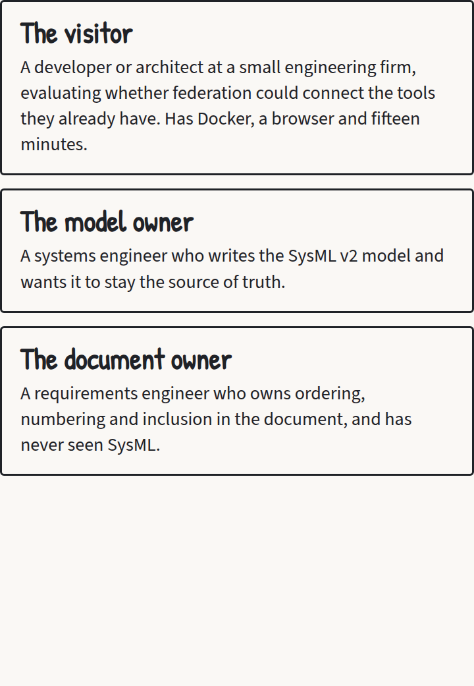
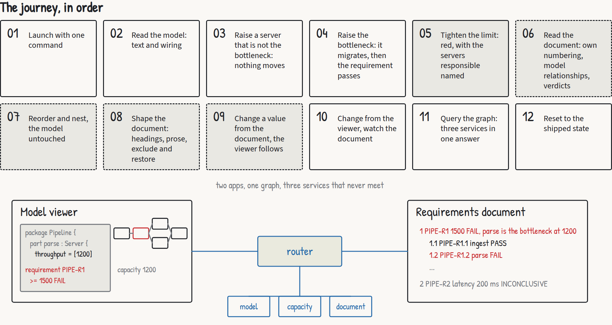
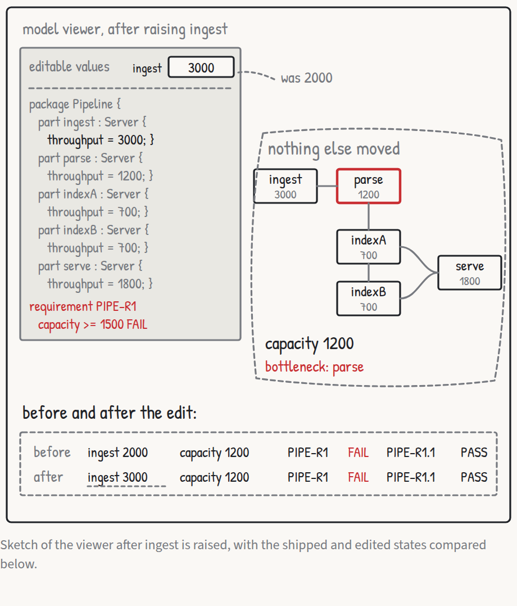
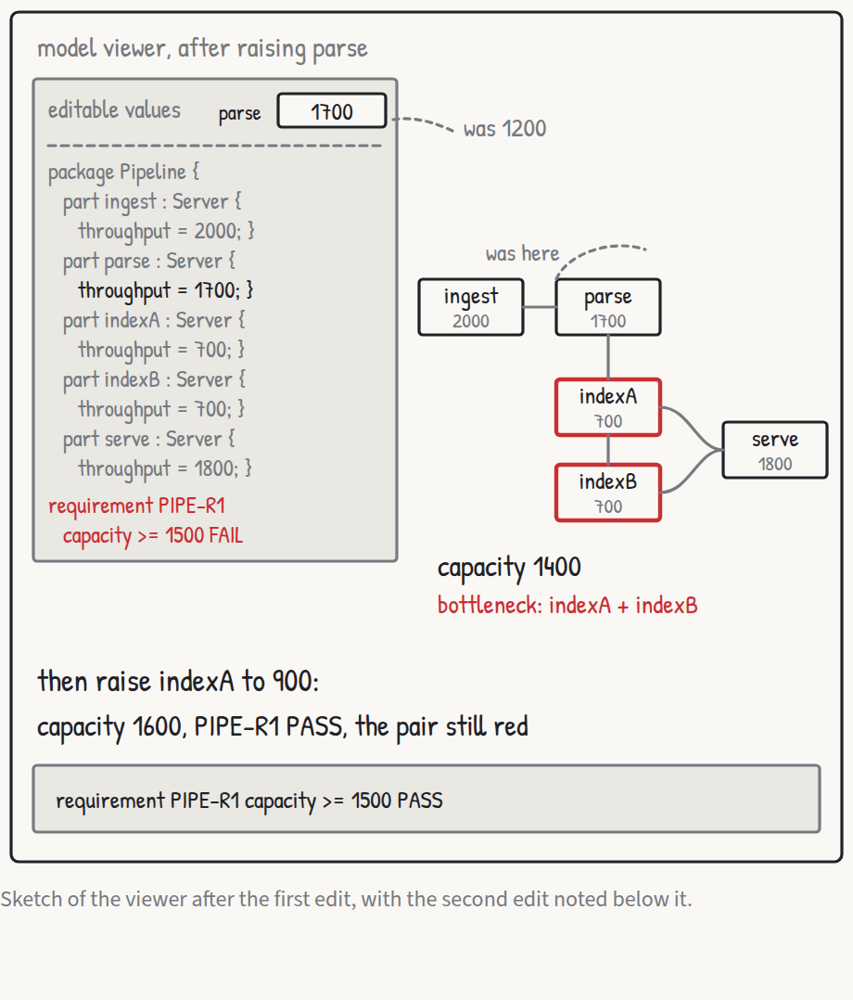
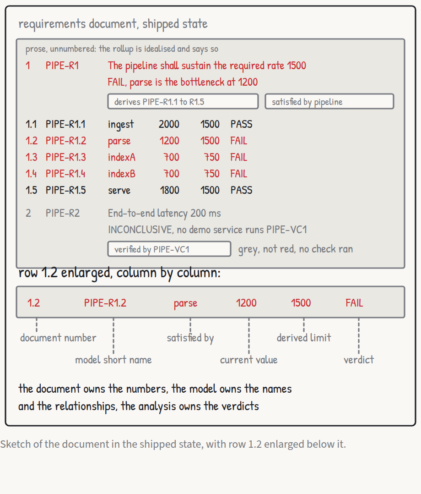
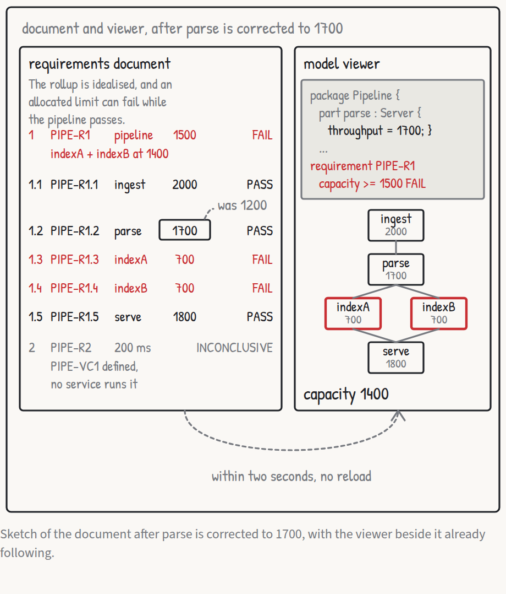

# Twelve use cases and one moving bottleneck

*Roar Georgsen, 27 August 2026*

Part 5 of 11 in [Federating a systems model](../README.md).

The demo is a SysML v2 model of a five-server query pipeline, published through a federated GraphQL router to a capacity service, a document service and two web apps. A requirement's verdict can then be watched changing in a requirements document served by a service that has never parsed a model file.

## The brief

The design brief opens by quoting the claim the project makes for itself, that federation is the missing integration layer for open MBSE. It then says what the demo has to do about that claim, in words that every later document was measured against:

> A SysML v2 model is published as a live, joinable, mechanically checked projection, so that services which know nothing about SysML can attach their own data to the model's objects. The demo has to make that argument visible in under fifteen minutes to someone who has Docker installed and has never seen SysML. Its one memorable moment is a bottleneck moving.

A projection, throughout this series, is the model as it appears through a GraphQL schema: its parts, attributes, connections and requirements answered from the source files on every query, rather than an export taken at some earlier moment. Raise the throughput of a server that is not the bottleneck and nothing moves. Raise the bottleneck and the capacity rises, but the bottleneck itself moves to the next weakest place in the wiring, and only a raise there makes the requirement pass.

Three services stand behind one router. Each is a subgraph, a GraphQL service that contributes its own part of one shared schema, and the router composes those parts and answers a query by asking each service for the fields it owns. The adapter reads the model from files and publishes parts, attributes, connections and requirements. The capacity service computes a rollup over the wiring and returns a verdict for each requirement, one of PASS, FAIL, INCONCLUSIVE or ERROR, with a reason string alongside, the four words of `VerdictKind` in the SysML v2 Systems Library. The document service holds the editorial structure of a requirements document. None of the three imports or calls another. [Article 01](01-the-architecture-in-one-sitting.md) treats that shape in full.

Three personas carry the use cases. The brief aims the repository at engineering organisations with fewer than 25 engineers, which it calls the place where most engineering happens and where the existing integration answers are unaffordable. The visitor is a developer or architect at such a firm, evaluating whether federation could connect the tools they already have. "They have Docker, a browser and fifteen minutes, and they will not read a manual." The model owner is a systems engineer who writes the SysML v2 model, wants it to remain the source of truth, and wants to see that an edit made anywhere lands in the served model rather than in a copy. The document owner is a requirements engineer who owns the ordering, numbering and inclusion decisions of a requirements document, "has never seen SysML, and must never need to".



*The three personas as they appear on the storyboard, cut from [the use-case PDF](../stories/use-cases.pdf).*

The success criteria are four sentences, quoted whole.

> One command launches it on Linux, macOS and Windows with nothing but Docker installed. The bottleneck moving is visible in both apps within two seconds of the edit. A visitor can run one query in the playground that returns text from the adapter, a verdict from the capacity service and a document number from the document service for the same requirement. The whole repository can be read in an afternoon.

The non-goals fit in one sentence. "Not a product, not a SysML v2 API implementation, no persistence across restarts, no authentication, no multi-user editing, no queueing model, no full language coverage in the adapter."

## The example model

A query processing pipeline of five servers, one requirement on the whole pipeline, one derived requirement per server, and one latency requirement with a verification case. Values are queries per second unless stated. Each element has a short name, and those short names are the entity keys: the value by which every service agrees it is talking about the same object, so that a verdict from one service and a document number from another attach to the same requirement ([short names as keys](../decisions/AD-0018-short-names-as-keys.md)).

| Short name | Element | Subject and value | Satisfied by |
|---|---|---|---|
| `PIPE-S1` | ingest, a Server | throughput 2000 | |
| `PIPE-S2` | parse, a Server | throughput 1200 | |
| `PIPE-S3` | indexA, a Server | throughput 700 | |
| `PIPE-S4` | indexB, a Server | throughput 700 | |
| `PIPE-S5` | serve, a Server | throughput 1800 | |
| `PIPE-P1` | pipeline, the part that owns the servers and the wiring | capacity and latency declared, no value | |
| `PIPE-R1` | the pipeline shall sustain the required query rate | subject pipeline, limit 1500, editable | pipeline |
| `PIPE-R1.1` | derived: ingest shall sustain its allocated rate | subject ingest, limit bound to the limit of `PIPE-R1` | ingest |
| `PIPE-R1.2` | derived: parse shall sustain its allocated rate | subject parse, limit bound to the limit of `PIPE-R1` | parse |
| `PIPE-R1.3` | derived: indexA shall sustain its allocated rate | subject indexA, limit bound to half the limit of `PIPE-R1` | indexA |
| `PIPE-R1.4` | derived: indexB shall sustain its allocated rate | subject indexB, limit bound to half the limit of `PIPE-R1` | indexB |
| `PIPE-R1.5` | derived: serve shall sustain its allocated rate | subject serve, limit bound to the limit of `PIPE-R1` | serve |
| `PIPE-R2` | end-to-end latency shall not exceed a limit | subject pipeline, 200 ms, read-only in both apps | pipeline |
| `PIPE-VC1` | a verification case that verifies `PIPE-R2` | | |

The wiring is ingest to parse, parse to indexA and to indexB, indexA and indexB to serve. With the starting values the capacity is min(2000, 1200, 700 + 700, 1800) = 1200, so the model requirement `PIPE-R1` fails against its limit of 1500 and the bottleneck is parse. The derived limits follow from the global one: 1500 on each serial server, 750 on each index server, since the pair shares the load.

Three edits are the whole script. Raising ingest to 3000 changes none of the capacity, the verdict or the bottleneck. Raising parse to 1700 gives 1400, still failing, and the bottleneck moves to the index pair. Raising indexA to 900 gives 1600, which is below parse's 1700, so the bottleneck stays uniquely at the index pair and `PIPE-R1` passes, while `PIPE-R1.4` on indexB still fails its allocated 750. A prose paragraph in the document explains why a derived requirement can fail while the global one passes.

The model never carries the rollup arithmetic. An abstract part definition shared by the pipeline and the servers declares `capacity : Real` without a value, so every throughput requirement, global or derived, constrains `<subject>.capacity` and the same rule evaluates all six. The pipeline also declares `latency` as an ISQ duration without a value, which `PIPE-R2` constrains, and each server declares `throughput : Real` with a literal value. The derived limits are bound by expressions in the model, so they follow the limit of `PIPE-R1` and cannot be edited. Where the number comes from is the capacity service's business: it treats the wiring as a flow network with a capacity on each node and reports the bottleneck as the set of servers on the source side that limits the flow, the minimum cut ([rollup as maximum flow](../decisions/AD-0007-rollup-as-maximum-flow.md)). That arithmetic is idealised and says so ([an idealised capacity model](../decisions/AD-0006-idealised-capacity-model.md)). The demo is about where the number is computed, and that record keeps the project's own description of it, arithmetic chosen to make a point about federation rather than a performance model anyone should plan capacity with.

## The two apps

The model viewer shows the SysML v2 model as its own text, with the editable numbers as inline inputs, beside a sketch of the pipeline drawn from the model's connections. The sketch shows each server's throughput, the rolled-up capacity and the current bottleneck, with a failing requirement in red ([the viewer shows text beside wiring](../decisions/AD-0026-viewer-shows-text-and-wiring.md)). The inline inputs did not survive: the editable numbers later moved to a panel above the text, as [article 08](08-planning-the-build.md) describes, and the decision record has been amended to match.

The requirements document shows the same requirements as a numbered document whose numbering is its own. The document owner reorders, nests, adds headings and prose, hides and restores requirements. Every requirement still shows the relationships that come from the model, the verdict and reason from the analysis, and the current value it is checked against, which can be edited in place ([the document owns its structure](../decisions/AD-0025-document-owns-its-structure.md)).

The editable set is exactly the five server throughput values and the limit of `PIPE-R1`. Everything else is read-only in both apps, although the adapter's mutation accepts any literal in the source, the 200 ms of `PIPE-R2` included, which the playground can reach. Edits land in the served model text and its version counter, never on disk, which the project admits is a stand-in and the brief records as an assumption ([editing as scaffolding](../decisions/AD-0004-editing-as-scaffolding.md)).

## The twelve use cases



*The twelve use cases in the order a visitor meets them, from the overview board of [the use-case PDF](../stories/use-cases.pdf).*

Each use case is written persona first, with a "when" clause where the situation changes the behaviour, and its criteria say what is observed rather than which control is used.

Use case 1, launch with one command, belongs to the visitor. Given the image is already pulled, the line the first release will publish

```
docker run --rm -p 8080:8080 ghcr.io/roarge/sysml-federation
```

renders the viewer at `http://localhost:8080/viewer` and the document at `http://localhost:8080/document` within ten seconds. For a private network the second criterion is the one to read: with no route to the internet, either app renders fully and every request it makes goes to the one published port ([one binary, one port](../decisions/AD-0011-one-binary-one-port.md)). The image pull is deliberately outside the ten seconds.

Reading the model, use case 2, asks that the viewer's text pane show the model file with the servers, their throughput values, the connections, the requirements and their short names, and that the sketch show the five servers left to right as wired, each with its throughput, the capacity of 1200 and parse marked as the bottleneck. `PIPE-R1` shows its limit of 1500, a verdict of FAIL and a reason naming parse at 1200.



*Raise ingest to 3000: capacity, verdict and bottleneck stay put.*

Use case 3, raise a server that is not the bottleneck, is the lesson that a chain is governed by its worst link. Ingest goes from 2000 to 3000 and the capacity stays 1200, `PIPE-R1` stays FAIL, the bottleneck stays parse, and the only other visible change is `PIPE-R1.1` continuing to pass with its new value. Ingest is used rather than an index server on purpose. Raising indexA or indexB would also leave the capacity alone, but could flip that server's own derived requirement, and that is the lesson of use case 10, change from the viewer and watch the document, not this one. Two further criteria cover bad input: a throughput that is not a number or is negative is rejected and the previous value stands, and parse set to 0 gives a capacity of 0, `PIPE-R1` still failing, with a reason naming parse at 0.



*Raise parse to 1700: the cut moves to the index pair.*

Use case 4, raise the bottleneck, is the memorable moment, and it takes two steps. Parse goes from 1200 to 1700, the capacity becomes 1400, `PIPE-R1` stays FAIL, and the bottleneck moves to the pair indexA and indexB. Then, with parse at 1700, indexA goes from 700 to 900, the capacity becomes 1600, `PIPE-R1` becomes PASS with a reason naming the index pair at 1600 against a limit of 1500, and the requirement block is no longer red.

The model owner's use case 5 tightens the limit, and checks that the requirement is evaluated against the model rather than against a copy. The limit of `PIPE-R1` changed from 1500 to 1000 gives PASS. Changed to 2500 it gives FAIL, the block turns red, and the reason names parse as the bottleneck at 1200. The third criterion matters most to the model owner: whatever value is edited in the viewer, the model text read back shows the edited number exactly where the original literal was.



*The document as the document owner first sees it, numbered its own way.*

Use case 6, read the document, opens on the shipped structure: `PIPE-R1` as section 1, its derived requirements as 1.1 to 1.5, and `PIPE-R2` as section 2, numbers that are the document's own and not the model's short names. Each requirement shows its short name, text, limit, the requirement it is derived from or the requirements derived from it, the part that satisfies it, the verification case that verifies it, the current value of the subject it is checked against, and its verdict with a reason. `PIPE-R2` is INCONCLUSIVE, with the reason given as "PIPE-VC1 is declared and no service runs it". The capacity service only judges requirements whose quantity is the one it computes ([quantity read from the constraint](../decisions/AD-0008-quantity-from-constraint.md)), and a latency requirement is somebody else's job.

Reordering and nesting, use case 7, moves `PIPE-R1.5` above `PIPE-R1.1`, whereupon it becomes 1.1 and the others shift to 1.2 to 1.5 in their former order with nothing else renumbered. `PIPE-R2` moved under `PIPE-R1` becomes 1.6, and its relationships in the model are unchanged and still shown. After all of that the viewer's text and sketch are exactly as they were.

Use case 8, shape the document, inserts a heading "Performance" as the parent of `PIPE-R1`. The heading takes number 1, `PIPE-R1` becomes 1.1 and its derived requirements 1.1.1 to 1.1.5. A prose paragraph added under the heading appears in place and carries no number. Excluding `PIPE-R1.4` removes it from the document, `PIPE-R1.5` becomes 1.1.4, and the model still lists `PIPE-R1.4`. Restoring it returns it as the last child of `PIPE-R1`, numbered 1.1.5 rather than the 1.1.4 it held before.



*Parse changed to 1700 in the row of its derived requirement, with the viewer following in another tab.*

Use case 9, change a value from the document, is where the document owner touches the model without knowing it. With the viewer open in another tab, the throughput of parse is changed from 1200 to 1700 in the row of `PIPE-R1.2`. `PIPE-R1.2` becomes PASS, `PIPE-R1` stays FAIL with a reason now naming indexA and indexB at 1400, and within two seconds the viewer's text shows 1700 and its sketch shows capacity 1400 with the index pair marked, all without a reload. The limit of `PIPE-R1` changed in its row shows up in the viewer's requirement text the same way.

Use case 10, change from the viewer and watch the document, is the visitor's proof that both apps read the same data rather than each other. It starts from the state raising the bottleneck leaves behind, parse at 1700, and depends on it. Raising indexA from 700 to 900 in the viewer gives, within two seconds and without a reload, a document showing `PIPE-R1` as PASS with a reason naming the index pair at 1600 against 1500, `PIPE-R1.3` as PASS, and `PIPE-R1.4` still FAIL with a reason giving 700 against its limit of 750. That last line is the derived-requirement lesson that raising a server which is not the bottleneck stepped around, and the prose paragraph the document ships with above section 1 exists to explain it. The mechanism behind the two seconds is a subscription that carries version events and clients that refetch ([version events](../decisions/AD-0014-version-events.md)).

One query in the playground, use case 11, asks for the text, verdict and document number of `PIPE-R1`. One response carries all three, and the served schema contains types contributed by all three subgraphs. Everything before this point could, in principle, be faked by one clever service. This one cannot.

Reset, the twelfth, returns both apps to the shipped values and document structure within two seconds, from the reset control in either app.

## The storyboard

The storyboard keeps a low-fidelity sketch register of four neutral tones, paper, ink, pencil and shade, with two accents only: one red for a failing requirement or the bottleneck, one blue for whatever is shared through the router.

There is an overview board of 1440 by 800 and one board per use case at 960 by 640, each with a sketch column of 460 pixels. All thirteen boards are in [the use-case PDF](../stories/use-cases.pdf). The overview is page 1 and the use cases follow in order, so raising the bottleneck is page 5.

## What the first review changed

Before any board existed, the argument, the plan, the brief and the use cases were read against each other in one pass. Every arithmetic claim held and the writing rules were met. What the pass found were gaps in specification rather than errors.

The largest was a tie. Raising the bottleneck originally took parse to 1600, and with indexA at 900 the index pair also sums to 1600, so parse and the pair tie and the minimum cut is not unique. The highlighted bottleneck would then be implementation-defined. Parse is now raised to 1700, the cut stays at the index pair, and the demo never shows a tie on the shipped values. Which cut the capacity service reports when several exist was carried forward to the capacity model, which [article 05](05-from-use-cases-to-requirements.md) covers.

The purpose paragraph had promised a pass on the first raise. With a limit of 1500 it cannot deliver one, since raising parse alone gets to 1400, and the paragraph now describes the two-step migration. The same promise had been made in the project's public description, whose sentence "raise the bottleneck instead and the requirement passes" was queued for the same correction.

Raising a server that is not the bottleneck promised that nothing changes anywhere, and that overreached. Raising indexA or indexB leaves the capacity alone but can flip that server's own derived requirement. The use case now claims only that capacity, verdict and bottleneck stay put, and says why it uses ingest.

The shipped document structure, the satisfy relationships, the mapping of the five derived requirements onto their servers and the subject of every requirement were all absent from the brief. All are now in it, and the document shows the current value a requirement is checked against, which is where changing a value from the document edits it. The brief also lacked a row for the decision that the model never carries the rollup arithmetic, and the caveat that editing through the projection is scaffolding. Both are now in the brief. Invalid input, non-numeric, negative and zero, is covered by two new criteria on raising a server that is not the bottleneck.

The smaller fixes were wording. Launching with one command no longer implies the container opens a browser and no longer counts the image pull in its ten seconds. Shaping the document says "inserted as the parent of". Reordering and nesting says "moved" rather than "dragged", since the criteria describe what is observed and not the control. Querying the graph no longer names a UI element. The reason on `PIPE-R2` was reworded, and the use case and the record of the review word it slightly differently. The wording that ships will be the capacity service's, built from templates ([reason templates](../decisions/AD-0024-reason-templates.md)).

Two suggestions were declined. Quoting the argument for federation at length was refused, since the brief quotes one sentence and [Why federate a systems model](00-why-federate-a-systems-model.md) makes the case in full, and trimming each app's description to a single sentence because short paragraphs read better.

A second reading, after the boards were drawn, read all thirteen against the brief and the use cases. No number was wrong, and red and blue were used only where allowed. It found seven cosmetic drifts. The document board lacked the shipped prose paragraph and embedded the limit inside the requirement text. The overview strip had truncated the title of the board for changing from the viewer, and its thumbnail's wiring was a stub. That board showed only the derived limit where every other document sketch shows the current value first. The failure reason as it will ship had been worded four ways, and now reads "parse is the bottleneck at 1200" wherever it fits. The unit suffix was dropped everywhere so values read alike, and the legend now says red marks a failing requirement or the bottleneck. Two things stayed as drawn, the top-to-bottom viewer thumbnail on the board for changing a value from the document and the overview board's lack of a caption or trace line. None of the seven touched a number.

---

Previous: [What the research overturned](03-what-the-research-overturned.md) · Index: [Federating a systems model](../README.md) · Next: [From use cases to requirements](05-from-use-cases-to-requirements.md)
