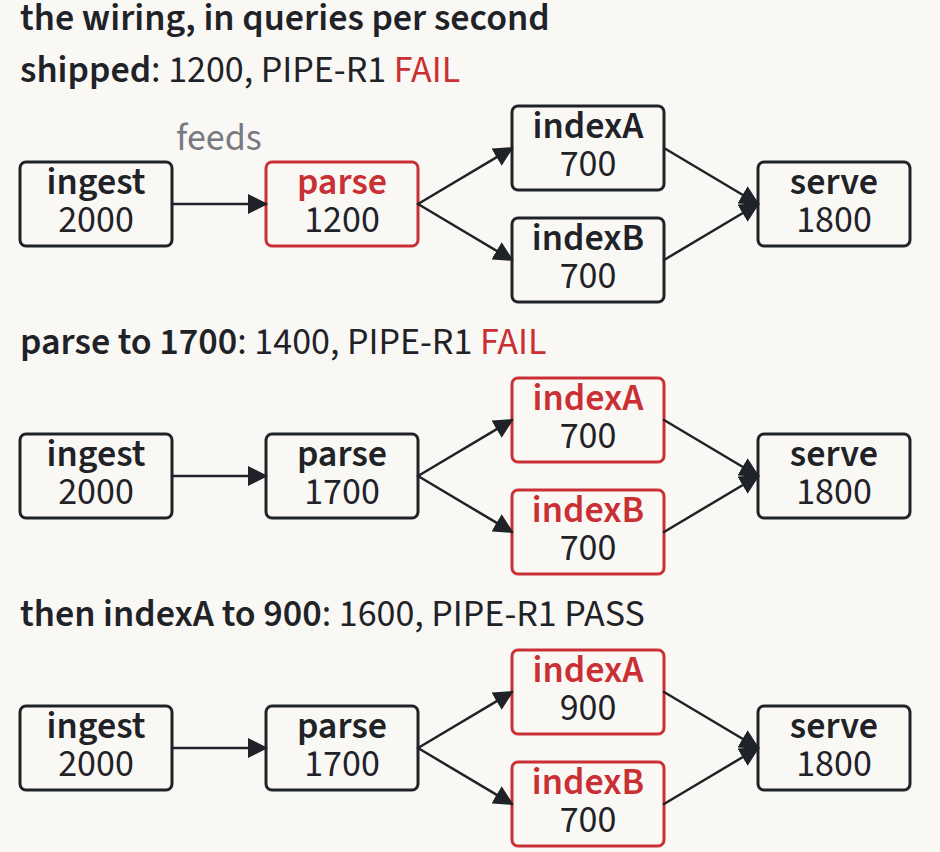
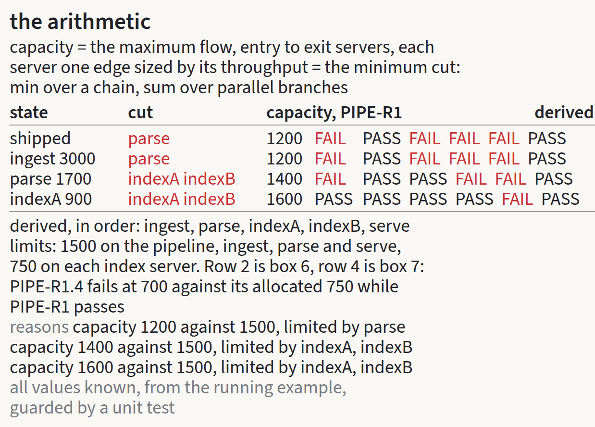
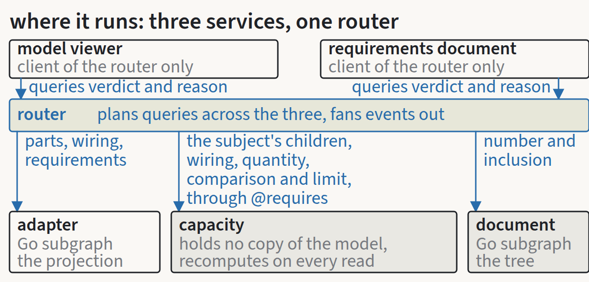

# From use cases to requirements

*Roar Georgsen, 27 August 2026*

Part 6 of 11 in [Federating a systems model](../README.md).

The demo is one container that runs a SysML v2 adapter, a capacity service and a document service as three GraphQL subgraphs behind a single router, with a model viewer and a requirements document as two web apps reading the one graph. A subgraph is a GraphQL service that owns part of a shared schema. The router is the process that composes those parts into one graph and answers every query against it. The [twelve use cases](04-twelve-use-cases-and-one-moving-bottleneck.md) say what a visitor does with that. The approval gate after them, the review the requirements work had to pass before the architecture began, says what the code owes the visitor in return.

## Four documents

The gate produced four documents.

A constraints card of 95 entries, compiled from the research reports and the repository's own policy files. Each entry states a fact or a limit in one to three sentences, then its source with the confidence the research assigned in brackets (verified, likely or unverified, with repository policy where the source is the repository's own configuration, decision where the entry records a choice the design made rather than a fact, and editorial for a wording choice), then the decision it serves or, for an unverified item the design leans on, a spike to be settled early in the build before anything depends on it.

A capacity model page, stating what the service computes and how far the number can be trusted.

Forty-five requirements in EARS form, so each statement takes one of its five patterns, ubiquitous, event-driven, state-driven, unwanted behaviour and optional feature, or the complex form that combines two of them. Each requirement carries that one statement with one system name, a rationale that cites the decisions and the constraints behind it, a verification method, the use cases it traces up to and the elements it is allocated to. The seven design constraints that follow them carry a plain statement instead, because EARS suits behaviour and not architectural limits. Allocation is to nine elements: the adapter, the capacity service, the document service, the router with its committed execution configuration, the model viewer, the requirements document app, the image (the supervisor binary, the one UI server that serves both apps and proxies the router, and the publishing workflow), the example model file, and the repository's build, tests and continuous integration.

Verification is by one of four methods. Test means a Go test named after the requirement and run by the repository's full check. Analysis and Inspection are what they sound like. Demonstration means a scripted checklist run in a local browser or on a Docker host and recorded in the example's README, because nothing in the repository drives a browser and the language and licence constraint permits no dependency that does. Behaviour that lives in browser JavaScript is therefore demonstrated rather than tested, a smaller promise, stated as one.

The fourth document is the traceability, generated from the requirements and checked both ways. Every one of the twelve use cases traces to at least one requirement. Thirty-eight of the forty-five requirements trace up to a use case, and the other seven trace to an obligation stated in the README, in the brief or in a licence, which the tables say rather than leaving a blank. Every requirement names a verification method, and once the [decision records](../decisions/README.md) existed the same tables gained a column showing that every requirement is affected by at least one of the twenty-six.

Model requirements, the ones that live inside the example model such as `PIPE-R1`, are demo content and not obligations on this code. They keep their SysML short names.

## Three findings that reached back into the design

The four documents were read against their sources and against each other. Three of the things that came back were holes in the design rather than defects in the wording, and each went back to the brief as a decision before the documents were revised.

The first concerned the constrained quantity. The example has two requirements on the pipeline, `PIPE-R1` on throughput and `PIPE-R2` on latency, and both have the pipeline as their subject. A verdict is the answer returned for one requirement, one of PASS, FAIL, INCONCLUSIVE or ERROR. A verdict rule keyed on the subject, which is what every document had assumed until then, could not tell one from the other and would have passed the latency requirement at 1200 against 200. The same pass found a second gap in the same place: no document said how an adapter that contains nothing specific to any one model knows which of a requirement's attributes is its limit.

One rule answers both. The adapter reads each requirement's `require constraint` as a comparison between a feature chain rooted at the requirement's subject and either an attribute of the requirement or a literal. The chain's last segment is projected as the constrained quantity, the operator as the comparison, and the other operand's value as the limit. In the example that is `<subject>.capacity >= requiredRate` for the six throughput requirements and `pipeline.latency <= maxLatency` for the latency one. A constraint of any other shape is refused at start with file, line and column, the same treatment any construct outside the supported subset gets. The capacity service then evaluates only requirements whose quantity is the one it is configured to compute and returns INCONCLUSIVE for every other. The alternative was a naming convention on the requirement's attributes, an agreed name such as `requiredRate` that the adapter would look for. It was rejected because the convention would have been an assumption taken from the example, and the whole claim is that the adapter is specific to none. The record is [quantity, comparison and limit read from the constraint](../decisions/AD-0008-quantity-from-constraint.md).

The second finding was direction. A SysML v2 `connect` has two ordered ends and no direction of its own, and the rollup, a maximum flow over the wiring, needs directed edges. The direction had been assumed rather than stated. It is now the end order, first end to second, and the adapter refuses to start on a connect whose first end is not an `out` port or whose second is not an `in` port. The end order is the source of the direction and the port declarations are the check, so a wiring error becomes a model error with a position rather than a wrong capacity with nothing to say so. The record is [connection direction from the order of the ends](../decisions/AD-0009-connection-direction.md).

The third settled two smaller things at once. The reason string attached to every verdict is built from fixed templates that carry no word of the model. The record is [verdict reasons built from templates](../decisions/AD-0024-reason-templates.md). And the single UI server that serves both apps and proxies the router belongs to the image element, so the two apps are HTML, CSS and JavaScript and nothing else, which [one binary, one port](../decisions/AD-0011-one-binary-one-port.md) records.

## What else the review changed

Nine requirements named two systems or two obligations in one statement and were split. With the four added below, the set reached forty-five, above the plan's target of 20 to 25, and the overrun was accepted for that reason.

Four use-case criteria had no requirement behind them. The viewer showing a verdict and its reason, document edits leaving the model version unchanged, the apps referencing no resource at another origin, and short names as identifiers each gained one. The last of those matters more than it appears to, because the short name is the entity key, the field every service uses to say "this requirement" so that the router can join what three subgraphs know about it.

The no-outbound-network requirement had listed the four environment variables that silence the router's telemetry in its rationale. They are now the obligation itself, and its demonstration runs the container with the network removed at debug log level and looks for connection attempts, since the router's usage tracker fails quietly and readiness alone would prove nothing.

The allowlist constraint had listed two gaps in the repository's tracking rules that were not gaps and missed the two that were: the committed router configuration and its compose input must sit at `examples/pipeline/` for the existing one-level rules to reach them, and the one vendored JavaScript file must stay out of any directory named `vendor/`.

On the capacity page, the explanation of the tie the example avoids had placed the tie in the wrong state and now says where it would have arisen. The edge cases were brought into line with the verdict rules. Flow conservation and the inference of entry and exit servers from the wiring were added to the assumptions, where they had been used but not stated. And the limits paragraph no longer claims both "upper bound" and "invalidated by any violation" of the same number.

On the constraints card, the OMG training folders for ports and connections are 09 and 10, not 14 and 16, the function that populates a subgraph's required fields takes a map rather than a slice of maps, and three references to the plan's candidate requirement numbers now point at the real identifiers.

A second cross-document pass over the revised set found two gaps the first fix had opened, closed by the abstract part definition that lets `Server` declare `capacity` as well as `throughput` and by the reordered verdict precedence, both described below. The pipeline also gained a `latency` attribute without a value, which the latency constraint needs in order to resolve at all. The reason templates had carried the words "capacity" and "server", which the service is not allowed to know, and now use the two configured names and the word "part". The limit's unit as written in the source is now projected beside the limit, so the document can show "200 ms". Two requirements that had traced to use cases which do not observe them now trace to stated obligations.

## The capacity model

The decision to keep [an idealised capacity model](../decisions/AD-0006-idealised-capacity-model.md) requires a page that states what is computed, the assumptions, the limits of validity and the absence of an uncertainty estimate, published beside the verdicts a reader sees.

### What is computed

A pipeline part owns servers, which are its child parts, and a wiring, which is a set of directed connections between those servers. Each server carries one numeric attribute, `throughput`, in queries per second. The capacity of the pipeline is the largest sustained query rate the wiring can carry from the servers that receive queries to the servers that deliver results. The capacity service computes that number, names the servers that limit it, and returns a verdict for every requirement that constrains a quantity it computes.

Only two names configure the service, the quantity it computes, `capacity`, and the attribute it reads from each child, `throughput`. It never sees the words "server" or "pipeline". They are used in this section because it describes the example.

From the pipeline the service builds a flow network. Every server becomes two nodes, an in-node and an out-node, joined by one edge whose capacity is the server's throughput. Every connection becomes an edge with no capacity limit from the out-node of its first end to the in-node of its second end, the direction the adapter took from the order of the ends. A super-source is joined by unlimited edges to every server that has no incoming connection, and a super-sink is joined by unlimited edges from every server that has no outgoing connection. Entry and exit servers are therefore inferred from the wiring: a server nobody feeds receives queries from outside, and a server that feeds nobody delivers results. A server with no connections at all is neither and is left out of the network, and so is any server the flow cannot reach from an entry or from which it cannot reach an exit. Such servers are ignored for capacity and are not named in any reason.

Capacity is the maximum flow from the super-source to the super-sink. Dinic's algorithm computes it in a few dozen lines of Go.

Because the connection edges carry no limit, every finite cut of the network consists of server edges alone, and the max-flow min-cut theorem gives the same number a second way:

```
capacity(P) = max flow from s to t in N(P)
            = min over server sets C that separate every entry server
              from every exit server of  sum of throughput(v), v in C
```

In words, the capacity is the smallest total throughput of any set of servers whose removal would cut every path from an entry server to an exit server, with entries and exits taken from the full wiring before any removal. That set is a minimum cut, and it is what the demo calls the bottleneck.

The README describes the rollup as a minimum over serial stages and a sum over parallel ones, and the flow agrees with that description wherever it applies. Flow through a chain cannot exceed the smallest throughput in it, and a flow of exactly that size can be routed through, so the capacity of a chain is the minimum. For parallel branches that share one fork and one join, any flow splits into one flow per branch, each bounded by that branch's capacity, and the branch maxima can all be reached at once because the branches share no server, so the capacity of the group is the sum. Applied recursively, replacing each chain or parallel group with one server of the group's capacity, the two rules give the maximum flow of any series-parallel wiring, and a differential test in the capacity package checks flow against them on such wirings.

Wiring that is not series-parallel leaves the flow intact and the two rules without an answer. Fan-in from servers that were not forked at the same point, a cycle, or several entry or exit servers all have a well defined maximum flow, while the question of whether a given stage is serial or parallel has none. Flow is therefore the mechanism, and minimum over serial with sum over parallel is the explanation a reader can check by hand. The rejected alternatives, the rollup evaluated in the adapter, in each app, or by a service that queries the supergraph it belongs to, are in [rollup as maximum flow](../decisions/AD-0007-rollup-as-maximum-flow.md).

### The bottleneck

A network can have several minimum cuts, so the reported one has to be defined. The service reports the source-side canonical cut: the servers whose in-node is reachable from the super-source in the residual network of a maximum flow but whose out-node is not. Those are the saturated servers closest to the entry. The set of nodes reachable from the super-source in the residual network is the same for every maximum flow, so the reported cut does not depend on the order in which Dinic's algorithm found augmenting paths.



*The example wiring in its three states, cut from the [L2b sheet on capacity and verdicts](../a3/L2b-pipeline-example-capacity-and-verdicts.pdf).*

A visitor sees the consequences directly. Raising the throughput of a server outside the cut changes nothing, because the same cut still limits the flow to the same value. Raising a server inside the cut raises the capacity by the same amount, since the members of a cut add, until some other set of servers becomes the cheapest cut. At that point the bottleneck migrates to that set and further increases to the first server stop having any effect.

The demo's values are chosen so that no tie occurs anywhere on the visitor's path. Had `parse` been raised to 1600 rather than 1700, the second step would still have moved the bottleneck to the index pair at 1400, but the third step, `indexA` to 900, would then have left `parse` at 1600 and the pair at 1600, two minimum cuts of equal weight. The source-side rule would report `parse`, which is correct and confusing to a visitor who has just edited `indexA`. At 1700 the pair at 1400 is the unique minimum cut after the second step, and after the third step the pair at 1600 is still strictly below `parse`.

### Verdicts and reasons

A requirement reaches the service with its subject, the quantity its constraint names, the comparison operator, the limit and, where the model declares one, the short name of its verification case. All of that comes from the adapter's projection, the generic set of fields the adapter serves for any model, carried through the router. The service evaluates a requirement only when the named quantity is the one it computes. For the example that is `capacity`, so `PIPE-R1` and its five derived requirements are evaluated, and `PIPE-R2`, which constrains `latency`, is not.



*The quantification zone of the L2b sheet, with the formula, the four states and the derived verdicts.*

For an evaluated requirement the verdict is PASS when the subject's capacity satisfies the projected comparison against the limit and FAIL otherwise. The comparison is the constraint's own, `>=` for every throughput requirement in the example, so a requirement written the other way round would be evaluated the other way round.

A leaf is a part that carries the configured attribute and has no children. Its capacity is its own attribute value and its bottleneck set is empty, so the derived requirements on single servers are evaluated by the same rule with no second code path. For that to hold in the model, the servers must declare `capacity` as well as `throughput`, which the example does through an abstract part definition shared by the pipeline and the servers, so that every throughput requirement constrains `<subject>.capacity`. A part with neither children nor the attribute is empty and has no capacity.

The enumeration mirrors `VerdictKind` from the SysML v2 Systems Library, so a reader of the model meets the same four words in the analysis. INCONCLUSIVE is returned when the constrained quantity is not the one the service computes, when the subject is empty, and when the wiring has no entry part or no exit part. ERROR is returned when a child's attribute is missing or negative, and the reason names the child. The precedence is that a requirement whose quantity is not the one computed is INCONCLUSIVE before anything else is looked at, so the latency requirement never reports a bad child value. Then ERROR, then the remaining INCONCLUSIVE cases, then PASS or FAIL. In every INCONCLUSIVE case the capacity is absent rather than zero.

Every verdict carries a reason string built from one of seven templates. A cut of several servers is listed in the order the router delivers the children, comma separated, and the wording avoids a verb that would have to agree in number with the cut.

| Case | Template |
|---|---|
| PASS or FAIL, subject with children | `<quantity> <value> against <limit>, limited by <cut>` |
| PASS or FAIL, leaf subject | `<attribute> <value> against <limit>` |
| INCONCLUSIVE, other quantity, verification case declared | `<verification case> is declared and no service runs it` |
| INCONCLUSIVE, other quantity, no verification case | `no service computes <quantity>` |
| INCONCLUSIVE, empty subject | `no children to analyse` |
| INCONCLUSIVE, no entry or no exit | `no entry part` or `no exit part` |
| ERROR | `<child> has <missing / negative> <attribute>` |

The words in angle brackets are the only variable parts, and `<quantity>` and `<attribute>` are the service's two configured names, so a template never carries a word of the model. For the example the first template renders as `capacity 1200 against 1500, limited by parse`. The leaf template is selected by the subject having no children, not by the requirement being derived, which the service cannot know. Words such as "allocated" belong to the document, which does know the derivation relationship and may add them beside the reason.

### Derived limits and the worked example

The derived limits are written in the model as expressions over the limit of `PIPE-R1` and evaluated by the adapter. The capacity service never sees the allocation rule, only the number that results. The rule is the full rate on the serial path and an equal share per parallel branch: `ingest`, `parse` and `serve` are each allocated the whole of the limit, and the two index servers half each.

A derived requirement can fail while the pipeline passes, because the pipeline's capacity counts what a parallel group delivers in total, and one branch delivering more than its share covers another delivering less. That is how allocated requirements behave wherever a budget is split over parts, and the two verdicts side by side are consistent with each other. The shipped requirements document says so in one unnumbered prose paragraph above `PIPE-R1`, which is the one caveat the idealised-model decision insists a reader meets in the document itself.

Values as shipped: `ingest` 2000, `parse` 1200, `indexA` 700, `indexB` 700, `serve` 1800, wired `ingest` to `parse`, `parse` to both index servers, and both index servers to `serve`. `PIPE-R1` requires 1500 of the pipeline. The derived limits are 1500 for `ingest`, `parse` and `serve` and 750 for each index server.

| State | Capacity | `PIPE-R1` | Cut | Derived: ingest, parse, indexA, indexB, serve |
|---|---|---|---|---|
| Shipped | 1200 | FAIL | parse | PASS, FAIL, FAIL, FAIL, PASS |
| `ingest` to 3000 | 1200 | FAIL | parse | PASS, FAIL, FAIL, FAIL, PASS |
| `parse` to 1700 | 1400 | FAIL | indexA, indexB | PASS, PASS, FAIL, FAIL, PASS |
| then `indexA` to 900 | 1600 | PASS | indexA, indexB | PASS, PASS, PASS, FAIL, PASS |

The second row is the nothing-moves case, `ingest` raised from 2000 to 3000 in the shipped state. Capacity stays at 1200, the cut stays at `parse`, `PIPE-R1` still fails with the reason `capacity 1200 against 1500, limited by parse`, and every derived verdict is unchanged. `PIPE-R1.1` on `ingest` passed already at 2000.


*The note panel on the nothing-moves case, cut from the [architecture views](../architecture/architecture-views.pdf).*

The last row shows the derived failure. `PIPE-R1` passes at 1600 against 1500 with the reason `capacity 1600 against 1500, limited by indexA, indexB`, while `PIPE-R1.4` on `indexB` fails with `throughput 700 against 750`, and `indexA` at 900 is what makes up the difference.

### Assumptions, limits and edge cases

The number is exact for a pipeline that meets eight assumptions. Every query traverses exactly one path from an entry server to an exit server, and no server duplicates, drops or multiplies queries, so flow is conserved at every server and a fork partitions the queries rather than sending each to every branch. Work is evenly partitionable across parallel branches, so a group of branches can be loaded to the sum of their throughputs. Load balancing is perfect, so queries reach whichever branch has capacity. There is no queueing and no latency coupling, so throughput is the only quantity that limits anything. Load is stationary, a sustained rate with no bursts. Connections have unlimited capacity, so only servers limit the flow. A server's throughput is independent of the mix of queries it receives. And entry and exit are read from the wiring, so a feedback connection into an exit server would make it stop being one.

For a real pipeline that meets the conservation assumption, the usual departures from the others, queueing, uneven balancing, bursts and imperfect routing, only lower the rate that can be sustained, so the number then reads as an upper bound. A departure from the conservation assumption, a server that duplicates or drops queries, can move the real rate either way, and the service cannot detect any departure because it sees only throughputs and connections. No quantitative estimate of the uncertainty in these results is available, and the results must not be used for capacity planning. The arithmetic is exact for the idealised model, and the idealised model was chosen to make a point about federation.

The edge cases follow from the rules above rather than adding to them. Zero throughput is a valid value, and a zero on the serial path gives capacity 0, FAIL, with that server as the cut. A negative or missing throughput in the model file gives ERROR with the server named, and since the adapter refuses a negative or non-numeric value on edit, ERROR is reached only from a literal in the source. A cycle is handled by the flow without special treatment, and a wiring left with no exit or no entry gives INCONCLUSIVE with the reason `no exit part` or `no entry part` and no capacity value. An empty subject gives INCONCLUSIVE with the reason `no children to analyse`.



*The physical view from the L2b sheet, where the service holds no copy of the model and recomputes on every read.*

The service never sees SysML: no model file, no KerML, no usage, no relationship beyond a from and a to, and nothing about derivation. The router carries the parts, attributes, connections and requirement fields to it on every query that asks for a capacity or a verdict, and the service recomputes from scratch each time, so it cannot be stale and needs no change feed. Its agreement with the adapter is the entity key, a SysML short name, the field set of the generic projection it declares in its `@requires`, and the two names it is configured with.

## Two things deliberately not done

The document's row for `PIPE-R2` shows no current value. No service computes latency, so there is none to show, and the requirement on what a row displays now says the value is present only where the analysis returns one, rather than inventing a figure so the row looks complete. The row's verdict is INCONCLUSIVE with the reason that `PIPE-VC1` is declared and no service runs it, a more useful sentence than a number would have been.

The second was left open on purpose. The repository's tracking policy listed the internal helper packages as local only, yet directed tests to import one of them, so a tracked test that did so would fail on a fresh clone and in continuous integration. The choice was either to track the two helper packages and amend the policy, or to keep tracked tests free of the import. The gate recorded the question as decided at the next one, where it became [track the internal helpers](../decisions/AD-0022-track-internal-helpers.md). I still think that was the right place for it, since a tracking decision belongs with the other decisions and not in a constraint's rationale.

---

Previous: [Twelve use cases and one moving bottleneck](04-twelve-use-cases-and-one-moving-bottleneck.md) · Index: [Federating a systems model](../README.md) · Next: [Five views and twenty-six decisions](06-five-views-and-twenty-six-decisions.md)
