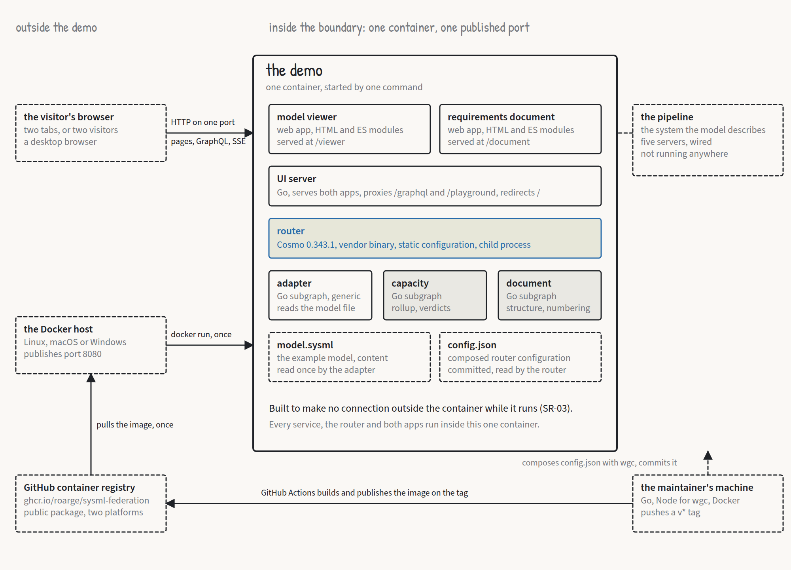
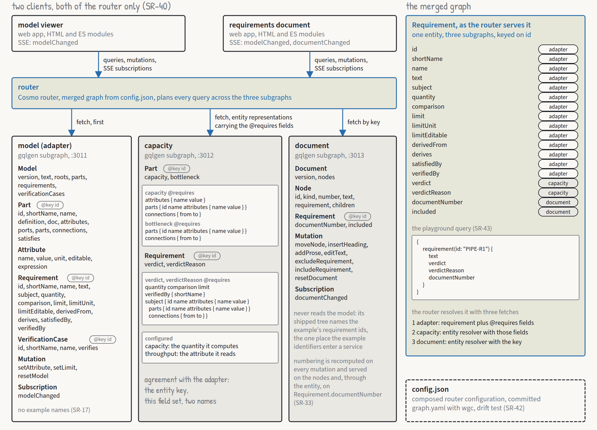
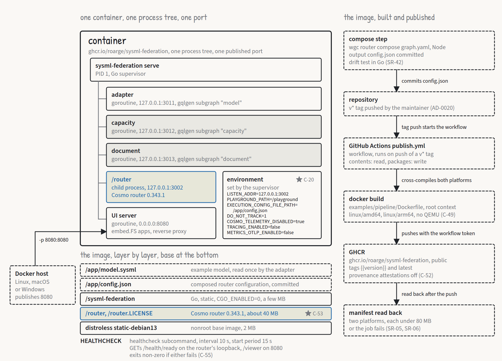

# Five views and twenty-six decisions

*Roar Georgsen, 27 August 2026*

Part 7 of 13 in [Federating a systems model](../README.md), written for release v0.3.0.

> [!IMPORTANT]
> **The story so far**
>
> The demo is a SysML v2 model of a five-server query pipeline, published as one federated GraphQL graph by three services in one container. A capacity analysis and a requirements document are joined to the model by the router that merges the three schemas, and edits from either app land in the model text. Part 6 turned the use cases into requirements. This part is the architecture description that answered them, in five views and twenty-six decision records, and what a later reading against the requirements changed without overturning any decision. At one sitting's length, [The architecture in one sitting](01-the-architecture-in-one-sitting.md) covers the same ground, and [An A3 sheet for a fifteen-minute reader](07-an-a3-sheet-for-a-fifteen-minute-reader.md) is what was cut from it.

## An architecture description for two kinds of reader

I wrote the description for two readers who want different things from it. The entity of interest is the demo: the adapter, the example stack behind it, and the image they ship in. By contrast, the pipeline the example models, with its ingest, parse and index servers, is a system the demo describes, and isn't running anywhere. The description never lets the two blur.

[ISO/IEC/IEEE 42010](https://en.wikipedia.org/wiki/ISO/IEC_42010) supplies the vocabulary: stakeholder, concern, viewpoint, view, decision, rationale. The description follows the standard's concepts "without a claim of conformance", which I think is an honest phrase. The concepts sort the material, and nobody has audited the document against the standard's own requirements.

> [!NOTE]
> **View and viewpoint**
>
> In ISO/IEC/IEEE 42010, a view is one picture of a system drawn for a particular set of concerns, such as what runs where or how a request flows. A viewpoint is the recipe for that picture: which concerns it answers, for whom, and in what notation. Five views of one system can drift apart, so a good description also says how they correspond.

Five stakeholders are named, each with a question, and each pointed at the views that answer it:

- **The visitor** asks whether it launches at all, and whether what it shows is something they wouldn't have believed.
- **The model owner** wants the model to stay the source, and an edit anywhere to land in it.
- **The document owner** wants to shape the document without touching the model, and still see what the model knows.
- **A maintainer or contributor** asks whether it can be read in an afternoon, built with Go alone, and changed one service at a time.
- **An organisation deciding whether the approach fits** asks what the services have to agree on, and what it would have to replace.

That last one is the reason the series exists. The later reading found that the description had promised it an answer and never given one. The answer it gained is the adoption contract stated in [The architecture in one sitting](01-the-architecture-in-one-sitting.md).

A viewpoint definition sits above the views. Each view is a model of one kind, drawn in one notation, with a text form in the description and a board on the canvas. Because five views of one thing can drift apart, the description states how they correspond.

The three subgraphs tie the views together. Each is a GraphQL service that owns part of a merged schema, and they carry the names `model`, `capacity` and `document` into composition. They run as the three goroutines in the deployment view's process tree, listen on the ports that view names, and are the packages `adapter/` and `examples/pipeline/{capacity, document}/` in its layout. The table of who resolves which field is the contract a test guards against drift. Step 5 of the runtime view carries the field sets the capacity service requires between services. In the other views, the adapter view's packages are the adapter's single box.

## The five views

### Context



*The context view draws the demo as one box, and the browser, the Docker host and the container registry as dashed boxes outside it. The boards are collected in the [architecture views PDF](../architecture/architecture-views.pdf).*

Inside the boundary are three subgraphs, one router, one UI server and two web apps. They all run in one container, started by the `docker run --rm -p 8080:8080 ghcr.io/roarge/sysml-federation` that the first release would publish. The router is the process that merges the parts of the schema and plans each query across them.

Outside the boundary are a browser with two tabs (or two browsers), the Docker host, the GitHub container registry the image is pulled from once, and nothing else. The demo is built to make no connection outside the container while it runs, and a demonstration under `--network none` is what shows it.

Two things sit at the edge and are easy to mistake for the inside. The example model file is content the adapter reads, written in the repository and not produced by it. The Cosmo router is a vendor binary copied into the image, and driven only by configuration and environment.

What crosses the boundary is short to list. There are HTTP requests from the browser to one published port, and the image pull. There's also the composition step, and the tags that publish the image, and neither of those runs from the container.

### Composition



*The composition view shows the three subgraphs, which service resolves every field, and the merged graph in which one requirement carries fields from all three.*

The three subgraphs resolve fields that don't overlap:

- The **adapter** resolves everything that comes from the source, plus the three mutations and the model subscription.
- The **capacity service** resolves `Part.capacity`, `Part.bottleneck`, `Requirement.verdict` and `Requirement.verdictReason`, computed on read from the fields it requires.
- The **document service** resolves the document query, the tree of nodes, `Requirement.documentNumber` and `Requirement.included`, plus its seven mutations and its subscription.

The field table behind this list says "resolves" and not "defines". The review asked for that change, because the capacity subgraph declares fields the adapter owns.

Three types are entities, `Part`, `Requirement` and `VerificationCase`, keyed on `id`. An entity key is the field by which the router recognises the same object in two subgraphs. Here it's the SysML short name or, where an element declares none, its qualified name. The <span class="term" data-term="entity-resolver">entity resolvers</span>, generated from the `@key` directives, are the contract between services as it exists in code.


*The three subgraph schemas as columns: the adapter's generic projection, the capacity service's external fields and requires selections, and the document service's tree.*

The adapter's schema is generic and names nothing from the example. Its projection, meaning the set of GraphQL types it publishes from the model, is `Model`, `Part`, `Attribute`, `Port`, `Connection`, `Requirement` and `VerificationCase`. The mutations `setAttribute` and `setLimit` accept any value that is a literal in the source, and refuse the rest with an error naming the element and the reason.

The capacity service's side of the agreement is the interesting part. It carries two configured names, `capacity` and `throughput`, and no other word of the model. Its requires selections read the subject's attributes, its child parts with their attributes, and the connections between them. Part names travel in every selection, because the reason strings name the servers in the cut that limits the flow:

```graphql
capacity: Float
  @requires(fields: "attributes { name value } parts { id name attributes { name value } } connections { from to }")
```

The value types carry `@external` on the fields the selections read and no `@shareable`, which is the shape the vendor documents for nested requires. `VerificationCase` is keyed `resolvable: false`, because the capacity service only reads it. Whether Cosmo composition and <span class="term" data-term="gqlgen">gqlgen</span> accept this exact shape was the first implementation spike, covered in [Five spikes before the first line](09-five-spikes-before-the-first-line.md). The description carries a fallback, `Part.wiring: String`, a JSON document of the children and connections that the capacity service would require instead.

The document service's shipped tree names the example's requirement ids in a configuration file, the one place the example's identifiers enter a service. It never reads the model. A requirement that isn't in its tree isn't in the document. For an id it has never heard of, its entity resolver answers `included: false` and `documentNumber: null`.

Composition merges the three into one schema, in which `Requirement` carries text and limit from the adapter, verdict and reason from the capacity service, and number and inclusion from the document service. A verdict is the capacity service's judgement of one requirement, `PASS`, `FAIL`, `INCONCLUSIVE` or `ERROR`, with a reason string beside it. The query the visitor runs in the playground, against the model requirement `PIPE-R1`, is:

```graphql
{
  requirement(id: "PIPE-R1") {
    text
    verdict
    verdictReason
    documentNumber
  }
}
```

The router resolves it with three fetches. First it goes to the adapter, for the requirement and every field the capacity service requires. Next it calls the capacity service's entity resolver, with those fields as the representation, and last the document service's entity resolver, with the key.

Both the compose input and its output are committed at `examples/pipeline/`, and a Go test compares each schema embedded in the output with the file it came from. The vendor says of this static path that "it is recommended to not use this for production", and the router logs "Not recommended for Production" at every start without a graph token. The demo has no control plane to fetch from, so the static path is the only one. My answer to the caveat is the drift test, plus pinning the router and the compose tool together.

Both apps are clients of the router and of nothing else. The viewer subscribes to `modelChanged`, and the document app to both `modelChanged` and `documentChanged`. Each refetches its whole query on every event. Neither app renders from a mutation's response, and neither computes anything it shows.

### Runtime


*The runtime view follows one edit from the viewer through the router, the adapter and the capacity service to both apps rendering.*

The view is one edit, in seven numbered steps, from a value changed in the viewer through the router, the adapter and the capacity service to both apps rendering. It ends with the viewer's red outline moved off `parse` and on to the index pair, whose combined throughput now bounds the flow. That set is the minimum cut, the smallest set of parts whose throughput bounds the whole, which the demo calls the bottleneck.

[The architecture in one sitting](01-the-architecture-in-one-sitting.md) narrates the sequence, and the variant where nothing moves, and the two seconds the requirement allows bound the whole of it. What the view adds is what the numbered steps leave out.

**A document edit is shorter.** Moving `PIPE-R2` under `PIPE-R1` goes to the document service alone. It reorders its tree, renumbers, increments its version and emits `documentChanged`. The viewer isn't subscribed to document events and does nothing, and the model version is unchanged. That asymmetry is the whole of what the document owner is promised: shape the document without touching the model.

**Reset** from either app is one mutation document with both root fields, `mutation { resetModel { version } resetDocument { version } }`. The router plans the two fields to the two services. Each restores its shipped state, increments its counter and emits its event, and both apps refetch. The apps send both because neither service knows about the other.

**Start-up** has to be right once. `serve` starts the three subgraphs as goroutines on loopback ports and waits for each to answer its health endpoint. Then it starts the router as a child process, waits for `/health/ready` on the router's loopback port, and only then opens the published port. What `/health/ready` reports before the subgraphs answer was a spike, and the ordering doesn't depend on it.

### Deployment



*The deployment view shows one container with one process tree, the three build stages, and the workflow that publishes on a version tag.*

```
PID 1  sysml-federation serve            Go, supervisor, PID 1
  |-- goroutine  adapter        127.0.0.1:3011   gqlgen subgraph "model"
  |-- goroutine  capacity       127.0.0.1:3012   gqlgen subgraph "capacity"
  |-- goroutine  document       127.0.0.1:3013   gqlgen subgraph "document"
  |-- child      /router        127.0.0.1:3002   Cosmo router 0.343.1
  \-- goroutine  ui server      0.0.0.0:8080     static apps, proxy
```

The UI server serves `/viewer`, `/document` and the `/shared` JavaScript the two apps draw on, all from an embedded filesystem. It proxies `/graphql` and `/playground` to the router, and redirects `/` to `/viewer`. A `healthcheck` subcommand probes the router's `/health/ready` on its loopback port and `/viewer` on the published port, and exits non-zero if either fails. The router's health path isn't proxied, so the five paths just named are all the published port serves.

The Dockerfile has three stages:

1. A Go build stage cross-compiles the binary for the target platform.
2. A stage named `router` is the vendor's image at the pinned version, from which `/router` is copied.
3. The final stage is a distroless static base running as nonroot. Into it go the router binary, the demo binary, the committed configuration and the model file.

The router's licence is fetched at build time from the vendor's repository, at the pinned tag and with a pinned checksum, so it can't drift from the binary's version. Whether `COPY --from` of a multi-platform image resolves the target platform's binary was a spike. The router is about 40 MB compressed, the demo binary a few MB and the base 2 MB, against a budget of 80 MB.

Publishing runs on a pushed `v*` tag. It builds `linux/amd64,linux/arm64` by cross-compilation with no <span class="term" data-term="qemu">QEMU</span>, and pushes under the <span class="term" data-term="semver">semver</span> version alone. Then it reads the manifest back, and fails the job if either platform is missing or over budget. `latest` moves onto the measured image only once both platforms have passed, and only for a version with no pre-release suffix.

### The adapter


*The adapter view is a pipeline of four packages, with the patch path from a mutation back to the syntax tree.*

```
files --> lexer --> parser --> AST with spans --> resolver --> projection --> gqlgen
                                   |                              ^
                                   +---- patch literal at span ----+   (setAttribute, setLimit)
```

**`syntax`** turns the text into tokens, and the tokens into a tree in which every node carries its byte range in the source. It accepts a strict subset of the textual notation, listed construct by construct, and refuses anything else with the file, line and column of the first offending token. It has no opinion about meaning.

**`model`** resolves names: qualified names, short names, and feature chains through a requirement's subject and its part usages. It evaluates the bound expressions the subset allows, which are a literal with an optional unit, a feature chain, the four arithmetic operators and parentheses. That's exactly enough to bind the derived limits to `PIPE-R1`'s. It reads the shape of every `require constraint` into a quantity, a comparison and a limit, checks port directions against connection end order, and keeps the source text with an index from every numeric literal to its span.

`Patch(span, newLiteral)` replaces the text and re-parses, so the served text and the projection are rebuilt together and can never disagree. The spans are what make editing possible without the adapter holding a second representation of the model.

**`projection`** maps resolved elements to the schema's types, and holds nothing the schema doesn't show.

**`serve`** is the gqlgen server with WebSocket subscriptions, the entity resolvers, the store that hands each operation one snapshot of the current model, and the version counter. The store increments that counter on every accepted mutation and on reset.

A second fixture model with other names and wiring is part of the adapter's tests. The escape hatch left open for coverage to grow into, a generic type for elements nobody has projected yet, isn't built in this phase. A construct outside the subset is refused instead of being served generically, which is the smaller first cut.

A subset parser can't prove that a file is valid SysML. So the example model is checked before it becomes a fixture, locally and never in CI, against the <span class="term" data-term="pilot-implementation">OMG pilot</span> release 2026-07 and the <span class="term" data-term="opensysml">OpenSysML</span> command line at 0.2.1. OpenSysML v0.6.0 accepted the same file again on 12 September.

## Twenty-six decisions

The records are in the Nygard form: context, decision, alternatives, consequences, requirements affected and sources. All twenty-six were accepted. Twenty-four were written from decisions already taken in the brief, the plan and the engineering log. Two more came after the traceability showed six requirements with no decision behind them. The document owning its structure, and the viewer's form, were real decisions that had never been recorded.

They're indexed at [docs/decisions](../decisions/README.md), which lists thirty-one by release v0.3.0. Of the five after the first twenty-six, two were written while the system was built. The other three came in September, with the demo's own model, model validation in CI and the check session.

The twenty-six fall into five groups.

**The shape of the system**, six records:

- The model, the analysis and the document structure are three independently owned subgraphs behind one router, and no service reads another's data. That's [federation over a single service](../decisions/AD-0001-federation-over-single-service.md).
- The platform is [Cosmo](../decisions/AD-0002-cosmo-as-platform.md), pinned to router 0.343.1 and a matching compose tool, and run from a static execution configuration with no control plane and no graph token.
- Everything ships as [one binary, one process tree and one port](../decisions/AD-0011-one-binary-one-port.md), with the router run as [a child process from the copied binary](../decisions/AD-0010-router-as-child-process.md).
- Composition is [a maintainer step whose output is committed and tested for drift](../decisions/AD-0012-composition-committed.md).
- The router's [telemetry is disabled by environment baked into the image](../decisions/AD-0013-telemetry-off.md).

**The analysis**, five records:

- The example's capacity arithmetic is [idealised](../decisions/AD-0006-idealised-capacity-model.md), with no queueing, balancing or latency, and says so.
- Rollup is [maximum flow, with the source-side minimum cut](../decisions/AD-0007-rollup-as-maximum-flow.md) as the bottleneck.
- A requirement's [quantity, comparison and limit are read from its constraint](../decisions/AD-0008-quantity-from-constraint.md), and declared nowhere else.
- [Connection direction comes from the order of the ends](../decisions/AD-0009-connection-direction.md) in the `connect` statement, and the adapter refuses to start on a connection whose ends face the wrong way.
- Every verdict reason is built from [fixed templates in the capacity service](../decisions/AD-0024-reason-templates.md).

[From use cases to requirements](05-from-use-cases-to-requirements.md) treats the capacity model in full.

**The adapter**, six records:

- It [reads files instead of fronting a repository](../decisions/AD-0003-adapter-reads-files.md), and a counter that only grows stands in for commits.
- Value edits arrive as three mutations and are applied by replacing a literal at its span, which the record calls [editing as scaffolding](../decisions/AD-0004-editing-as-scaffolding.md).
- The model is published through [a curated generic projection](../decisions/AD-0005-curated-generic-projection.md), and not through types generated from the metamodel.
- The parser is [hand-written and accepts a strict subset](../decisions/AD-0015-hand-written-subset-parser.md).
- Elements are identified by [short names, with the qualified name as fallback](../decisions/AD-0018-short-names-as-keys.md).
- The target is [SysML 2.0 formal, validated with the pilot and OpenSysML](../decisions/AD-0019-sysml-2-0-target.md).

**The two apps**, four records:

- Subscriptions carry nothing but [a version number](../decisions/AD-0014-version-events.md), and each app refetches on the event.
- Both apps are [plain HTML, CSS and native modules with one vendored file](../decisions/AD-0017-vanilla-web-apps.md), with no build step and no node_modules.
- [The document owns its structure and nothing else](../decisions/AD-0025-document-owns-its-structure.md), an ordered tree of heading, prose and requirement nodes numbered from the tree alone.
- [The viewer shows the model's text beside a sketch of its wiring](../decisions/AD-0026-viewer-shows-text-and-wiring.md). The index marks it as amended, because the editable numbers moved to a panel above the model text. The record kept its number and its first date, and the amendment is dated at its head.

**The repository itself**, five records:

- [Generated code is exempt from the empty-interface rule](../decisions/AD-0016-generated-code-exempt.md), and every hand-written file stays under it.
- [The image is published by a tag-triggered workflow](../decisions/AD-0020-publish-on-tags.md).
- [The Markdown description is the record, and the A3 sheets are the overview](../decisions/AD-0021-architecture-record.md).
- Two test helper packages under `internal/` are [tracked as ordinary Go packages](../decisions/AD-0022-track-internal-helpers.md), so that tracked tests may import them.
- The artefacts are numbered under [a light scheme](../decisions/AD-0023-light-requirements-scheme.md), where a number is never reused and a replaced decision gets a new one.

The traceability was regenerated with a decision column, plus a table from records back to requirements. Every one of the forty-five requirements is affected by at least one record.

## What the review changed

Nothing the reading found overturned a decision, and every fix was local. That tells me the decisions had settled before the description was drawn. What changed were mechanisms, three of them:

- The reason strings name the servers in a cut, so the requires selections gained `name` beside `id`, and the capacity subgraph declares `Part.name` external.
- The licence moved from a copy out of the image to a checksummed fetch, which needs no allowlist rule.
- The router's health check moved off the published port.

<details markdown="1">
<summary>Under the bonnet: smaller settlements from the same reading</summary>

- `VerificationCase` is keyed non-resolvable.
- gqlgen's `explicit_requires` was chosen, and `preloaded_requires` excluded because it rejects nested fields.
- A non-numeric literal is refused at parse time, so the capacity service's `ERROR` case covers only missing or negative values.

</details>

The additions are what a systems engineering reader expects. In them, the description gained viewpoint definitions, a statement of how the views correspond, and the paragraph on what an adopting organisation agrees to and replaces. The field table gained the rows it had left out: the query roots, ports and connections. Now the description states the document service's limit, and defines its answer for an unknown id.

The records went through a reading of their own against the sources. It corrected misattributions. Among them were an inverted reading of the router's compatibility rule, and a claim that the whole capacity service is a few dozen lines when only the flow algorithm is. Another was an unsourced reason for leaving the escape hatch open.

A final reading set the twenty-six records against the revised description, the traceability and the six boards. It found record sentences still carrying the earlier design, and two boards out of step.

<details markdown="1">
<summary>Under the bonnet: what the final reading corrected</summary>

In the records:

- the health check going through the published port
- the licence copied, not fetched
- conditional wording on the `internal/` additions
- reset as one mutation per service
- a stale count of the records themselves

On the boards, the composition board's requires field sets lacked the part names the revision had added, and the overview board filed the deciding organisation under the context view and not under composition.

</details>

All of it was corrected. After that, every reference anywhere in the set resolves.

## The canvas

There are six boards: an overview and one per view. I drew the first two with the description, and the other four from it after the review, each checked against the text. They share one legend:

- plain ink for a component of the demo, named with its type and technology
- a shaded box for one owned by the example and not the adapter
- blue for the router and what is shared through it
- a dashed outline for something outside the demo
- red for a failing requirement or a bottleneck, and nothing else

Arrows are labelled and point one way. In the final pass, the blue tint of the boxes was brought into line with the legend's swatches.

---

Previous: [From use cases to requirements](05-from-use-cases-to-requirements.md) · Index: [Federating a systems model](../README.md) · Next: [An A3 sheet for a fifteen-minute reader](07-an-a3-sheet-for-a-fifteen-minute-reader.md)
