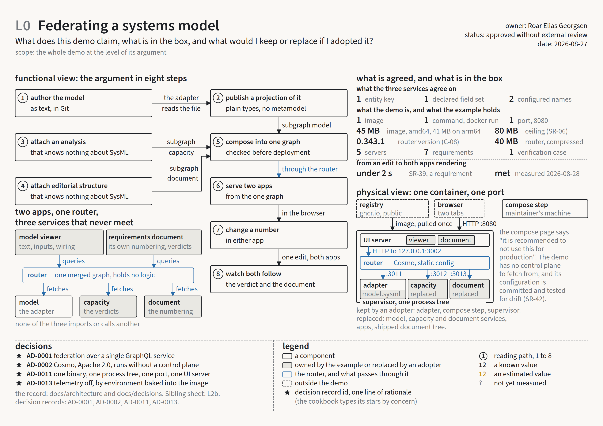
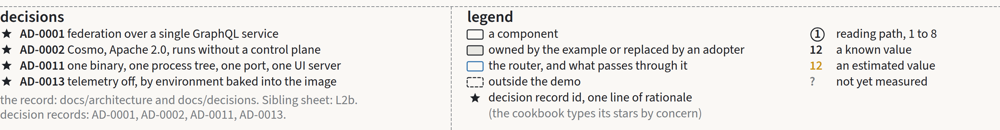
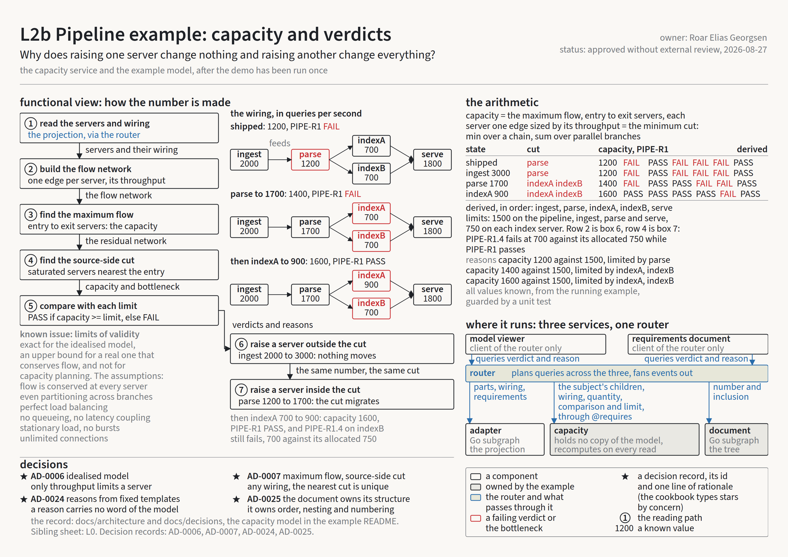

# An A3 sheet for a fifteen-minute reader

*Roar Georgsen, 27 August 2026*

Part 8 of 11 in [Federating a systems model](../README.md).

The demo takes a SysML v2 model, a capacity analysis and a requirements document, publishes each as a GraphQL subgraph (a service that owns part of one shared schema), composes the three into one graph and serves two web apps from it through a router (the one endpoint that plans a query across the subgraphs and merges their answers), all from one container. [The architecture in one sitting](01-the-architecture-in-one-sitting.md) describes it for someone who will build or change it.

## Who the sheet is for

An engineering manager, or a systems engineer new to federation, deciding in a quarter of an hour whether the approach deserves a closer look. That reader is not going to open an architecture description with [five views and twenty-six decision records](06-five-views-and-twenty-six-decisions.md). What they need fits on one sheet of paper, which is why the design phase made [the Markdown description the record and the A3 sheets the overview](../decisions/AD-0021-architecture-record.md). When the design changes, the description changes first and the sheet at its next re-issue, so a sheet may lag and its status says so.

The top sheet condenses the argument the project makes for itself, which [Why federate a systems model](00-why-federate-a-systems-model.md) sets out at length, and the decision accepts that overlap on purpose. The article is prose for a reader at a desk. The sheet is for a meeting.

## The method, its rules and its recommendations

The format is the A3 architecture overview of Borches and Bonnema, developed at Philips Healthcare on an MRI scanner and published from the University of Twente. Borches found that readers came to meetings having read the A3 when they had not read the equivalent text document. His [cookbook](https://www.gaudisite.nl/BorchesCookbookA3architectureOverview.pdf), a draft of December 2009 that is itself an A3 overview, holds most of the rules, and the [2010 symposium paper](https://web.mst.edu/~lib-circ/files/Special%20Collections/INCOSE2010/A3%20Architecture%20Overviews.pdf) argues the method.

The design keeps what the cookbook fixes apart from what it recommends. Fixed are one system aspect per sheet, a model side with a summary side (models without supporting text ended up buried in other documents), the order of the summary side's sections, at most five colours plus shading since people will not remember more, and type at 30, 18 and 14 points on A3. Formal modelling notation is ruled out, since in Borches' SysML experiments the notation took most of each meeting. Condensing is validated when nothing has been added and nothing removed. And a sheet cannot hold everything its author knows about the topic, so the author should not try.

Everything else the cookbook offers is adopted as a recommendation: where each view sits, the visual aid beside the functional view, a legend, decisions marked as stars, and a numbered reading path. Its own template labels the summary side the front and the model side the back, the reverse of how the layout rules are usually summarised. The design steps around that by calling them the model side and the summary side, saying nothing about which is printed first.

Two things come from later practice rather than from Borches: the hierarchy of an L0 context sheet, an L1 technical overview and L2 topic sheets, which Pesselse and others settled on at Mercedes-Benz in 2019 after Muller in 2015 and Viken and Muller in 2018, and the reading time of ten to fifteen minutes that Bergtun and Engen measured on industry readers in 2025. Where the cookbook types its stars by concern, the design simplifies a star to a decision record id and one line of rationale, and the legend says so.

## Four sheets on three levels

Each sheet has a goal question its reader should be able to answer afterwards. L0, Federating a systems model, for an organisation deciding: "What does this demo claim, what is in the box, and what would I keep or replace if I adopted it?" L1, Three subgraphs, one graph, for a developer evaluating it: "What do the three services agree on, and what happens when a number changes?" L2a, Adapter: projecting SysML v2, for one extending it: "How does a model file become a subgraph, and where does the adapter stop?" And L2b, Pipeline example: capacity and verdicts, for anyone who has run the demo: "Why does raising one server change nothing and raising another change everything?"

Four sheets on three levels sits inside Borches' one to five per aspect, far below the forty to sixty he estimated an MRI scanner would need. L0 and L2b were drafted first, because they carry the argument and the memorable moment.

Every sheet keeps both sides, although the research records readers who wanted no summary side and practitioners who shipped one-sided sheets with a linked page. The summary side is where a sheet points back to the record, names who is responsible and carries the concerns table. A sheet that does none of those is a poster.

## The model side

A3 landscape at 1587 by 1123 px. A title band carries the sheet id and title, the goal question, a scope line in pencil, and on the right the sheet's owner, status and date. The functional view takes the left 58 per cent: verb plus noun boxes joined by labelled arrows, at most nine, each with a circled reading-path number and one line of text. Where the flow leaves room in that column sits the visual aid, a picture the reader recognises and never notation, though one small snippet of code or schema is allowed. The right column holds quantification above the physical view, a formula and a table of values marked by confidence over components with interfaces labelled by protocol and port. Decision stars run along the bottom of the functional column, a references footer under them, and the legend bottom right.

Type is Source Sans 3 throughout, and nothing is below 19 px, the cookbook's 14 point floor with no exception for legends or labels. Elsewhere in this series the diagrams use a handwriting face for their titles, because they are sketches for a maintainer. The sheets are read by engineering managers, and the research records a customer who asked for standardised illustrations rather than hand-drawn ones, so the sheets drop the handwriting. The same research records readers who preferred life-like figures, so which style suits a code-repository audience is untested.

Colours are five plus shading: ink, pencil, blue for the router and whatever passes through it, red for a bottleneck or a failing verdict, the capacity service's judgement that a requirement's limit is not met, and amber for an estimate, over paper with shade for shading. The cookbook codes confidence as blue for known, orange for estimated and red for unknown. Since blue here already means the router and red a failure, the design recodes it: a known value is ink, an estimated value amber, an unknown value a pencil question mark. A requirement's bound, such as the two seconds from an edit to both apps rendering, is neither, and shows in ink with its id, the measured value beside it a question mark until one exists. The legend says so on every sheet.

## The summary side

Text in the cookbook's order, eleven sections in two columns: definitions, introduction, system partition, the functional and physical views as paragraphs, a concerns table with the cells it does not address hatched in pencil, key parameters and requirements, an owner block naming who is responsible and who has read the sheet, design strategies with assumptions and known issues, a roadmap, and references. The cookbook's remark is that the size of the text boxes does not matter but the order does.

## L0, the argument in eight steps

*The L0 model side: the argument as eight numbered boxes on the left, the agreement and the box's contents top right, the container bottom right. The whole sheet is [L0, Federating a systems model](../a3/L0-federating-a-systems-model.pdf).*

The reading path is [the argument for federating a systems model](00-why-federate-a-systems-model.md) in eight boxes. Author the model as text, in Git. Publish a projection of it, plain types and no metamodel (a projection is the curated set of GraphQL types the adapter derives from the model). Attach an analysis that knows nothing about SysML. Attach editorial structure that knows nothing about it either. Compose the three into one graph, checked before deployment. Serve two apps from the one graph. Change a number in either app. Watch the verdict and the document follow. The visual aid is the overview sketch: two apps, one router, three services that never meet.

Quantification marks every value's confidence. The agreement between the services is one entity key (the field by which the router recognises the same element across subgraphs), one declared field set and two configured names, all known. The demo is one image, one command, one port, about 40 MB compressed for the router and under 80 MB in all, the latter amber until measured. The example is five servers, seven requirements and one verification case, and the two seconds from an edit to both apps rendering is a requirement in ink with a question mark beside it.

The physical view is the container as one box with the three subgraphs, the router and the UI server inside, the browser and the registry outside. What an adopter keeps (the adapter, the compose step, the supervisor) is shaded and what it replaces (the model, the example services, the apps, the shipped document tree) is hatched. Four decisions are starred: [federation over a single GraphQL service](../decisions/AD-0001-federation-over-single-service.md), [Cosmo as the platform](../decisions/AD-0002-cosmo-as-platform.md), [one binary, one port, one UI server](../decisions/AD-0011-one-binary-one-port.md), and [telemetry off by baked-in environment](../decisions/AD-0013-telemetry-off.md).

Beside the router box, in pencil, sits the vendor's caveat with the demo's answer, a note every public description of static composition in this project has to carry. The compose page says "it is recommended to not use this for production". The demo has no control plane to fetch from, and its configuration is committed and tested for drift.

*The bottom of L0: four stars with one line of rationale each, the footer that keeps the corner full, and the legend where the confidence code differs from the cookbook's.*

## L2b, how the number is made

*The L2b model side, from [L2b, Pipeline example: capacity and verdicts](../a3/L2b-pipeline-example-capacity-and-verdicts.pdf): seven boxes on the left, the wiring in three states beside them, the arithmetic and its four-row table top right.*

Seven boxes. Read five servers and their wiring from the projection. Build the flow network. Find the maximum flow, which is the capacity. Find the source-side minimum cut, the saturated servers nearest the entry, which is the bottleneck. Compare against each requirement's limit to get the verdicts. Raise a server outside the cut, and nothing moves. Raise a server inside the cut, and the cut migrates. The visual aid is the wiring with its numbers in each state of the worked example, and the capacity model behind it is explained in [From use cases to requirements](05-from-use-cases-to-requirements.md).

The quantification block gives the formula in words, capacity is the maximum flow, equal to the minimum cut, min over a chain and sum over parallel branches, then the worked example as a four-row table: the shipped state, the ingest raise that changes nothing, the parse raise that moves the cut, and the indexA raise that makes the pipeline pass. Each row carries the cut, the capacity, the verdict on the model requirement `PIPE-R1` and the five derived verdicts in server order. The numbers are the ones in [From use cases to requirements](05-from-use-cases-to-requirements.md), which owns the capacity model, and the sheet takes them from the running example rather than restating them from anywhere else.

`PIPE-R1` has a limit of 1500, allocated to five derived requirements, one per server, 1500 on the serial path and 750 for each index server. The second row of the table is box 6 and the fourth is box 7. In that last row `PIPE-R1.4` still fails, indexB at 700 against its allocated 750, while `PIPE-R1` passes at 1600, which is what the document's shipped prose paragraph explains. All the values are known, none estimated.

In the physical view the capacity service sits beside the adapter and the document service, the router between them and the two apps above. The router carries the subject's children, wiring, quantity, comparison and limit to the capacity service through `@requires`, and the capacity box says "holds no copy of the model, recomputes on every read". Starred: [an idealised capacity model](../decisions/AD-0006-idealised-capacity-model.md), [rollup as maximum flow with the source-side minimum cut](../decisions/AD-0007-rollup-as-maximum-flow.md), [verdict reasons built from templates](../decisions/AD-0024-reason-templates.md), and [the document owning its own structure](../decisions/AD-0025-document-owns-its-structure.md). The known-issues slot carries the limits of validity: exact for the idealised model, an upper bound for a real one that meets the assumptions, and not for capacity planning.

## Production, and the review that shaped it

Each sheet is drawn as one SVG with a `viewBox` of 0 0 1587 1123 and literal colour values, not stylesheet variables, so the drawing lifts out unchanged and the PDF exported from it, which is what is published, prints as one true A3 page. Fonts are the production risk. Source Sans 3 loads from Google Fonts, which GitHub's SVG rendering cannot fetch, so a sheet viewed there would reflow in a fallback face and lose its fit. An SVG published beside a PDF will have to embed the face or convert its text to outlines. Whether `oklch()` colours survive the export is checked on the first one.

Numbers on a sheet are of three kinds, and the summary side says which each is. A requirement or a constraint, such as the two seconds, the 80 MB or the expected 2750 lines of hand-written Go under the adapter, cites its id, and so does a fact about the vendor, such as the 40 MB router image. Numbers from the running example are guarded by a unit test that reads the shipped model through the adapter, runs the rollup and checks every number in the L2b table against the SVG, so a change to the example fails a test before it silently dates the sheet. The capacity service's own tests would not catch it: they build their representations by hand and never read the model file.

The sheets reuse the cookbook's layout rules and none of its artwork, whose licence is unverified, which the [sheet index](../a3/README.md) records against each sheet.

Reading the design back against the research and the record is where most of what reads above as a careful distinction comes from. The method paragraph had presented the cookbook's placements and the L0, L1, L2 hierarchy as rules, where the research records the first as guidance and the second as later practice, and had missed that the cookbook's template calls the summary side the front. L2b's worked example gained its fourth row, the ingest-to-3000 state that box 6 needs, and its derived verdicts. L0 gained the demo's answer beside the vendor's quote. The safeguard on the numbers had been left to the capacity service's tests.

Beside the method's own test of the condensing sits the reader's test: a reader of the kind the sheet names as its audience answers its goal question in fifteen minutes without the record. A public repository maintained by one person has none of the two-to-four-week review loop that every published case ran, so the mechanism is an issue template asking such a reader for the answer and the time it took. A sheet is finished when it answers its goal question, and it ships at that point rather than waiting, because the method's documented failure mode is a sheet that is never finished at all. What the issue template collects afterwards is what sends a sheet back for re-issue.

Both drafted sheets are published on those terms, approved without external review, and the sheet index says so in the status column. L1 and L2a follow the first implementation phases, once the schemas and the projection stop moving.

---

Previous: [Five views and twenty-six decisions](06-five-views-and-twenty-six-decisions.md) · Index: [Federating a systems model](../README.md) · Next: [Planning the build](08-planning-the-build.md)
