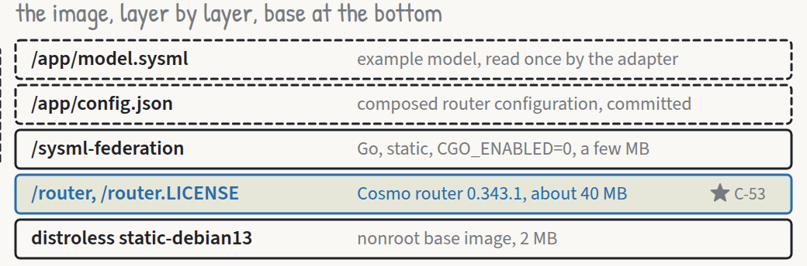

# Planning the build

*Roar Georgsen, 27 August 2026*

Part 9 of 11 in [Federating a systems model](../README.md).

The demo is a SysML v2 model of a five-server query pipeline, served as one subgraph of a federated GraphQL graph beside a capacity service that computes where the pipeline's bottleneck sits and a document service that owns an editorial ordering of its requirements, the whole thing shipped as one container image. A subgraph is a GraphQL service that owns part of a shared schema, and the router is the process that composes the subgraphs into one graph and answers queries against it. [The architecture in one sitting](01-the-architecture-in-one-sitting.md) walks through the parts. This article is about the plan that turns the design record into code, and the decisions the plan had to take that the record had left open.

## From record to plan

The design phase ended with the fourth gate approved, twenty-six decision records accepted and an architecture description that names every type, every field and every process. What it did not have was a sequence of tasks. The plan had to be detailed enough to implement from without re-deciding anything, and it opens on the finish line: "Build the pipeline demo the design phase specified: a generic SysML v2 adapter subgraph, a capacity service, a document service, two vanilla web apps and a Cosmo router, shipped as one container image launched by one `docker run`", with each of the forty-five requirements verified in the way its own text says.

The stack was already fixed by the records and the plan restates it in one line. Go 1.27 with the toolchain pinned locally. gqlgen 0.17.94 for the three subgraphs, with federation v2 and WebSocket subscriptions over the `coder/websocket` package gqlgen already requires. WunderGraph Cosmo router 0.343.1 as the child process, and wgc 0.130.1 as the composition tool that runs only on the maintainer's machine, since [composition is a maintainer step with committed output](../decisions/AD-0012-composition-committed.md). The two web apps are vanilla ES modules with one vendored file, SortableJS 1.15.7, which is the whole of [the vanilla web apps decision](../decisions/AD-0017-vanilla-web-apps.md). The image builds on a distroless static base and is [published to GHCR by a tag-triggered workflow](../decisions/AD-0020-publish-on-tags.md).

The plan has three layers. A top-level document carries the global constraints, the working method and one line per task. One detail document per phase carries the full text of each task: every file, every test, every command and the output it should print. A coverage map closes the set by listing every requirement and constraint against the task that meets it and the test or demonstration that verifies it. The top-level document and the one task in hand are enough to build from.

## Five phases, one pull request each

Before the five phases of building there is a phase zero, on its own branch and its own pull request like every other one, which changes the repository's policy and settles the spikes. The allowlist `.gitignore` gains rules for the test helpers, the gqlgen configuration, the web app sources, the vendored licence, the composed router configuration and the NOTICE file, each proved with `git check-ignore`. The Makefile gains `generate`, `compose`, `image` and `run` targets, and the empty-interface rule stops reporting generated files, as [the generated code decision](../decisions/AD-0016-generated-code-exempt.md) says. Then come the five spikes the architecture names. Two concern the model and the graph: the ports and connections syntax quoted from the OMG training material and checked in the example model's own shape, and a nested-list `@requires` composed and served through the router into gqlgen. Three concern the container: whether the router starts from environment variables alone on a distroless image and what its readiness path proves when the subgraphs are down, whether a `COPY --from` of the multi-platform router image resolves the target platform, and whether the container reaches anything outside itself under `--network none`. The first four run ahead of any code that depends on them. The fifth needs the built image and waits for Phase 5. A spike that fails switches the plan to the fallback the architecture names for it, and the switch is recorded before the next phase starts. [Five spikes before the first line](09-five-spikes-before-the-first-line.md) has the outcomes.

The example model and the adapter core come next: the lexer with byte spans, the AST, the structural parser, expressions with precedence, port definitions, connections, requirements and verification cases, and then the model package that projects the AST onto the types the schema shows. Phase 1 closes the ten requirements on the adapter. They run from the generic projection, the plainly typed set of GraphQL types the adapter serves in place of the metamodel, proved against a second fixture model, through refusal of unsupported syntax, connection direction and short names as identifiers. Edits patch the source, expression-bound values are evaluated and read-only, invalid values are rejected, and the reference tools accept the model. The phase ends with the second fixture, a warehouse model with other names and wiring, and the walk that proves no identifier from the example appears in the adapter.

Phase 2 builds the three subgraphs and composes them. The capacity service gets its `flow` package first, [the rollup as maximum flow with the source-side cut](../decisions/AD-0007-rollup-as-maximum-flow.md), the cut being the set of servers whose combined throughput bounds the pipeline, which is what the demo calls the bottleneck. A differential test checks the result against the naive minimum and sum. Then the verdict precedence and every reason template, a verdict being the capacity service's judgement on one requirement, PASS, FAIL, INCONCLUSIVE or ERROR. The gqlgen schema and the entity resolvers follow. The document service gets its `tree` package with dotted-decimal numbering, then its service with WebSocket subscriptions. The adapter gets its schema, its store and its server. The phase closes with the committed router configuration, the drift test that fails if a schema file and the composed configuration disagree, a loopback test, a WebSocket composition test and the isolation test that proves document operations leave the model's version alone. Seventeen requirements close here, more than in any other phase.

With the subgraphs composed, Phase 3 brings the supervisor, [one binary, one process tree, one port](../decisions/AD-0011-one-binary-one-port.md). The `serve` subcommand runs the subgraphs as goroutines and [the router as a child process](../decisions/AD-0010-router-as-child-process.md), and a UI server serves both apps and proxies the router on the one published port. The tests need neither Docker nor the vendor's binary. The phase's second task is a set of demonstrations against the running stack with the router extracted from the pinned image: the four paths, one query across three services, a version event over server-sent events, refusals through the router, the playground, a clean stop on SIGTERM, a restart, and an inspection of imports that proves the services share no code.

Phase 4 replaces the placeholder pages with the two apps and the shared client module: the viewer with its tokeniser, its sketch drawn from the wiring, its edit panel and its requirement blocks with their verdicts and reasons, the document app with its numbered tree, drag and drop, headings and prose, exclude and restore and its current value and limit inputs, and NOTICE and the vendored licence beside them.

Phase 5 builds the image. Cross-compiled Go, the router copied from the pinned image, the licence fetched by `ADD --checksum`, a nonroot distroless base and a `HEALTHCHECK`. The publish workflow runs on `v*` tags and reads the manifest back, failing if either platform's image exceeds 80,000,000 bytes. The example's documentation is completed, the air-gap run happens, `v0.1.0` is tagged, and the last requirement, that one command runs the demo, is verified from a logged-out host.

*The layers of the shipped image, from the distroless base through the router binary to the supervisor and its embedded apps. Cut from the [architecture views](../architecture/architecture-views.pdf).*

## The working method

Test first, with the test as the specification. A new implementation file never appears in a package that has no test yet, and every task creates the test file before the implementation file. The tests use the two tracked helper packages, [assert and tabletest](../decisions/AD-0022-track-internal-helpers.md), rather than a library that takes the empty interface throughout, and a test that verifies a numbered requirement is named for it.

`make check` after every task: toolchain, formatting, vet across five operating system and architecture pairs, lint, the race detector and the tracked-files check. `make preflight` before every push adds a 70 per cent coverage floor. Every task ends with one commit. Every phase ends with `make preflight` green, a push, a pull request whose body lists the requirements the phase satisfies, a merge, one entry in the engineering log, and the next branch cut from `main`. Each phase is reviewed against its tasks and the requirements it claims before it merges.

Requirements verified by demonstration have checklists in the tasks, fourteen items for the viewer and twelve for the document app, and their outcomes go into the example's verification record with the date and host. The end-to-end proof is the worked example of [the capacity model](05-from-use-cases-to-requirements.md) observed through the router and both apps: the shipped state fails at parse, raising ingest to 3000 changes nothing, raising parse to 1700 moves the bottleneck to the index pair at 1400, raising indexA to 900 passes at 1600 while the model requirement `PIPE-R1.4` still fails, then from the shipped state again the limit of `PIPE-R1` dropped to 1000 lets the same 1200 pass, a reorder in the document leaves the model's version at 1, and Reset from either app restores the shipped state within two seconds.

The plan carries line figures, because the constraint that the adapter be readable in an afternoon means little unless somebody counts. The first estimate for hand-written Go under `adapter/` was 2000 lines: 800 for `syntax`, 650 for `model` and 550 for `projection` and `serve` together. When the detail document for Phase 1 had every file's text written out in full, the mandated text measured about 1261, 932 and 389 lines, and the figure was revised to 2750, split 1300, 1000 and 450, from the measured counts plus a margin. The two example services get 600 lines each, the supervisor 700, and each web app 900 lines of JavaScript and 300 of CSS, with the shared client counted against the document app. Tests and generated files are outside the figures.

Having to revise the figure as soon as the real text existed settled what kind of number it is. These are estimates of the expected scale rather than limits. Correctness comes first, a component that needs more lines to be right takes them, and the figure is then revised to what the work turned out to be. The counts are still measured and reported at each phase close, because the scale is worth seeing, but nothing is trimmed and no fix is refused to stay under one. A figure written as a limit reaches for the wrong things first, since the cheapest lines to give up are the doc comments, the positioned refusals and the guards that make a refusal honest, which are the parts a reader in an afternoon most needs.

## Decisions the plan made

A plan detailed enough to implement from has to decide things the design record did not, and it has to say so rather than bury them in task text. The adapter core fixed fourteen, the subgraphs ten, the supervisor six and the web apps nine, most of them at the head of the phase's detail document with a reason.

The abstract shared definition in the example model is `Component`, not `Node`. The merged graph already has a `Node` type from the document service, and the viewer draws nodes, so `Component` collides with nothing in any schema. Port direction is carried by directed items inside the port definitions, `in item queries : Query` in the input definition and `out item queries : Query` in the output one, which is the shape the language itself gives ports, rather than the conjugation operator or a direction prefix on the usage. The port names are `input` and `output` because `in` and `out` are reserved words. A port usage's projected direction is derived from its definition's items. This is how [connection direction from the order of the ends](../decisions/AD-0009-connection-direction.md) is realised in text.

The model declares its own millisecond. The shipped library declares seconds, minutes, hours and days as duration units and no `ms`, so the example carries an `<ms>` declaration copied from the library's own pattern for the millimetre. If a validation tool's own library declares `ms`, the line is deleted and nothing else changes.

A model is immutable once built. Patching a literal returns a new model with the version incremented, and the store swaps a pointer. That is what keeps a query from ever observing the text and the projection disagreeing under concurrent reads. The projected types are `Model`, `Part`, `Attribute`, `Port`, `Connection`, `Requirement` and `VerificationCase`, the set [the curated projection decision](../decisions/AD-0005-curated-generic-projection.md) chose over generated metamodel types.

The constraint operand order is free. [The constraint shape](../decisions/AD-0008-quantity-from-constraint.md) fixes that a requirement's quantity, comparison and limit are read from its constraint, but it does not fix which side the subject sits on, so the parser accepts either and flips the comparison when the subject-rooted chain is on the right. The warehouse fixture writes it the other way round on purpose. Identifiers follow [the short-name decision](../decisions/AD-0018-short-names-as-keys.md): the short name if declared, else the qualified name, with duplicates refusing the model. Sum types in the AST are typed slices per member kind everywhere except expressions, where one small named interface with three implementations does the work, and both packages panic internally with a typed error and recover at their one entry point, which the plan reckons saves roughly 120 lines of error plumbing.

On the federation side, gqlgen is pinned as a tool directive in `go.mod` and its generated files are committed, so continuous integration needs no generator. The capacity service uses gqlgen's explicit requires strategy, the only one documented to support nested and array fields, and its two populate functions carry the only two permitted empty-interface lines in the hand-written code, taking the tracked baseline from 2 to 4 with the justification in the pull request. Pure code lives in `flow` and `tree` sub-packages beside the generated code, because the generated enum is also called `Verdict` and the generated document type is also called `Node`. The adapter's store owns the version counter, setting it on every accepted mutation and on reset, so the counter only ever grows across a reset, whatever version a fresh parse of the text would carry. Every operation takes a snapshot of the current model, so one query never mixes two versions. Excluding a requirement that has children promotes the children into its place, and restoring it puts it back childless as the last child of its former parent.

The largest departure is in the viewer. [The viewer decision](../decisions/AD-0026-viewer-shows-text-and-wiring.md) said the editable numbers would appear as inline inputs at the literals' positions in the text pane. The projection carries each attribute's editability, value and unit but no source spans, so an inline input could only be placed by a client-side search for the literal by part name and attribute name, which is a second and weaker parser of a syntax the adapter has already parsed. And it cannot work at all for a requirement's limit, because the limit attribute's name is not projected. The plan puts the editable literals in a panel above the text pane, one control per projected field the adapter marks editable, and the served text still shows the edited number where the literal was, because the adapter patches it. I still think the panel is the right call for a demo whose point is the model text, and the record is due for amendment when the apps ship.

*The adapter's packages, from the source text through the parser and the model to the served projection.*

## Validation tools

The requirement that the reference tools accept the model is served by two of them, and [the decision on the language target](../decisions/AD-0019-sysml-2-0-target.md) fixed them: the OMG pilot implementation, release 2026-07, run in batch on Java 21, and the OpenSysML command line at version 0.2.1 with strict validation. Both are installed once in Phase 0 and run on the probe model and then on both fixtures. A third tool, a commercial validator, was considered and dropped on its licence terms. Validation runs locally and never in continuous integration.

## Open points carried into the build

The escape hatch for elements nobody has projected, which [the curated projection decision](../decisions/AD-0005-curated-generic-projection.md) leaves open, is still open. A model that uses a construct outside the subset does not load, and the plan builds nothing to soften that.

Inline inputs in the viewer would need byte-range span fields for attributes and limits on the adapter's schema. The plan adds none, and the panel stands until somebody decides the schema change is worth it.

The A3 set published so far is the L0 and L2b sheets, described in [the A3 article](07-an-a3-sheet-for-a-fifteen-minute-reader.md). The L1 sheet, which is where the contract between the adapter and the capacity service is meant to fit as its quantification block, and the L2a sheet are still to be drawn.

---

Previous: [An A3 sheet for a fifteen-minute reader](07-an-a3-sheet-for-a-fifteen-minute-reader.md) · Index: [Federating a systems model](../README.md) · Next: [Five spikes before the first line](09-five-spikes-before-the-first-line.md)
