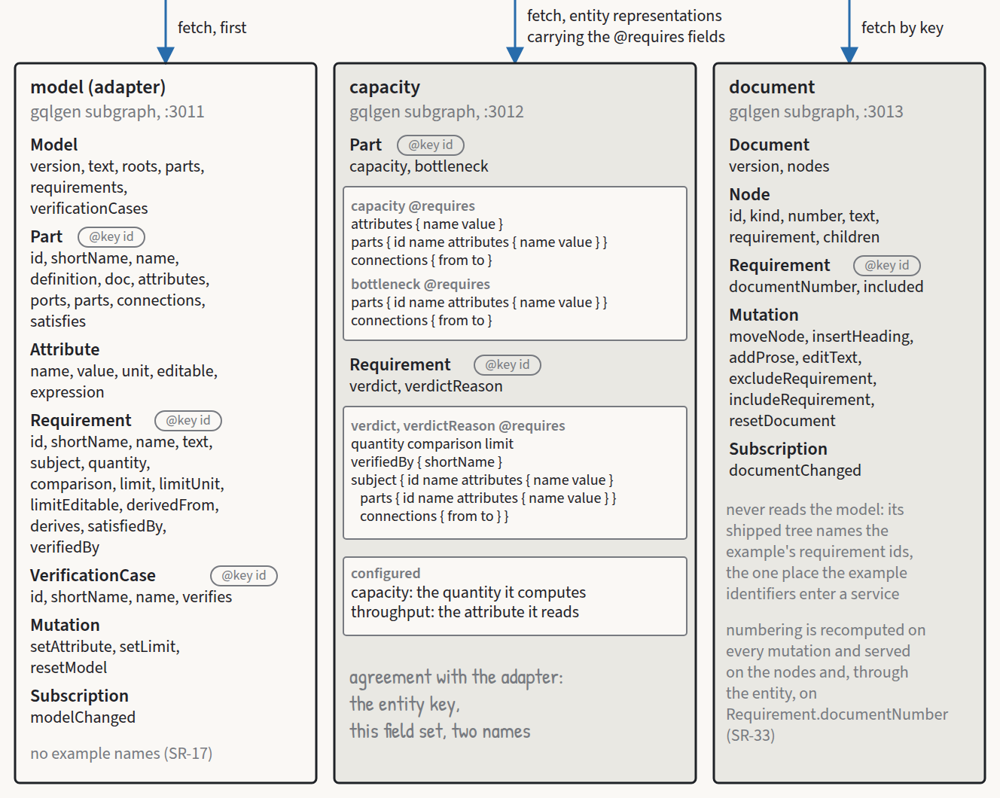

# Five spikes before the first line

*Roar Georgsen, 27 August 2026*

Part 10 of 11 in [Federating a systems model](../README.md).

The demo serves a SysML v2 model of a query pipeline through a federated GraphQL graph, with one subgraph reading the model text, a second computing capacity and verdicts, and a third owning a document that quotes the requirements. A subgraph is one GraphQL service that owns part of the graph, and the router is the process that stitches the subgraphs into one schema and answers queries against it. A verdict is the capacity service's judgement on one requirement, PASS, FAIL, INCONCLUSIVE or ERROR, with a reason built from a template. [The architecture in one sitting](01-the-architecture-in-one-sitting.md) gives the whole shape.

## Why spikes first

The architecture description carries a list of things it could not settle from documentation. Five of them were turned into spikes, each with a pass criterion and a fallback written down before it ran, and the implementation plan described in [Planning the build](08-planning-the-build.md) put them in a phase of their own ahead of the first implementation task. Two concerned the model and the graph, the port and `connect` syntax the reference validators accept, and whether a nested-list `@requires` survives composition and the router. Three concerned the container: whether the router starts from environment variables alone in an image with no configuration file and what its readiness endpoint reports with the subgraphs down, whether `COPY --from` resolves the target platform on a multi-platform build, and whether the container makes any outbound connection under `docker run --network none`. The last demonstrates a requirement rather than checking an assumption, and it could not run until the image existed.

All five have run, and none failed outright. Each of the four that tested an assumption corrected something, and the demonstration left an edge of its own open.

## The syntax the reference tools accept

The design phase had left port definitions, port usages and `connect` off the list of constructs the parser accepts, because no research report had fetched the OMG training folders that show them. The spike fetched folders 09 and 10, and then 11 as well, since neither of the first two carries a port-to-port `connect`.

Folder 10 gives the port definition with directed items, and the port usage on a part definition:

```sysml
port def FuelOutPort {
    attribute temperature : Temp;
    out item fuelSupply : Fuel;
    in item fuelReturn : Fuel;
}

part def FuelTankAssembly {
    port fuelTankPort : FuelOutPort;
}
```

Nothing in that file conjugates a port. Inbound and outbound are two mirrored definitions, `FuelOutPort` and `FuelInPort`, which is the shape the example model had already chosen for `QueryInput` and `QueryOutput`. The `~` conjugation form, which the [hand-written parser over a strict subset of the language](../decisions/AD-0015-hand-written-subset-parser.md) refuses by design, is not needed and does not appear. Folder 09 connects parts rather than ports and puts a multiplicity on each end, `connect [0..1] lugBoltJoints to [1] wheel.w.mountingHoles;`. The port-to-port form sits in folder 11, inside an interface definition, as `connect suppliedBy.hot to deliveredTo.hot;`. That is the probe's spelling exactly, without the multiplicity.

The validators are the two the design committed to in [SysML 2.0 formal as the target](../decisions/AD-0019-sysml-2-0-target.md). The OMG pilot is the release tagged `2026-07`, its kernel jar run through the batch entry point on Java 21 with the standard library beside it. OpenSysML is v0.2.1, run as `sysml -validate -strict`. Its `-version` flag prints only `sysml dev` with commit, build time and Go version all `unknown`, so the pin lives in the install command and nowhere in the binary.

The probe is the example model reduced to two servers, one connection and three requirements. In the form the plan wrote it, the pilot refused it at the two `satisfy` lines, twice with `ERROR:Cannot override a binding feature value`, at line 52 column 27 and line 53 column 25. OpenSysML accepted the same file with `no errors` and exit 0. The message points at a double binding of the requirement's subject: the requirement usage bound it with `subject :>> target = pipeline;`, and the `satisfy` statement bound it a second time.

The plan's fallback for that row was to move the `satisfy` statements into a separate part. It does not help. A variant with the statements inside `part deployment { ... }` and the subject bindings left alone produced the same two errors, at lines 55 and 56. Two other spellings pass both tools: dropping the subject binding from the satisfied requirement usages, and turning the binding into a subsetting, `subject target :> pipeline;`, which keeps the explicit subject and the `satisfy` line together. The second was taken. It is a one-token change that keeps every element of the planned shape, and the verification usage was already written that way. What it gives up is the subject as a bound value, and whether the projection needs that is a question the spike passed back to planning.

The probe as it finally passed:

```sysml
package Probe {
    private import ScalarValues::Real;
    private import ISQ::*;
    private import SI::*;
    private import SIPrefixes::*;
    private import MeasurementReferences::*;

    attribute <ms> millisecond : DurationUnit {
        :>> unitConversion : ConversionByPrefix { :>> prefix = milli; :>> referenceUnit = s; }
    }

    abstract part def Component {
        attribute capacity : Real;
    }

    item def Query;

    port def QueryInput {
        in item queries : Query;
    }

    port def QueryOutput {
        out item queries : Query;
    }

    part def Server :> Component {
        attribute throughput : Real;
        port input : QueryInput;
        port output : QueryOutput;
    }

    part def Pipeline :> Component {
        attribute latency : DurationValue;
    }

    requirement def ThroughputRequirement {
        subject target : Component;
        attribute requiredRate : Real;
        require constraint { target.capacity >= requiredRate }
    }

    requirement def LatencyRequirement {
        subject target : Pipeline;
        attribute maxLatency : DurationValue;
        require constraint { target.latency <= maxLatency }
    }

    part pipeline : Pipeline {
        part a : Server { attribute :>> throughput = 2000; }
        part b : Server { attribute :>> throughput = 1200; }
        connect a.output to b.input;
        satisfy global by pipeline;
        satisfy half by b;
    }

    requirement global : ThroughputRequirement {
        subject target :> pipeline;
        attribute :>> requiredRate = 1500;
    }

    requirement half : ThroughputRequirement {
        subject target :> pipeline.b;
        attribute :>> requiredRate = global.requiredRate / 2;
    }

    requirement lat : LatencyRequirement {
        subject target :> pipeline;
        attribute :>> maxLatency = 200[ms];
    }
}
```

The pilot prints `Package Probe (e8b187c6-7205-42ae-a110-c5b6481d27a4)` and no diagnostic. OpenSysML prints `no errors` and exits 0.

The three-line `<ms>` declaration at the top is there because the shipped library has no millisecond. A grep for `<ms>` over the SI file of the pilot's library prints nothing, and a recursive grep over the whole library nothing either, so the model keeps its own declaration and `200[ms]` was accepted with it present.

Then the pass criterion itself was wrong. The pilot runs as an interactive shell and writes its leading `1> ` without a newline, so the first diagnostic of a run lands on that line as `1> ERROR:...`, where the plan's `grep -E '^(ERROR|WARNING):'` cannot see it. The first refusal printed two errors and that grep showed only the second. The first deliberate breakage is sharper. It produced exactly one error, so the grep printed nothing and exited 1, the plan's own pass signal, and the criterion as written would have passed a file the pilot had rejected. The spike's findings stand because the root element line, `1> Package <name> (<uuid>)`, was required as well. The later gate takes the corrected pattern, `grep -E '(^|> )(ERROR|WARNING):'`, which tolerates the `1> ` prefix and finds nothing on a clean run.

Three deliberate breakages confirm that a clean pass means something. Misspelling the port in the connect, `connect a.outpt to b.input;`, gives the pilot `ERROR:Couldn't resolve reference to Feature 'outpt'. (1.sysml line : 51 column : 19)` and OpenSysML `error: unresolved member: outpt` at `51:19` with exit 2. Dropping the semicolon after that same line gives the pilot `ERROR:no viable alternative at input 'satisfy'` at line 52 column 9 and OpenSysML `error: expected '{' or ';' after declaration` at the same place. Misspelling the port definition in a usage, `port input : QueryInptu;`, gives the pilot three errors, the unresolved type plus `A port must be typed by port definitions.` and `A usage must be typed by definitions.`, and OpenSysML the unresolved reference with a spelling suggestion. Both tools caught all three. The plan's grep would have shown two.

Of the constructs the model phase needed an answer on, the probe settles most. The plain numeric binding `attribute :>> throughput = 2000;` is accepted by both tools, which matters, because the projection (the curated GraphQL view of the model, described in [a curated generic projection](../decisions/AD-0005-curated-generic-projection.md)) exposes that literal as the editable number and had nowhere else to put it. The arithmetic binding `global.requiredRate / 2` is accepted. `abstract part def` and `item def Query;` are accepted. `satisfy X by Y;` inside the pipeline part is accepted, and the relative reference `by b` resolves without a `pipeline.` prefix. Three rows are not exercised by the probe, the `objective { verify ... }` body, the `#derivation connection` block and the package-level `doc /* */`. They wait for the full model.

So the example model writes two mirrored port definitions carrying `in item` and `out item`, port usages `port input : QueryInput;` and `port output : QueryOutput;` on `part def Server`, and `connect ingest.output to parse.input;` between sibling parts inside `part pipeline`. Every requirement usage named by a `satisfy` statement declares its subject as `subject target :> pipeline.ingest;` rather than binding it with `=`.

## Nested requires through the router

The capacity subgraph computes `Part.capacity` and `Requirement.verdictReason` from data it does not own. In federation the mechanism for that is `@requires`, which asks the router to fetch named fields from the owning subgraph and hand them over in the entity representation, the object the router sends when it asks a subgraph to resolve an entity by its key. An entity key is the field, here `id`, that identifies the same object across subgraphs. The capacity subgraph needs the whole subtree beneath a part, the children with their attributes and the connections between them, so its `@requires` selection is a nested list two levels deep. The vendor documents that arrangement, but nothing the research found confirmed that Cosmo composition and gqlgen's `explicit_requires` option carry it intact, and the plan carried a fallback, a flat `wiring` string on `Part` holding the subtree as JSON.



*The three subgraph schemas of the design. The requires spike composed the first two, model and capacity, in reduced form. Cut from the [architecture views](../architecture/architecture-views.pdf).*

The spike built the two subgraphs with fixed data, a pipeline `P1` carrying the example model's shipped throughputs over five children, with five connections between them. Its resolver returned the plain minimum, 700, rather than the 1200 the real rollup by [maximum flow](../decisions/AD-0007-rollup-as-maximum-flow.md) gives for that wiring, since it was a stand-in. A `received` field reported how many parts and connections had arrived. The versions were `wgc` 0.130.1 for composition, router 0.343.1 by digest and gqlgen v0.17.94.

The criterion query returned, byte for byte, what the plan predicted:

```
{"data":{"part":{"id":"P1","name":"pipeline","capacity":700,"received":"5 parts, 5 connections"},"requirement":{"id":"R1","verdictReason":"capacity GE 1500 pipeline 5 5 PIPE-VC1"}}}
```

The 700 proves that `parts { attributes { value } }` arrived, the `5 parts, 5 connections` proves both lists reached the capacity subgraph, and the verdict reason proves `verifiedBy { shortName }` on an entity marked `resolvable: false` as well as the nested `subject { parts { ... } }` inside a `Requirement` representation, with `PIPE-VC1` the verification case's short name. Nested-list `@requires` is confirmed end to end. The flat fallback was not built and no new decision record was needed.

Composition itself was uneventful. Across all three runs the command's entire output was the one line reporting the execution config written, with exit 0 and no warning on either stream. The first `@shareable` placement composed, the directive on `Attribute` and `Connection` in the model subgraph only, so the second was never applied.

The corrections came from the edges. The subscription subprotocol key in the composition file is not `websocket_subprotocol`. With that spelling the composed config reported `GRAPHQL_WEBSOCKET_SUBPROTOCOL_AUTO` for the model subgraph, and changing it to the camelCase `websocketSubprotocol: graphql-transport-ws` flipped the value to `GRAPHQL_WEBSOCKET_SUBPROTOCOL_TRANSPORT_WS`. The plan had predicted the longer `..._GRAPHQL_TRANSPORT_WS`, so any assertion on the value uses the observed spelling instead.

The embedded schema, which the drift test in [composition as a maintainer step](../decisions/AD-0012-composition-committed.md) compares against the source files, sits at `.engineConfig.datasourceConfigurations[n].customGraphql.federation.serviceSdl`, with `n` the subgraph's index. The lengths are 720 and 1250 bytes, matching the two source files. The plan's comparison does not print `IDENTICAL`, because the stored text already ends with the file's final newline and `jq -r` adds a second, so `diff` reports one surplus blank line. Extracted with `jq -j`, both are byte-identical to their sources, confirmed by `diff`, by a 1250-byte count on each side and by a matching `sha256sum`. The drift test uses `jq -j`.

gqlgen writes the requires stub to `federation.requires.go` with `package main` as its first line and no `// Code generated` header at all, unlike `generated.go` and `federation.go`, which both open with one. That matters because the repository's rule against the empty interface exempts files carrying the header, as the decision to [exempt generated code from the empty-interface rule](../decisions/AD-0016-generated-code-exempt.md) records, and the stub's generated signature is `PopulatePartRequires(ctx context.Context, entity *Part, reps map[string]any) error`, with `map[string]any` rather than the `map[string]interface{}` the plan wrote. So the stub is the one generated file whose `map[string]any` parameter needs an explicit allowance, the allowance is keyed to the line the parameter sits on, and the next `gqlgen generate` moves it off that line. It has to be replaced after every regeneration, and the plan now says so.

One smaller friction. The generator configuration sets `skip_mod_tidy: true`, so a `go mod tidy` at the module root is needed by hand after the first generate.

## A router with no configuration file

The spike built a cut-down version of the demo's image, with the router binary lifted out of the official image into `gcr.io/distroless/static-debian13:nonroot` beside the composed config. [The router as a child process](../decisions/AD-0010-router-as-child-process.md) decided that the supervisor starts this binary and sets its environment, and [telemetry disabled by environment](../decisions/AD-0013-telemetry-off.md) fixed the variables. The spike had to show that no YAML file is needed anywhere.


*The container the router spike rehearsed, with the router as a child process started from the environment the supervisor sets.*

It is not. The router starts from environment variables alone, and no log line mentions `config.yaml` or any configuration file. `/health/live` returns 200, `/playground` returns 200, and `{ __typename }` on `/graphql` returns `{"data":{"__typename":"Query"}}`. The distroless image also served the requires spike's full criterion query with the same byte-for-byte result, so the binary lifted out with `COPY --from` behaves as the one in the official image.

The playground has a catch that a later smoke test would trip over. A bare `curl`, sending `Accept: */*`, gets `200 OK` with `Content-Length: 0` and no `Content-Type` header. The path is genuinely routed, since any other path returns 404, but only a request with `Accept: text/html` gets `text/html; charset=utf-8` and a 2,965,926-byte body opening `<!doctype html>`.

The research had not predicted a deprecation warning, abridged here to the fields that matter:

```
{"level":"warn","msg":"The playground_path option is deprecated. Use the /playground/path option in the config instead.","service":"@wundergraph/router","service_version":"0.343.1"}
```

`PLAYGROUND_PATH` still works in 0.343.1, and the replacement the router names lives in the YAML config, which the design does not have. The variable was kept: the supervisor sets it on the router child so that the query editor answers on `/playground`, and the warning is accepted as a line the router prints at every start. The other expected line, the warning that no graph token was provided and some Cosmo Cloud features are disabled, lists three features when the tracing and metrics variables are set and five when they are not.

The hosts the log names are the input to the offline demonstration. Grepping every `url`, `listen_addr`, `endpoint`, `host` and `addr` field over the whole startup log yields exactly four values: `"endpoint":"/metrics"`, `"listen_addr":"0.0.0.0:3002"`, `"listen_addr":"127.0.0.1:8088"` and `"url":"http://0.0.0.0:3002/playground"`. A grep for any external domain, covering the Cosmo CDN, the control plane, OTLP and telemetry, returns nothing. The router opens two listeners, the published port and a Prometheus listener on loopback inside the container, and the line `Usage tracking is disabled by the environment variable` confirms `DO_NOT_TRACK=1` took effect. The Prometheus listener is the router's own default rather than anything the spike asked for, and the supervisor later closes it with `PROMETHEUS_ENABLED=false`, so a running container opens one listener fewer than this spike saw.

Then readiness. `/health/ready` returns 200 whether the subgraphs are up or down. With both subgraph ports closed it returned 200, `/health/live` returned 200, and the part query returned `{"errors":[{"message":"Failed to fetch from Subgraph 'model'."}],"data":{"part":null}}`. With both subgraphs restarted against the same container and nothing else changed, `/health/ready` returned 200 again and the same query returned `{"data":{"part":{"id":"P1"}}}`. Readiness follows the static configuration being loaded rather than subgraph reachability, as a reading of the router's source during research had suggested. So `/health/ready` proves that the router process is listening and its execution config is loaded, and nothing about the graph answering. The supervisor's ordering does not depend on it, as the plan already assumed, and the demo's own documentation states that limit rather than letting the container's `HEALTHCHECK` imply more.

## Copying across platforms

The published image is built for amd64 and arm64, and the design lifts the router binary out of the official image with `COPY --from` rather than downloading per-architecture release files. The open question was whether a plain `FROM ghcr.io/wundergraph/cosmo/router:0.343.1 AS router` resolves to the target platform of each layer, or needs `--platform=$TARGETPLATFORM`.

It resolves. A `buildx` build for both platforms exited 0 and exported 96.30 MB uncompressed for amd64 and 90.67 MB for arm64, against a budget stated in compressed layer bytes and measured on the shipped image rather than on this cut-down one. `file` reports the arm64 binary as `ELF 64-bit LSB executable, ARM aarch64, version 1 (SYSV), statically linked` and the amd64 one as `x86-64`, statically linked, with different build IDs. The `--platform` variant was not needed and not tried, and neither was the fallback of downloading the per-architecture release binaries with `ADD --checksum` instead of copying them out of the image.

The plan's inspection command was slightly wrong. Its grep over `go version -m` matches nothing, because the build settings sit behind a `build` field, so the lines read `build GOARCH=arm64` rather than `GOARCH=arm64`. With `grep -E 'build\s+(GOARCH|GOOS|CGO_ENABLED)'`, the arm64 binary reports `CGO_ENABLED=0`, `GOARCH=arm64`, `GOOS=linux`, the amd64 binary the same with `GOARCH=amd64`, and both report `go1.25.14`. The `CGO_ENABLED=0` confirms the static linking the distroless base assumes.

## A container with no network

The fifth spike is the demonstration behind the claim that the demo opens no connection of its own. [Telemetry disabled by environment](../decisions/AD-0013-telemetry-off.md) turns the router's reporting off through its environment and says plainly that readiness is no evidence that the container stays quiet, so the record made this run a condition of the air-gap sentence going public.

The image ran detached under `docker run --network none` with the log level at debug, and the container reached `healthy`. It was then left alone for nine minutes, which gives the router's per-minute usage event several chances to fire if anything is still tracking. The log ran to 22 lines, all of them from start-up, and it did not grow again. A search over it for `posthog`, `wundergraph.com`, `otel` and `otlp` found nothing, and so did a search for `lookup `, `no such host`, `network is unreachable` and `i/o timeout`, so nothing was attempted, retried or timed out. Inside the container the sole network interface is the loopback.

Every dotted address in the log is `127.0.0.1`, and the published listener is absent from that list because the user interface server writes its wildcard binding in the IPv6 form `http://[::]:8080/` rather than as `0.0.0.0`. A reader grepping the log for the wildcard address finds nothing, and nothing is wrong. What carries the claim in the end is the interface list rather than the quiet log. A container holding one loopback interface has nowhere to send a packet, and an empty log on its own is only an empty log.

The browser is what the run cannot reach. A container with no interface publishes no port, so neither app can be loaded from it, and the reload of an app with the host itself off the network is still an open check.

## What the spikes changed in the plan

No decision was reversed and no new decision record was written, but the plan that [Planning the build](08-planning-the-build.md) describes took a run of corrections. The satisfied requirement usages declare their subject with `subject target :> ...` rather than a bound value, and the two port forms and the `connect` form join the accepted subset as verified. The gate that validates the full model uses a grep that tolerates the pilot's leading `1> `. The composition file spells the subprotocol key `websocketSubprotocol`, the drift test extracts the embedded schema with `jq -j`, and the requires stub's exception comment is re-placed after every regeneration, with `go mod tidy` run by hand after the first. Any check on the playground sends `Accept: text/html`, the image inspection greps for the `build` prefix, and the deprecation warning stands, since the supervisor keeps setting `PLAYGROUND_PATH` and the configuration file that would replace it does not exist. None of these would have surfaced from reading, and one, the pass criterion that would have passed a rejected file, is the kind of defect that stays hidden until the first real refusal.

---

Previous: [Planning the build](08-planning-the-build.md) · Index: [Federating a systems model](../README.md) · Next: [The demo being built](10-the-demo-being-built.md)
