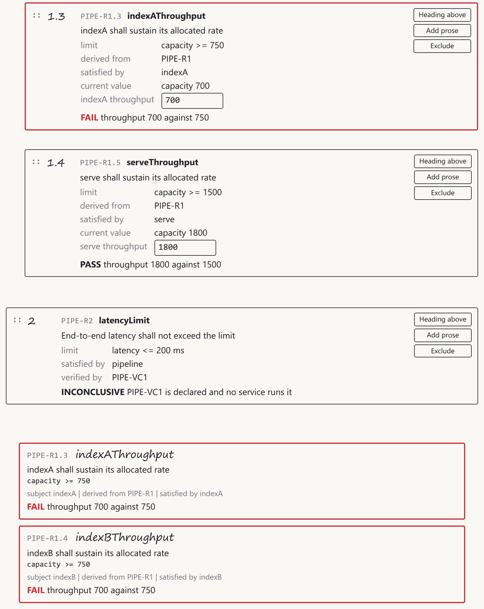

# The demo as it shipped

*Roar Georgsen, 27 August 2026, revised 29 August 2026*

Part 11 of 13 in [Federating a systems model](../README.md), written for release v0.3.0.

> [!IMPORTANT]
> **The story so far**
>
> The demo is a SysML v2 model of a five-server query pipeline, published as a live GraphQL projection and joined at a federation router by a capacity service and a document service, with two web apps in front. Parts 9 and 10 planned the build and tested its riskiest assumptions. This part is the demo as it shipped: what you see when you run it, a fifteen-minute walk through it, and what the build came to.

## Run it

> [!TIP]
> **Run it yourself**
>
> ```
> docker run --rm -p 8080:8080 ghcr.io/roarge/sysml-federation
> ```
>
> Then open `http://localhost:8080`. Once the image is pulled, it's ready within ten seconds.

The image is public and built for amd64 and arm64. I build and test on Ubuntu under WSL, and [What shipped, and what did not](11-what-shipped-and-what-did-not.md) says what else it has been tried on. Nothing is written to disk, so stopping the container and starting it again brings back the shipped state.

## The model

The model is one file, [`model.sysml`](https://github.com/Roarge/sysml-federation/blob/main/examples/pipeline/model.sysml), with five servers, a pipeline part that owns them and their wiring, seven requirements and one verification case. [Twelve use cases and one moving bottleneck](04-twelve-use-cases-and-one-moving-bottleneck.md) lists every element. Here's what a requirement looks like in SysML v2:

```sysml
requirement def ThroughputRequirement {
    doc /* The subject shall sustain at least the required query rate. */
    subject target : Component;
    attribute requiredRate : Real;
    require constraint { target.capacity >= requiredRate }
}
```

`PIPE-R1` binds `requiredRate` to 1500 with the pipeline as its subject. The five derived requirements take their limits from expressions over `PIPE-R1`'s, so a derived limit follows an edit to `PIPE-R1` and can't be edited itself. Capacity is declared and never given a value. That's the capacity service's job.

## The viewer


*The shipped state, where parse holds the pipeline to 1200 and PIPE-R1 fails against its limit of 1500.*

The viewer shows the model as its own text, with the SysML keywords picked out, beside a sketch drawn from the model's connections. The caption reads `capacity 1200, bottleneck parse`, and parse is outlined red. Under the sketch, each requirement carries its verdict and reason. `PIPE-R1` reads `FAIL capacity 1200 against 1500, limited by parse`. `PIPE-R2` reads `INCONCLUSIVE PIPE-VC1 is declared and no service runs it`, because the capacity service computes capacity and nothing else.

Above the text sits an edit panel with exactly six inputs, the five throughputs and the limit of `PIPE-R1`. I'd originally meant these to sit inline in the text, and [Planning the build](08-planning-the-build.md) explains why they moved ([the viewer decision](../decisions/AD-0026-viewer-shows-text-and-wiring.md)). Live updates arrive as version numbers, and the app refetches on each one ([version events](../decisions/AD-0014-version-events.md)).

No request leaves `localhost:8080`. With the host itself taken off the network, both apps still load and draw in full, which I checked on 14 September, and the run is in the [example's verification record](https://github.com/Roarge/sysml-federation/blob/main/examples/pipeline/README.md#the-two-web-apps).

## The document


*The shipped tree. The prose paragraph takes no number, PIPE-R1 is 1, and its five derived requirements sit under it in server order.*

The document shows the same requirements, numbered its own way. It opens with an unnumbered paragraph explaining that an allocated limit can fail while the pipeline passes, then `PIPE-R1` as 1 with its five derived requirements as 1.1 to 1.5, then `PIPE-R2` as 2. Each row shows what comes from the model, what comes from the analysis, and what the document itself holds, which is the number. It has the same six inputs as the viewer.

Every row has a grip. Drag a requirement and it renumbers, add a heading or a paragraph, or exclude a requirement and restore it later. None of that touches the model: the header's model version stays where it was, because order and numbering belong to the document service ([the document owns its structure](../decisions/AD-0025-document-owns-its-structure.md)). Change a value in a row, though, and it goes to the model through the adapter. The drag and drop is the one third-party file the apps carry, SortableJS, and otherwise both apps are plain HTML, CSS and JavaScript with no build step ([vanilla web apps](../decisions/AD-0017-vanilla-web-apps.md)).



*The same exclusion from both sides. The document has dropped PIPE-R1.4, and the viewer still lists it, because the model never changed.*

## Fifteen minutes with it

This is the walk I'd give a visitor, and it's the worked example from [From use cases to requirements](05-from-use-cases-to-requirements.md) seen through both apps.

**Raise ingest to 3000.** The text shows 3000 where 2000 was, and nothing else that matters moves. A chain carries no more than its weakest stage, and ingest was never it.

**Raise parse to 1700.** Capacity rises to 1400, and the sketch now outlines indexA and indexB. The bottleneck has moved to the two index servers, whose 700 and 700 add to 1400.

**Raise indexA to 900.** Capacity reaches 1600 and `PIPE-R1` passes. `PIPE-R1.4` on indexB still fails, at 700 against its allocated 750. The pipeline passes and one of its servers doesn't, and both verdicts are right.


*PIPE-R1 passes at 1600, and PIPE-R1.4 still fails at 700 against the 750 allocated to indexB.*

**Reset, and lower the limit to 1000.** The shipped capacity of 1200 now passes, and the derived limits follow without being touched.

**Edit from the document.** Reset again, then set parse's throughput to 1700 in the row of `PIPE-R1.2`, its derived requirement. Within two seconds the viewer in the other tab shows 1700 in the text and the index pair in the sketch, with no reload. Then drag a requirement, and watch the numbers change while the model version doesn't.

**Ask the graph.** In the playground at `/playground`, run:

```graphql
{ requirement(id: "PIPE-R1") { text verdict verdictReason documentNumber } }
```

The answer is one object. The text comes from the adapter, the verdict and its reason from the capacity service, and the number from the document service. Each declared `Requirement` with the same key, and the router joined them. This is the moment no single clever service could fake.


*One requirement answered by three services in a single object.*

**Try to break it.** Type -5 as a throughput in the viewer and it never leaves the page. The status line says `"-5" is not a finite, non-negative number, the served value stands`. The adapter guards itself as well, which the playground shows. Sent there, the same -5 comes back refused with `the value must be a finite, non-negative number`, and a limit on a derived requirement, which neither app offers, is refused with `the value is not a literal in the source`, because that limit is an expression. The adapter has three mutations, `setAttribute`, `setLimit` and `resetModel`. The first two only ever patch a literal in the source, and a refusal sends out no update ([editing as scaffolding](../decisions/AD-0004-editing-as-scaffolding.md)).


*A refusal as the visitor meets it. The status line names the value that was turned away, and the field takes the served one back.*

**Reset.** Either app puts the shipped model and the shipped document back, in both tabs, within two seconds.

## What the build came to

The line figures in [Planning the build](08-planning-the-build.md) were estimates, never limits. Here's what the finished code measures. Tests and generated code are left out.

| Part | Estimate | Shipped |
|---|---|---|
| Adapter (Go) | 2750 | 2804 |
| Capacity service (Go) | 600 | 519 |
| Document service (Go) | 600 | 553 |
| Supervisor (Go) | 700 | 653 |
| Viewer (JavaScript, CSS) | 900, 300 | 336, 66 |
| Document app (JavaScript, CSS) | 900, 300 | 352 plus the shared client's 208, 69 |

The adapter is the only part over its figure, by 54 lines, and it's also the only estimate I'd measured from written-out text rather than guessed. The web apps are where my guessing was furthest out, with neither reaching a quarter of its CSS allowance.

Tests keep the adapter honest about being generic: no source under `adapter/` may contain the example's names, and the capacity service is walked against a list of its own. The packages and how they fit together are on [the architecture page](../architecture/README.md), and the image, its environment and the publishing workflow are in [the example's README](https://github.com/Roarge/sysml-federation/blob/main/examples/pipeline/README.md#the-image).

The next part gives the image's size, and says what running it does and doesn't prove.

---

Previous: [Five spikes before the first line](09-five-spikes-before-the-first-line.md) · Index: [Federating a systems model](../README.md) · Next: [What shipped, and what did not](11-what-shipped-and-what-did-not.md)
