# The demo as it shipped

*Roar Georgsen, 27 August 2026*

Part 11 of 12 in [Federating a systems model](../README.md).

The demo is a SysML v2 model of a five-server query pipeline, published as a live GraphQL projection and joined at a federation router by a capacity service and a document service. A projection, here, is the small plainly typed view a consumer meets instead of the metamodel. Two web apps sit in front, and the whole thing ships as one container image that a single `docker run` starts. What follows describes it in the present tense. An earlier version of this article was written before any of it ran, from the design [Planning the build](08-planning-the-build.md) sets out, and it promised a revision once the image shipped. This is that revision.

## Run it

The line below is what the first release publishes. The package has been made public, so a host with no registry account pulls it and runs it.

```
docker run --rm -p 8080:8080 ghcr.io/roarge/sysml-federation
```

Once the image is pulled, the ready line appears within ten seconds. That has been watched on x86-64 Linux with nothing installed beyond Docker. The registry carries an amd64 manifest and an arm64 one, and Docker on macOS and Windows runs Linux containers, so the same line should follow there, though nobody has yet watched it do so. Port 8080 carries five paths. `/viewer` is the model viewer, `/document` the requirements document, `/shared` the client module both apps import and the drag library vendored beside it, `/graphql` the router's endpoint and `/playground` the router's own query editor. A request to `/` is redirected to the viewer. Nothing is written to disk, so stopping the container and starting it again returns the shipped state, model version 1 and document version 1.

Behind the port one Go binary runs three subgraphs as goroutines, the vendor's router as a child process, and a UI server that serves both apps and proxies the router. A subgraph, in federation vocabulary, is a service publishing a fragment of a schema, and the router is the process that merges the fragments and plans each query across the services that hold the fields it names. The subgraphs and the router listen on loopback ports and only 8080 is published, which is the decision on [one binary, one process tree and one port](../decisions/AD-0011-one-binary-one-port.md), with the [child-process router](../decisions/AD-0010-router-as-child-process.md) copied out of the vendor's image rather than linked as a library.

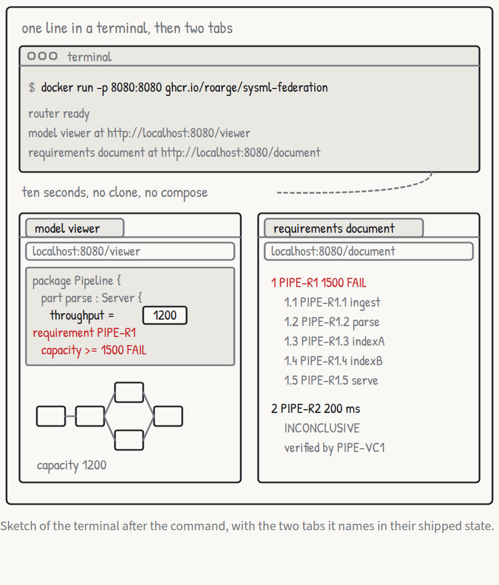

*Use case 1, launch: the ready line, and the viewer the visitor opens once it appears, from the [storyboard](../stories/use-cases.pdf).*

## The model

The file is `examples/pipeline/model.sysml` and it opens `package <'PIPE'> QueryPipeline`. Its doc comment says what the file is careful about: throughput and capacity are query rates in queries per second, and the rollup is absent because capacity is declared without a value and computed elsewhere. Five servers, `PIPE-S1` to `PIPE-S5`, hold the throughputs the visitor edits, one pipeline part owns them and the wiring, and seven requirement usages and one verification case sit beside them. [Twelve use cases and one moving bottleneck](04-twelve-use-cases-and-one-moving-bottleneck.md) lists every element with its short name, its value and the part that satisfies it. What matters here is how the file is put together.

An abstract part definition, `Component`, declares `capacity : Real` and nothing else, and both `Server` and `Pipeline` specialise it. A server adds `throughput : Real` and an `input` and an `output` port carrying a directed item, the pipeline adds `latency : DurationValue`, and neither capacity nor latency is given a value anywhere in the file.

The two requirement definitions share one shape, a subject, an attribute for the limit and a constraint comparing a feature of the subject with it:

```sysml
requirement def ThroughputRequirement {
    doc /* The subject shall sustain at least the required query rate. */
    subject target : Component;
    attribute requiredRate : Real;
    require constraint { target.capacity >= requiredRate }
}
```

`PIPE-R1` binds `requiredRate` to 1500 and takes the pipeline as its subject. `PIPE-R1.1` to `PIPE-R1.5` are joined to it by a `#derivation connection` with one `#original` end and five `#derive` ends, and their limits are expressions rather than numbers, `globalThroughput.requiredRate` for ingest, parse and serve and half of that for each index server. The adapter evaluates those expressions, which is why a derived limit follows an edit to `PIPE-R1` and cannot be edited itself. `PIPE-R2` is a `LatencyRequirement` with `maxLatency = 200[ms]` and `PIPE-VC1` is a verification whose objective is `verify latencyLimit`. Inside the pipeline part, five `connect` statements give the wiring and seven `satisfy` statements bind each requirement to its part.

How `target.capacity >= requiredRate` becomes a quantity, a comparison and a limit is the decision on [reading the constraint](../decisions/AD-0008-quantity-from-constraint.md), and reading a connection's direction from [the order of its ends](../decisions/AD-0009-connection-direction.md) is another. The file is checked against the OMG pilot implementation and OpenSysML under the decision on [SysML 2.0 formal as the target](../decisions/AD-0019-sysml-2-0-target.md), and the releases that accepted it are the OMG pilot 2026-07 and OpenSysML 0.2.1, run in [five spikes before the first line](09-five-spikes-before-the-first-line.md). [From use cases to requirements](05-from-use-cases-to-requirements.md) treats the model and the arithmetic in full.

## The viewer

The viewer at `/viewer` shows the model as its own text, with the language visible. A small tokeniser marks `package`, `part`, `attribute`, `requirement`, `connect` and `satisfy` in bold, numbers and quoted names such as `<'PIPE-R1'>` in blue, and doc bodies and comments in grey. The text is the served text, so an edit made anywhere shows up in it as a changed literal.

Beside the text is a sketch drawn from the wiring, not from anything hand placed. The five servers sit left to right, ingest, parse, indexA over indexB, serve, joined by arrows that follow the `connect` statements. Each box reads `throughput N`. The caption reads `capacity 1200, bottleneck parse` in the shipped state and parse is outlined red. Columns come from depth in the wiring.

Under the sketch, one block per requirement carries its verdict. A verdict is the capacity service's answer for a requirement, one of PASS, FAIL, INCONCLUSIVE and ERROR with a reason string beside it. `PIPE-R1`'s block is red and reads `FAIL capacity 1200 against 1500, limited by parse`. `PIPE-R2` reads `INCONCLUSIVE PIPE-VC1 is declared and no service runs it`, because the capacity service computes capacity and nothing else. The five derived blocks read PASS or FAIL with `throughput N against L`.

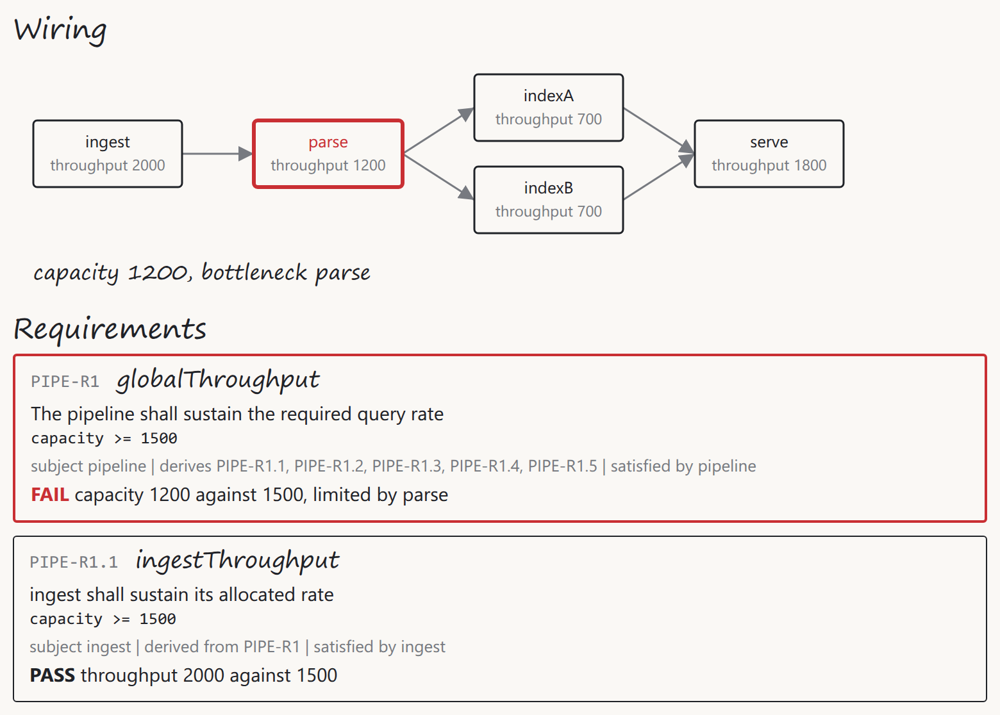

*The shipped state, where parse holds the pipeline to 1200 and PIPE-R1 fails against its limit of 1500.*

Above the text sits the edit panel with exactly six inputs: the five server throughputs and the limit of `PIPE-R1`. There is no control for `PIPE-R2`'s 200 ms, for a derived limit, or for capacity or latency. The panel is where the decision on [the viewer showing text beside wiring](../decisions/AD-0026-viewer-shows-text-and-wiring.md) was revised. As first accepted it placed the inputs inline, at the literals' own positions. The projection carries no source spans, so inline inputs had nothing to anchor to, and the record now carries the panel instead. A rejected value, `abc`, `-5` or an empty field, is named on the status line and the field returns to the served value. A Reset button restores the shipped model.

Live updates arrive over server-sent events on `/graphql`, as version numbers only, and the app refetches on each one, the decision on [subscriptions as version events](../decisions/AD-0014-version-events.md). If the stack goes away the status line reads `live updates: ...` and the app retries about 1, 2, 4, 8 and then 8 seconds apart until a connection succeeds. A refetch that lands while an input is focused keeps the focus. No request leaves `localhost:8080`. A reload of the viewer makes eight requests, the page, its stylesheet, its own three modules, the shared client and two calls to `/graphql`, with no font and no other host among them. Whether the page would still draw with the host taken off the network is a thing nobody has watched, and the two halves cannot be observed together: a container started with no network interface publishes no port, so there is no browser on the other side of it to reload.

## The document

The document at `/document` shows the same requirements as a numbered document whose numbering is its own. The shipped tree is an unnumbered prose paragraph first, explaining that the rollup is idealised and that an allocated limit on a server can fail while the pipeline as a whole passes, then `PIPE-R1` as `1` with `PIPE-R1.1` to `PIPE-R1.5` nested as `1.1` to `1.5` in server order, then `PIPE-R2` as `2`. The header reads `document version 1, model version 1`.

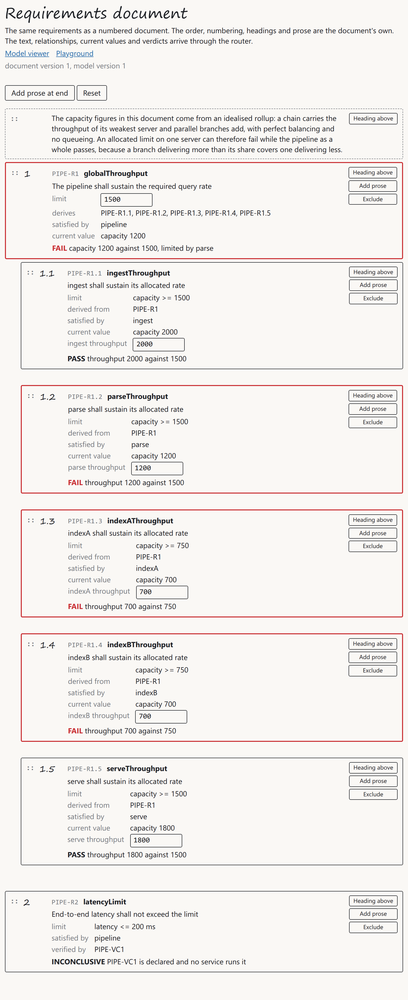

*The shipped tree. The prose paragraph takes no number, PIPE-R1 is 1, and its five derived requirements sit under it in server order.*

Each row shows what comes from the model, what comes from the analysis, and what the document itself holds. `PIPE-R1`'s row shows its short name and text, its limit as an input holding 1500, `derives PIPE-R1.1 to PIPE-R1.5`, `satisfied by pipeline`, `current value capacity 1200`, and the verdict `FAIL capacity 1200 against 1500, limited by parse`, outlined red. `PIPE-R1.2`'s row shows `derived from PIPE-R1`, `parse throughput` as an input holding 1200, and `FAIL throughput 1200 against 1500`. `PIPE-R2`'s row carries `limit latency <= 200 ms` as plain text and no input at all. Count the inputs on the page and there are six, the same six as the viewer.

Every row has a grip. Drag `PIPE-R1.5` above `PIPE-R1.1` and within two seconds it reads `1.1` and the others `1.2` to `1.5` in their former order. Drag `PIPE-R2` into `PIPE-R1`'s list and it reads `1.6` while still showing `verified by PIPE-VC1`, because the relationship comes from the model and the number from the document. `Heading above` on `PIPE-R1`, with the text `Performance`, takes number `1` and pushes `PIPE-R1` to `1.1` and its children to `1.1.1` to `1.1.5`, and `Add prose` on the heading appends a dashed, unnumbered paragraph. `Exclude` on `PIPE-R1.4` removes it from the tree, `PIPE-R1.5` moves up to `1.1.4`, a tray lists it with `Restore`, and the viewer still lists `PIPE-R1.4` because nothing happened to the model. Excluding a node with children promotes them.

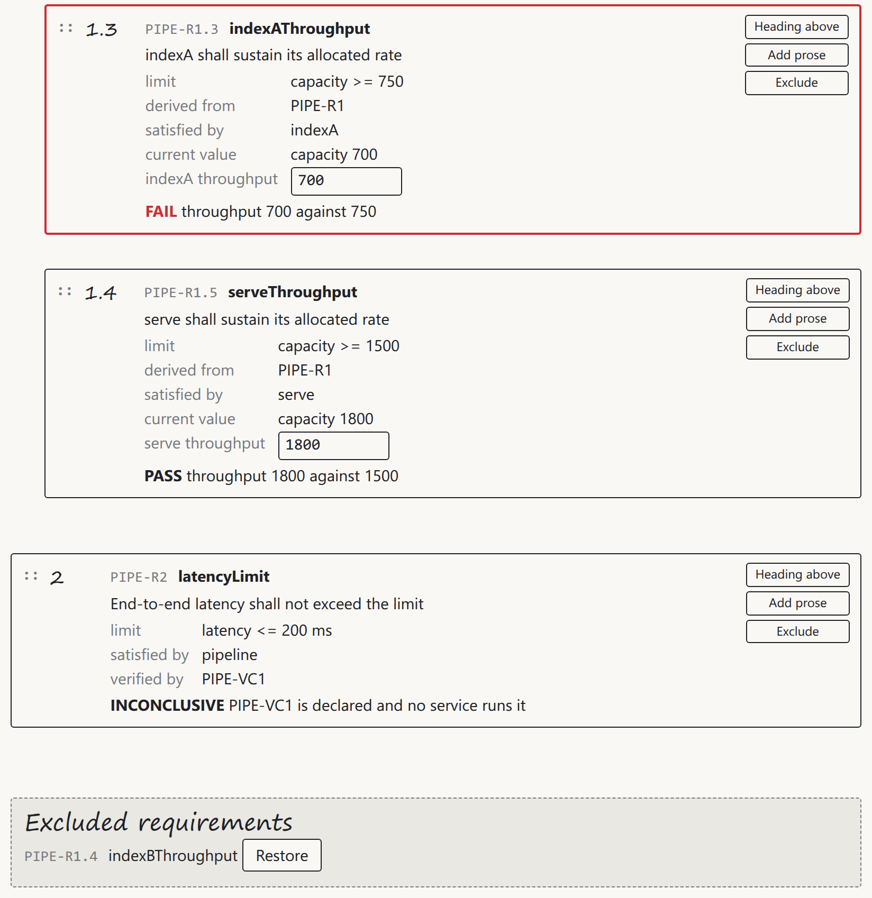

*An excluded requirement waits in the tray. The sibling below it has taken its number, and the viewer goes on listing it because the model never heard about any of this.*

The document service holds the tree and nothing else, the decision on [document-owned structure](../decisions/AD-0025-document-owns-its-structure.md), and its shipped tree is the one place the example's identifiers enter a service. Every edit above leaves the header reading `model version 1`, because a reorder, a heading, a paragraph or an exclusion is a document mutation and touches only the document's version. The value inputs go the other way: `PIPE-R1.2`'s throughput set to 1700 goes through the adapter, the model version rises, and the document's own version has not moved. Drag and drop is SortableJS, vendored as the one third-party file the decision on [vanilla web apps](../decisions/AD-0017-vanilla-web-apps.md) allows.

## What a visitor sees in fifteen minutes

The visitor has Docker, a browser and no manual. The walk below is the worked example of [From use cases to requirements](05-from-use-cases-to-requirements.md) observed through the router and both apps, and the plan names it as the end-to-end proof.

The shipped state fails. The viewer's caption says `capacity 1200, bottleneck parse`, `PIPE-R1` is red, and the reason names parse.

Set ingest to 3000 in the edit panel and press Tab. Within two seconds the text shows `3000` where `2000` was, and nothing else moves at all. `PIPE-R1.1` reads PASS with `throughput 3000 against 1500`, but it passed at 2000 as well. A serial chain is governed by its worst link and ingest was never it.

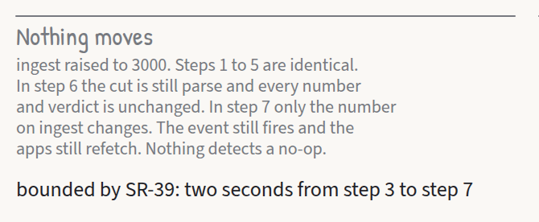

*Ingest raised to 3000 leaves the capacity and the verdict where they were, from the [architecture views](../architecture/architecture-views.pdf).*

Set parse to 1700, the edit from [use case 4, raise the bottleneck](04-twelve-use-cases-and-one-moving-bottleneck.md). Capacity rises to 1400 and the sketch outlines indexA and indexB red. The bottleneck has moved to the next weakest place in the wiring, the two index servers whose 700 and 700 sum to 1400. Set indexA to 900 and capacity reaches 1600, `PIPE-R1` reads PASS and the block loses its red. `PIPE-R1.4` on indexB still fails, `throughput 700 against 750`, because its allocated share is half of 1500 and indexA delivering more than its share covers indexB delivering less. The pipeline passes and one of its servers does not, and both verdicts are right.

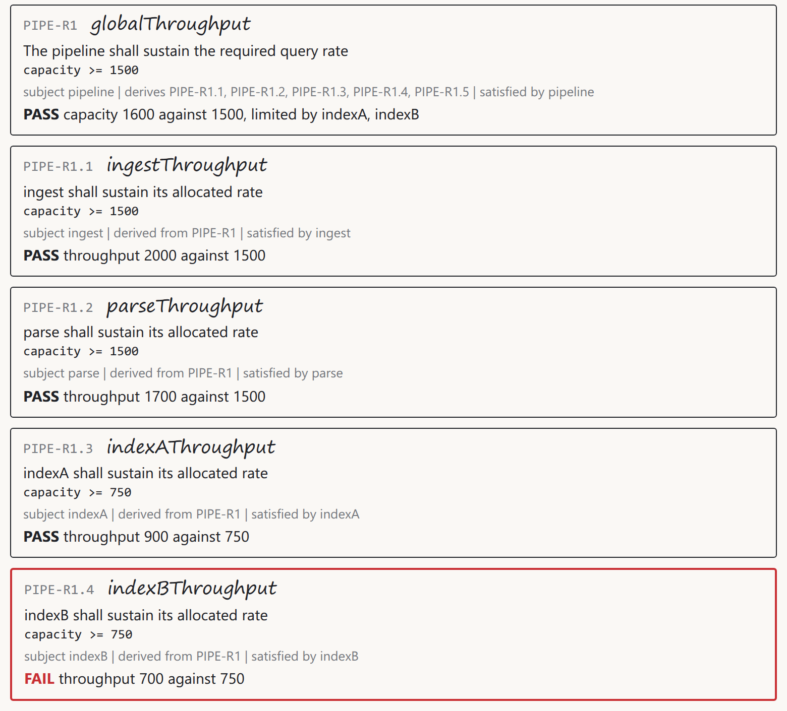

*Parse at 1700 and indexA at 900. PIPE-R1 passes at 1600 and PIPE-R1.4 still fails at 700 against the 750 allocated to indexB.*

The bottleneck the viewer outlines is the minimum cut, the smallest total throughput of any set of servers whose removal would sever every path from an entry server to an exit server. Capacity is the maximum flow through the wiring with each server's throughput as its limit, and the two numbers are equal by the max-flow min-cut theorem, which is the decision on [rollup as maximum flow](../decisions/AD-0007-rollup-as-maximum-flow.md). The values are chosen so that no tie occurs on this path. Every state of the walk, with its capacity, its cut and all six verdicts, is tabulated in [From use cases to requirements](05-from-use-cases-to-requirements.md).

Reset, then set the limit of `PIPE-R1` to 1000, and the shipped capacity of 1200 now passes. The derived limits follow without being touched, because they are expressions over `PIPE-R1`'s limit.

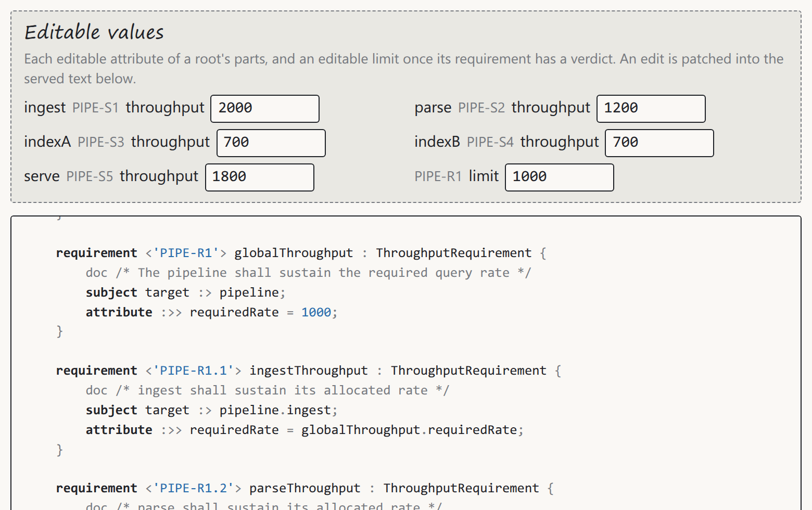

*The limit lowered to 1000. The served text carries the new literal where `model.sysml` on disk still reads 1500, which is where every edit in this demo stops.*

Reset again, because the same edits work from the document. Set `PIPE-R1.2`'s throughput to 1700 in its row and within two seconds the row reads PASS, `PIPE-R1` still fails at 1400, and the viewer tab shows 1700 in the text and `capacity 1400, bottleneck indexA, indexB` under the sketch, with no reload. Going the other way, edits made in the viewer land in the document's verdict column, which is use case 10, change from the viewer and watch the document.

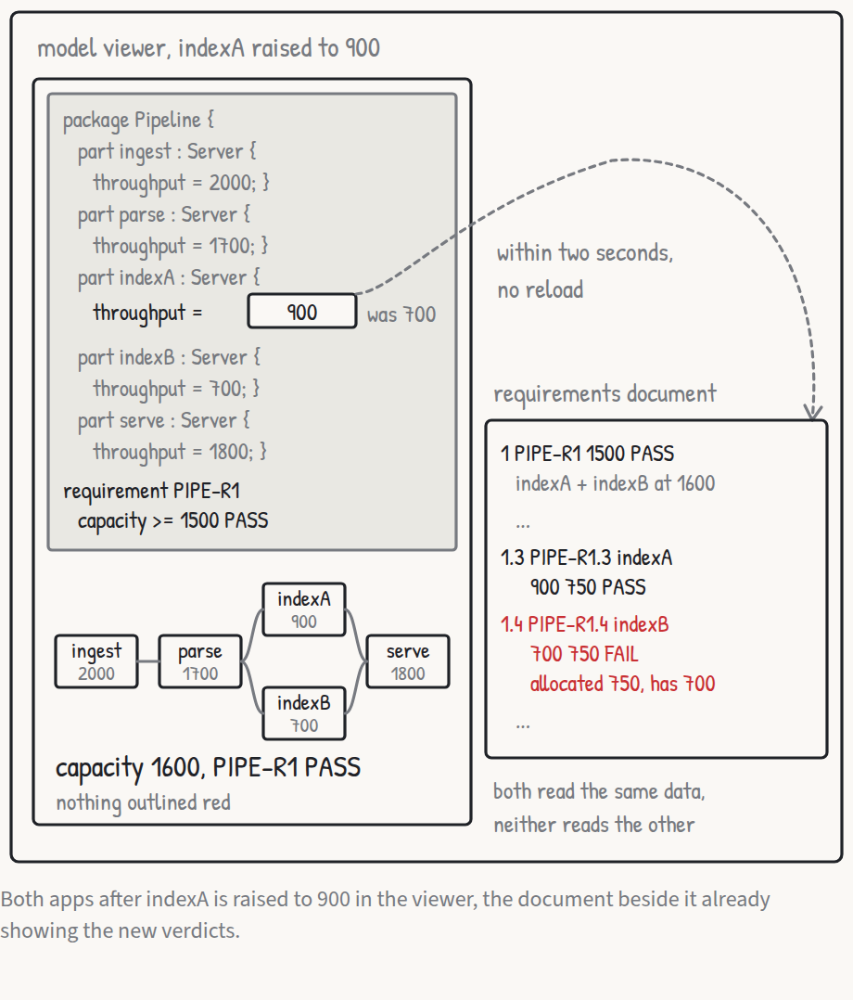

*Use case 10, change from the viewer and watch the document: an edit in one app, the verdict changing in the other.*

Then a reorder. Drag `PIPE-R1.5` to the top of `PIPE-R1`'s list. The numbering changes and the header still says `model version 1`. The visitor has now seen the two kinds of edit go to two different services through one endpoint.

Use case 11, query the graph, is the one to run in the playground at `/playground`:

```graphql
{ requirement(id: "PIPE-R1") { text verdict verdictReason documentNumber } }
```

In the shipped state the answer is `{"data":{"requirement":{"text":"The pipeline shall sustain the required query rate","verdict":"FAIL","verdictReason":"capacity 1200 against 1500, limited by parse","documentNumber":"1"}}}`. The text is from the adapter, the verdict and its reason from the capacity service, the number from the document service, in one object. Each service declared `Requirement` with the same entity key and the router joined them. An entity key is the field by which independently owned services agree that they are describing the same object, and the decision to use [short names as keys](../decisions/AD-0018-short-names-as-keys.md) is why `PIPE-R1` is the string in the query. The playground's schema explorer lists `documentNumber` beside `verdict` on `Requirement` as though one service had written both.

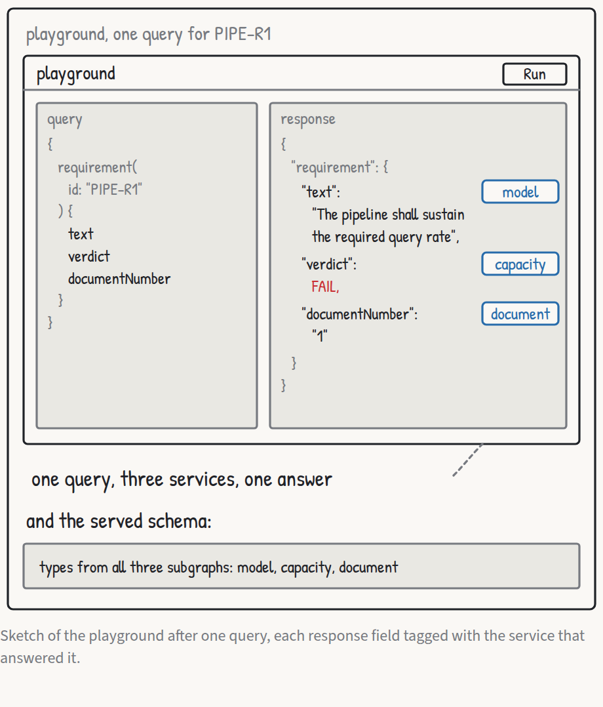

*One requirement answered by three services in a single object, use case 11, query the graph.*

The refusals are worth two minutes. `setLimit(requirementId: "PIPE-R1.3", value: 900)` answers an `errors` array whose message contains `the value is not a literal in the source`, because `PIPE-R1.3`'s limit is the expression `globalThroughput.requiredRate / 2` and there is no literal to patch. `setAttribute(partId: "PIPE-S1", name: "throughput", value: -5)` answers `the value must be a finite, non-negative number`. Neither emits a version event, which a `curl -N` subscription to `modelChanged` in a second terminal confirms: it shows `:heartbeat` lines while idle, a `data:` frame carrying the new model version within a second of each successful mutation, and nothing at all after a refusal. The document's refusals are the same shape.

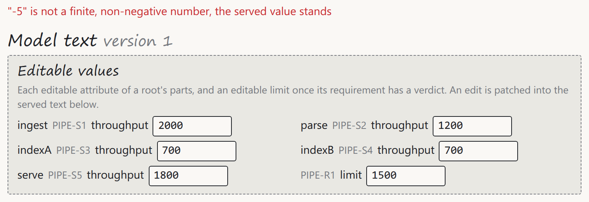

*A refusal as the visitor meets it. The status line names the value that was turned away and the field has already taken the served one back.*

Reset from either app, use case 12, restores the shipped model and the shipped tree in both tabs within two seconds, whatever was edited and wherever. Through the router the same thing is `mutation { resetModel { version } resetDocument { version } }`.

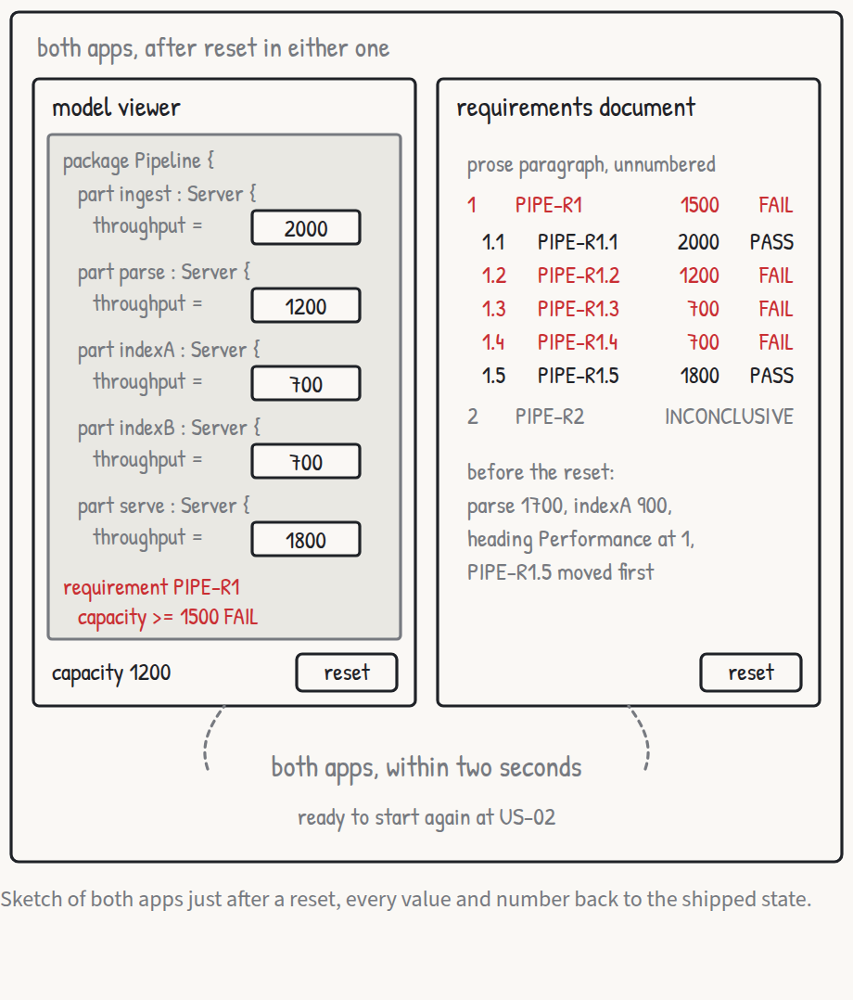

*Reset from either app returns both to the shipped state, use case 12.*

## Package by package

`adapter/syntax` is the hand-written parser of the decision on a [strict subset parser](../decisions/AD-0015-hand-written-subset-parser.md): tokens and a lexer with byte spans, a typed abstract syntax tree, expressions with precedence, and a structural parser covering packages, parts, attributes, ports, `connect`, `satisfy`, requirements with subjects and constraints, and the `#derivation connection`. A refusal is a `syntax.Error` with a line and a column counted from the source bytes.

`adapter/model` builds the projected model from that tree, evaluates expressions with units and a cycle guard, reads the quantity, comparison and limit from each constraint, and patches a literal in the source text for `setAttribute` and `setLimit`, producing a new immutable model with a new version each time. A second model, a warehouse, is the fixture that proves the adapter carries none of the example's words: neither `adapter/` nor the capacity service may contain `PIPE-`, `pipeline`, `throughput` or any other word of the example, and a test walks the sources for them.

`adapter/projection` resolves the schema's fields over the model and holds nothing the schema does not show. `adapter/serve` puts the subgraph on a port and holds the store, which hands each operation one snapshot of the current model and owns the version counter. What they publish is the curated projection of the decision on a [generic projection](../decisions/AD-0005-curated-generic-projection.md): parts, attributes, ports, connections, requirements with their relationships and verification cases, the model's text and its version, and nothing named after any example.

`examples/pipeline/capacity/flow` is pure code, the maximum flow with node capacities by Dinic's algorithm, the source-side minimum cut, and a differential test against the recursive minimum-and-sum on series-parallel wirings. Beside it `flow.Verdict` and `flow.Analyse` carry the verdict precedence and every reason template from the decision on [reason templates](../decisions/AD-0024-reason-templates.md). The capacity subgraph itself is thin, a schema, entity resolvers and two populate functions that receive the fields the router carries through `@requires`, computed afresh on every read so that the service holds no copy of the model. `examples/pipeline/document/tree` is the editorial tree with dotted-decimal numbering, also pure, and its subgraph loads `shipped.json`, serves the seven document mutations and `documentChanged`, and owns its version counter.

Both apps and the shared client sit under `examples/pipeline/ui`. `shared/graphql.js` does one query function and one subscribe function with the backoff above. The document app runs over SortableJS 1.15.7, vendored beside its MIT licence and its checksum, and `NOTICE` names the copyright and the two third-party licences. `cmd/sysml-federation` is the supervisor: `main.go` with the subcommands and exit codes, `serve.go` starting the subgraphs and stopping them in reverse order, `router.go` running the vendor's binary as a child, `ui.go` serving the embedded apps and proxying the router, and `healthcheck.go`, which the image runs in place of anything that would need a shell.

The composition is `examples/pipeline/graph.yaml` and the committed `config.json`, produced by `wgc router compose` outside the build and guarded by a drift test that fails when a subgraph schema and the composed configuration disagree, the decision on [committed composition](../decisions/AD-0012-composition-committed.md). That test is the third condition a projection has to meet, the contract between producer and consumer checked mechanically before deployment rather than discovered in production. The line figures [Planning the build](08-planning-the-build.md) set were estimates of the expected scale and never a limit, and this is what the finished code measures against them, hand-written files only with tests and generated code left out. Go under `adapter/` comes to 2804 lines against an estimate of 2750, the capacity service to 519 and the document service to 553 against 600 each, and `cmd/sysml-federation` to 636 against 700. The viewer is 336 lines of JavaScript and 66 of CSS, the document app 352 and 69 with the shared client's 208 lines counted against it, where each app had been allowed 900 and 300. The adapter is the only part over its figure, by 54 lines, and it is also the one estimate that had been measured from written-out text rather than guessed at. The two web apps are where the guessing was furthest out, neither of them reaching a quarter of the CSS. That such a figure is [read as the expected scale and never as a limit](../decisions/AD-0028-line-figures-are-estimates.md) has a record of its own. The stack is Go 1.27, gqlgen v0.17.94 with Federation v2 and WebSocket subscriptions over `coder/websocket`, Cosmo router 0.343.1 and wgc 0.130.1. Generated files are exempt from the empty-interface rule by [their own record](../decisions/AD-0016-generated-code-exempt.md).

## The image

`examples/pipeline/Dockerfile` has three stages. The first is `golang:1.27` on the build platform, cross-compiling `cmd/sysml-federation` for the target with `CGO_ENABLED=0`, `GOTOOLCHAIN=local`, `-trimpath` and stripped symbols. The second is `ghcr.io/wundergraph/cosmo/router:0.343.1` pinned by digest as well as by tag, used only as a source to copy from. The third is `gcr.io/distroless/static-debian13:nonroot`, which receives the router binary by `COPY --from`, the router's Apache licence by `ADD --checksum` pinned to the sha256 of the file at the router's release tag, the Go binary, and `config.json` and `model.sysml` under `/app`. No stage after the first runs a command, so there is no shell in the image and no QEMU in the build. That `COPY --from` a multi-platform image resolves the target platform rather than the build platform is the spike [Five spikes before the first line](09-five-spikes-before-the-first-line.md) describes, with `--platform=$TARGETPLATFORM` on the router stage as the fallback.

Five environment variables are baked in, `DO_NOT_TRACK=1`, `COSMO_TELEMETRY_DISABLED=true`, `TRACING_ENABLED=false`, `METRICS_OTLP_ENABLED=false` and `PROMETHEUS_ENABLED=false`, the decision on [telemetry off by environment](../decisions/AD-0013-telemetry-off.md). The last of them closes the scrape endpoint the router opens on loopback by default and which nothing here reads. All five are inert on the ordinary path, where the supervisor hands the router child a whole environment of its own that sets the same five, and they are in the image for anyone who runs `/router` out of it directly. `EXPOSE 8080`, a `HEALTHCHECK` every 10 seconds after a 15 second start period that runs `/sysml-federation healthcheck`, an entrypoint of the binary and a default command of `serve`. The router logs the vendor's own "Not recommended for Production" when it starts from a file, which the demo takes at face value, since there is no control plane and the configuration is committed.

Publishing is a GitHub Actions workflow on `v*` tags, the decision on [publishing on tags](../decisions/AD-0020-publish-on-tags.md). It builds for `linux/amd64` and `linux/arm64`, pushes the version tag, and then reads the manifest back. For each platform it sums the compressed layer sizes and the config size and fails the run if the sum exceeds 80,000,000 bytes, the 80 MB budget in the decimal unit the registry uses. Registry-counted sizes cannot be had without pushing, so the measurement happens on the published version tag, and `latest` is moved to the same bytes only once both platforms are under the budget. A run that fails the gate leaves `latest` pointing where it pointed. Nothing else runs in CI beyond the unit tests. The first tag was `v0.1.0`. The package was then made public once, by hand, a flip the registry does not allow anyone to undo, and the launch line answered from a host holding no credential for it.

The air-gap check is the last demonstration. The image runs with `--network none` and `LOG_LEVEL=debug`, and the container reports `healthy`. A search of its log for `posthog`, `wundergraph.com`, `otel`, `otlp` and their kin prints nothing, and the only dotted address it names is `127.0.0.1`, because the user interface server writes its wildcard binding in the IPv6 form `http://[::]:8080/` rather than as `0.0.0.0`. The log runs to 22 lines, every one of them from start-up, and it does not grow again over the nine minutes the container is left alone, which is long enough for the router's per-minute usage event to have fired several times had the tracker been running. Inside the container the sole network interface is the loopback, so there is nowhere for an outside connection to go, which is what readiness on its own never showed.

## What it is not

Not a product, not a SysML v2 API implementation. The adapter reads files rather than fronting a repository, the decision on [reading files](../decisions/AD-0003-adapter-reads-files.md), and its coverage of the language is a fraction of what the goal requires. There is no persistence across restarts, no authentication, no multi-user editing, no queueing model.

Editing through the projection is scaffolding, a decision recorded as [editing as scaffolding](../decisions/AD-0004-editing-as-scaffolding.md): edits land in the served text and its version counter, never on disk, and a real deployment would write through the SysML v2 API instead. The version counter stands in for the commits of a conforming repository. Expression-bound values are read-only in both apps, and a refetch that lands while a field is focused loses an unsent keystroke. Both apps trust the router's answer and compute nothing.

The capacity arithmetic is exact for the idealised pipeline it describes, one with perfect balancing, evenly partitionable work and no queueing, and it says so in the document's first paragraph. For a real pipeline the number reads as an upper bound at best, and the results must not be used for capacity planning. The arithmetic was chosen to make a point about federation, and the point is that the verdict beside each requirement comes from a service that has never parsed a model file, sitting beside text from a service that has never computed anything.

---

Previous: [Five spikes before the first line](09-five-spikes-before-the-first-line.md) · Index: [Federating a systems model](../README.md) · Next: [What shipped, and what did not](11-what-shipped-and-what-did-not.md)
