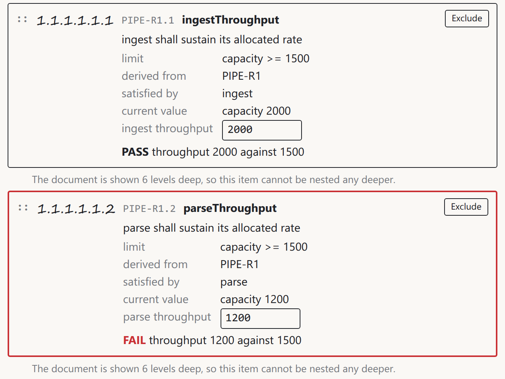

# What shipped, and what did not

*Roar Georgsen, 29 August 2026*

Part 12 of 11 in [Federating a systems model](../README.md).

`docker run --rm -p 8080:8080 ghcr.io/roarge/sysml-federation` pulls about 45 million bytes and answers on port 8080 roughly two seconds after the container starts. The package is public, so there is no account to make and no login to run, and the index behind that name carries one manifest for `linux/amd64` and one for `linux/arm64` and nothing else. [The demo as it shipped](10-the-demo-being-built.md) walks through what the port then serves.

There is a trap in the tags, and it catches anyone who types a version. The release is tagged `v0.1.0` in git, the image is tagged `0.1.0` in the registry, and the two are not the same string. The metadata step turns `refs/tags/v1.2.3` into `1.2.3`, dropping the leading letter on the way, so a pull of `ghcr.io/roarge/sysml-federation:v0.1.0` finds nothing at all. The untagged form the launch line uses avoids the question, and what it returns is `latest`.

## What it weighs

Read back from the registry, compressed the way the registry counts, the published image is 44,850,689 bytes on amd64 and 41,475,216 on arm64. The ceiling the publishing job enforces is 80,000,000 per platform, so both sit a little over half way into their budget.

Almost all of that is somebody else's binary. The vendor's router accounts for 39,987,546 bytes of the amd64 total, near enough 40 MB, which leaves under 5 million bytes for the distroless base, the Go supervisor with both web apps embedded in it, the composed router configuration and the model file together. A size budget written for this demo is therefore mostly a budget for the router, and the number it guards moves when the vendor's next release does.

## How the image is published

The design as first accepted put the moving tag on the image in the same push as the version tag and measured the result afterwards. That is the wrong order, and the reason is worth stating plainly, because it is easy to write the same mistake into a release job that looks correct. Registry-counted sizes cannot be had without pushing, so the measurement can only run after the push. With `latest` already moved, an image over the budget is what an untagged pull returns from the moment it goes up, and the run that later goes red changes nothing about what a stranger has already downloaded. A check that runs after the thing it guards is a report rather than a gate.

What ships works in a different order. The version tag goes up alone, with the metadata step's `latest` flavour turned off by decision rather than by oversight. Both platforms are then measured at the digest the build step reported, never at a tag re-resolved a step later, because a tag is a mutable pointer and re-resolving one measures whatever it happens to name by then. Only once each platform has been found present, singular and inside the budget does `latest` move onto that same digest, and the move is read back and compared against it. A run that fails the gate takes the job down before that step, so `latest` keeps pointing where it pointed and an untagged pull returns the last release that was measured and passed. The version tag itself stays in the registry and has to be deleted by hand. A version carrying a pre-release suffix stops at the gate on purpose, so a release candidate is published under its own tag and never becomes what an untagged pull returns.

The remaining sharpness is in the ordering of releases rather than in the gate. Two version tags pushed close together arrive as two events with no guaranteed order, so `latest` can land on the lower version with every step green, and only one run waits at a time, so a third tag pushed while one is running replaces the queued run and that middle version is never published at all. Releases here are cut by hand, one tag at a time, which is the answer to both and is not a mechanism.

## The container with no route out

The last demonstration runs the image under `docker run --network none` at `LOG_LEVEL=debug` and leaves it alone for nine minutes. The container reaches `healthy`. Its log runs to 22 lines, every one of them from start-up, and it does not grow again over the whole nine minutes. A search of it for `posthog`, `wundergraph.com`, `otel`, `otlp`, `lookup `, `no such host`, `network is unreachable` and `i/o timeout` returns nothing, so nothing was attempted, nothing failed to resolve and nothing timed out. The only dotted address the log names anywhere is `127.0.0.1`, and that is the user interface server writing its wildcard binding in the IPv6 form `http://[::]:8080/` rather than as `0.0.0.0`. Inside the container the sole network interface is the loopback. Nine minutes is long enough for the router's per-minute usage event to have fired several times had the tracker been running.

That is a real result and it is narrower than it sounds. It shows that the stack starts, reports itself healthy and goes quiet with no route to anywhere, which readiness on its own never showed. It does not show what the image does when a network is present, and silence from a process that has nowhere to send anything is weaker evidence than silence from one that could. The five environment variables in the image are what the demo relies on for that, and the router does log `Usage tracking is disabled by the environment variable` when they are set.

The run also shuts a door on its own. A container started with no network interface publishes no port, so nothing inside it can reach a browser, and one check that wants exactly this condition cannot be run under it.

## Depth, drops, frozen tabs and origins

The document app fetches its tree six levels deep. Anything below that is not shown, and the deepest visible row does not offer a control that would push a row past the limit and out of sight. It says what the limit is and offers `Exclude` alone, while `Add prose` and `Heading above` are present at every level above it. A withheld control is a plainer thing to meet than an accepted click that appears to do nothing.

Drag and drop needed geometry rather than event handling. The vendored library claims a drop for an empty list from five pixels outside it on every side, its `emptyInsertThreshold` default, and a list that ends on the same pixel as its last row therefore leaves nowhere to aim past that row, because the last row's own empty child list reaches out over exactly those pixels. Each list keeps a strip of twenty pixels below its last row against that five-pixel reach, so the foot of a list and the last row's child list are two places a drag can be aimed at separately. Dragging one requirement to the end of another's children and dragging it into that last child's own list are different intentions, and without the strip they are the same pixels.

*A row at the sixth level says how deep the document is shown and offers Exclude alone.*

A browser freezes the timers in a tab nobody is looking at. A page left in the background therefore stops being updated and shows no error at all while that lasts, which is the worst kind of stale, because it looks current. Both apps ask the router for the state it holds now whenever the page becomes visible again. A viewer drawing a model two changes out of date redrew its version, its values, its wiring caption and every verdict within a second of coming back, cleared its status line and went on taking live changes with no reload. A page loaded into a background tab and left there receives its updates normally, so this is the browser's own idle handling and not the subscription failing.

The two services that serve subscriptions, the adapter and the document service, register a WebSocket transport and keep the library's same-origin check on it. The router's own handshake carries no `Origin` header, so the check never fires on the connection that actually matters and both services answer `101 Switching Protocols`. The check is live all the same, which is a thing worth proving rather than assuming: the same handshake sent by hand with `Origin: http://evil.example` came back `403 Forbidden` and `request Origin "evil.example" is not authorized for Host "127.0.0.1:3011"`, and the document service refused it the same way, naming its own port.

## What is not done

The offline reload was never run. A reload of the viewer makes eight requests and all eight go to `localhost:8080`, the page, its stylesheet, its three modules, the shared client and two calls to `/graphql`, with no font and no other host among them. That is the half that is verified. The other half, that the page still draws with the machine taken off the network, has no observation behind it, and the two halves cannot be taken together, since the only way to run this stack with no network is the way that publishes no port for a browser to reach.

The launch line has been run on x86-64 Linux from a shell holding no registry credential, and nowhere else. macOS and Windows are what the image is built for and what nobody has started it on. The arm64 image has been inspected as far as the binaries inside it, where `/router` and `/sysml-federation` both read as `ELF 64-bit LSB executable, ARM aarch64`, so the multi-platform `COPY --from` picked the right variant. No record of that image running exists, which matters most for Apple Silicon, the one place a reader is likely to try it first.

Two smaller things read differently from how they look. A Reset raises both version counters rather than returning them to 1, so a header saying `version 1` means a stack that has just started rather than a stack that has just been reset. And a refetch that lands while a control is focused keeps the focus but replaces whatever was typed into it and not yet sent, so an edit arriving from the other app at the wrong moment costs a keystroke.

What is here is one command that puts a model file, an analysis that has never read a model file, and a document that has never computed anything behind a single endpoint, with two pages in front that work nothing out for themselves. It is not a product and not an implementation of the SysML v2 API. It reads a file rather than fronting a repository, its parser covers a fraction of the notation, it forgets every edit when it stops, and its arithmetic is exact for an idealised pipeline and must not be used to plan capacity for a real one. The claim it was built to test is narrower than any of that, and it is the one thing the running image does demonstrate: three services that share no code and know nothing of each other answer one query about one requirement, and a stranger with Docker can watch them do it.

---

Previous: [The demo as it shipped](10-the-demo-being-built.md) · Index: [Federating a systems model](../README.md)
