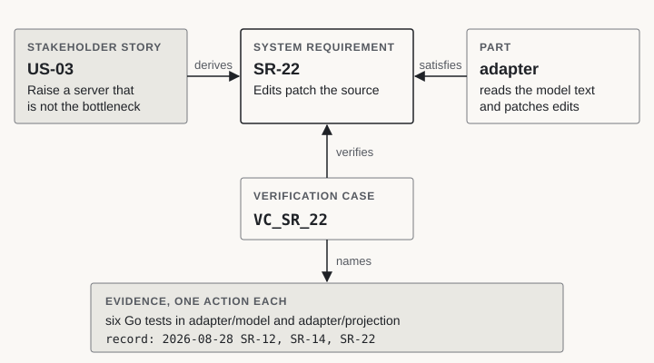

# A model of the demo itself

*Roar Georgsen, 13 September 2026*

Part 13 of 13 in [Federating a systems model](../README.md).

> [!IMPORTANT]
> **The story so far**
>
> The demo shipped as one container. Inside it, a <span class="term" data-term="sysml-v2">SysML v2</span> model, a capacity analysis and a requirements document answer as one graph behind a single <span class="term" data-term="router">router</span>, with two web apps in front. Part 12 weighed the image and listed what nobody had run. This last part turns the series' own argument on the repository. If a systems model belongs at the centre of an organisation's engineering, the description of this demo should be a model too.

## Prose that nothing checks

Early in the design I chose to keep the repository's own requirements as Markdown tables. The [light requirements scheme](../decisions/AD-0023-light-requirements-scheme.md) records why. Someone judging a SysML adapter is not judging a way of working, and a model of the requirements could wait until there were more of them than fit on a screen. There were more than that before the first line of code was written, and the model kept waiting all through the build.

Drift is what brought it back. More than once the published description came apart from the code. A number, a file name or a count of tests was true when written and wrong by the time someone read it. Each time, a person caught it by reading the text and the code side by side, and reading is not a mechanism. It also left the repository making its case with the wrong example. It argued that a systems model should sit at the centre of engineering work, while it described itself in prose that nothing checked.

So the demo now has [a model of its own in SysML v2](../decisions/AD-0029-the-demos-own-model-in-sysml-v2.md), in the [`model/`](https://github.com/Roarge/sysml-federation/tree/main/model) directory. A unit test fails whenever the model and the repository disagree, and both reference tools for the language read the model on every change. The model also brought a check session with it. A model can give every story a test case, but if nothing runs those cases against the live demo on a schedule, it is still a description with more structure.

## Two models in one repository

The repository now holds two SysML v2 models, and they describe different things.

The **pipeline model** is the example the demo serves. It lives in `examples/pipeline/model.sysml` and describes five servers wired in series and in parallel, each with a throughput. It states one requirement on the whole pipeline and derives one from it for each server. The <span class="term" data-term="adapter">adapter</span> reads this file when it starts. Every board and screenshot that shows `ingest`, `parse` or the model requirement `PIPE-R1` is showing this file's content.

The **demo model** describes the thing doing the serving. It covers the adapter, the capacity and document services beside it, the router that joins the three into one graph, the two web apps that read the graph, and the image they all ship in. Nothing of the pipeline is declared in it, and no running service reads it.

[](../figures/two-models.svg)

*The pipeline model is content the demo serves. The demo model describes the demo, and only tests and validators read it.*

You can tell the two apart by the shape of a name. Anything from the example starts with `PIPE-`, is set in code font, and is always called a model requirement or a model element. The demo's own identifiers come from the light scheme, where each has a short prefix and a number.

| Identifier | What it names | Example |
|---|---|---|
| `US-nn` | a story: who wants something from the demo, and why | `US-03` |
| `SR-nn` | a system requirement, something the demo must do | `SR-22` |
| `SC-nn` | a design constraint | `SC-07` |
| `AD-nnnn` | a <span class="term" data-term="decision-record">decision record</span> | `AD-0029` |

In the model each identifier becomes a <span class="term" data-term="short-name">short name</span>, such as `<'SR-22'>`. It sits in front of a longer name that carries the number and a phrase, such as `SR_22_EditsPatchTheSource`, so that a relationship reads as a sentence: `satisfy SR_22_EditsPatchTheSource by adapter`. The numbers were in the articles and the decision records before the model existed, and they stayed as they were.

Decision records appear in the model as well. A metadata tag on each element names the records that shaped it, and each story's rationale cites the records it rests on. From any element you can reach the reason for it without leaving the file.

## From a story to its evidence

> [!NOTE]
> **Traceability**
>
> Traceability means you can follow any requirement up to the need that caused it, and down to the part that meets it and the test that shows it is met. Systems engineers keep these links so that a change anywhere shows what else it touches. In a SysML model the links are typed relationships that tools can check, rather than rows in a spreadsheet.

The demo model is built around chains of such links, and one real chain shows the shape.

`US-03` is the storyboard's third story. A visitor raises a server that is not the bottleneck and sees that nothing else changes. Several system requirements follow from it, and one is `SR-22`, "edits patch the source". When someone edits a number, the adapter must replace that exact number in the model text, rebuild what it serves and increase the version, and no query may ever see the text and the served values disagree. The model says the adapter <span class="term" data-term="satisfy">satisfies</span> `SR-22`. A <span class="term" data-term="verification-case">verification case</span>, `VC_SR_22`, lists the evidence: six Go tests across two packages and a recorded run of the demo from 28 August.

[](../figures/story-to-evidence.svg)

*One chain through the model. A system requirement marked done must be derived, satisfied and verified.*

### The stories

The twelve stories of the storyboard became the model's stakeholder stories. Each is a SysML requirement that names a role, a capability and a benefit, holds its acceptance criteria, and carries its status as metadata.

Seven more stories came with the model. Each belongs to a requirement that had traced to an obligation the project set itself, with no use case behind it:

- the licences travel with whatever is copied (`US-13`)
- nothing of the example is in the adapter (`US-14`)
- a served model is never silently wrong (`US-15`)
- the contract between services is checked before deployment (`US-16`)
- the reference tools accept the example (`US-17`)
- the demo's own model is the record (`US-18`)
- the stories are exercised against a running instance (`US-19`)

Before the model, those requirements traced to an obligation and not to anyone who wanted it. A story has a role and a benefit, so it says who does.

### The system requirements

The forty-five requirements from [From use cases to requirements](05-from-use-cases-to-requirements.md) are restated as system stories. Three more came with the model:

- `SR-46`: a unit test fails when the model and the repository disagree.
- `SR-47`: both reference tools accept the model, and continuous integration runs them.
- `SR-48`: given credentials, the demo runs its check suite against itself through a tunnel, and given none it is unchanged.

Each story keeps its original <span class="term" data-term="ears">EARS</span> statement as an attribute, `attribute statement : String = "..."`. The text a case verifies is therefore the text the story carries, never a paraphrase of it.

Three statements were amended when the model arrived, and each amendment has a decision record behind it. The requirement that the container makes no outbound connection (`SR-03`) now allows for the configuration file the check session needs. The constraint on dependencies (`SC-01`) now covers the check project, and the constraint on continuous integration (`SC-07`) covers model validation. Article 05 still says forty-five, because that was the count at the design's second gate, and the sentence is about that gate.

The traceability tables in article 05 were one hop each and kept by hand. They are now nineteen <span class="term" data-term="derivation">derivation connections</span>, one per stakeholder story. Each has the stakeholder story as its original end and every system story that follows from it as a derived end. Nothing was renumbered. The rule is strict. A system story whose status is done must be derived from a stakeholder story, satisfied by a part of the architecture and verified by a case. An agreement called `coverage` names any story that is not.

### The evidence

Every system story and every design constraint has one verification case. Inside a case, each piece of evidence is an action, and the action's short name is the evidence's own name. The model points at each piece of evidence by the name it already has.

| Evidence | How the model names it | Example |
|---|---|---|
| a Go test | its function name, with the kind and the file on an evidence tag | `action <'TestSR02_ReadyWithinTenSeconds'> readyWithinTenSeconds` |
| a recorded run of the demo | its row in the example's verification record | `<'record: 2026-08-28 SR-02'>` |
| a validator run | an action of kind `validator` | |
| a <span class="term" data-term="make-target">make target</span> | as you would type it | `<'make check-tracked'>` |
| a workflow step | its file and its step | `<'publish.yml: Read the manifest back'>` |
| something read rather than run | an analysis or an inspection | the router's outbound paths, the module file |

Sixty-nine actions name a Go test. The file on the tag matters because two test functions share a name across two packages. One recorded run stands under every story it bears on.

A case names only evidence the repository holds. Four stories ask for more than that. One asks for three platforms and has one on record. One needs an offline render that has no row in the record. Two list a test among their methods and have no test of their own. Each of their cases claims what is recorded and nothing more.

Every live check is a verification case too. The check project reads a manifest of thirty entries, and the model holds thirty matching check cases. Each case's attributes equal its manifest entry: the check's id, its kind, how often it runs in minutes, where it runs, whether it is deployed and whether it changes the demo's state. Its actions are the check's own steps, such as "post the join query for `PIPE-R1`" and "expect the three <span class="term" data-term="subgraph">subgraphs</span> to answer". A thirty-first case has no kind. It is the session's own record, the trace of a check request found in the trace viewer beside the demo.

## The test that keeps the model honest

A model that nobody checks drifts just as prose does. What holds this one in place is a single Go test, `TestSR46_ModelAndRepositoryAgree` in `internal/trace`. It reads the model files as text, compares them with the repository around them, and runs one subtest for each of eight agreements.

| Subtest | What must agree |
|---|---|
| `identifiers` | Every short name the model writes is declared exactly once. Every decision record it names exists, and every record in the directory is named. |
| `requirementsAffected` | Every requirement a decision record lists as affected is a short name the model declares. |
| `goTests` | The Go tests that carry a requirement identifier and the tests the model names are the same set, counted per file. |
| `checkFiles` | The check files under `checkly/__checks__` and the file names the model quotes are the same set, and each browser test is exercised by exactly one <span class="term" data-term="validation-case">validation case</span>. |
| `images` | Every image under `docs/img` is named by exactly one view, and every image a view names exists. |
| `coverage` | A system story that is done is verified, satisfied and derived. A stakeholder story that is done has exactly one validation case. |
| `checkInventory` | The model's check cases and the check manifest carry the same checks with the same fields, each defined once. |
| `sessionParts` | The services the check session's compose file starts are the parts the model gives the session, and nothing else. |

The test runs under `make check` and takes a fraction of a second. From the day it existed, an edit to a check file, a manifest entry or a compose service was also a model edit, or the build went red.

> [!TIP]
> **Run the eight agreements yourself**
>
> From a clone of the repository, run the eight agreements on their own:
>
> ```
> go test -run TestSR46 -v ./internal/trace/
> ```
>
> Then rename any image under `docs/img` and run it again to watch the `images` agreement fail.

## The boards and their views

A SysML <span class="term" data-term="view">view</span> picks out the part of a model that one audience cares about. Every board published in this series now has one. The five architecture views, the two A3 sheets, the storyboard, the five-views overview and the app screenshots each have a view, ten in all. An eleventh view, for the check session, names no image.

A view says what it covers with `expose`. For example, `expose Federation_LogicalArchitecture::demo::**` covers every part of the demo, and `expose Federation_FunctionalArchitecture::EditPropagation::**` covers the seven steps of an edit. Nothing is redrawn. The boards stay the hand-drawn PDFs the design phase produced, and no view declares a rendering. So the model says what each board is about, and leaves the drawing where it was.

The `images` agreement checks the names in both directions. It cannot check that a drawing shows what its view exposes. So I opened each of the thirty-six images once and read it against its view's expose lines. The model's README keeps the result as a table, with the date of the reading, 12 September 2026.

Two patterns came up again and again. The storyboard frames and the app screenshots draw the example's servers and requirements, which belong to the pipeline model and not to this one, and their rows say so. Several boards also draw the demo's parts on a page whose own view is about something else, a group of functions or a set of stories, so those views expose the demo as well.

The reading found three things drawn on the boards that the model did not yet hold.

- The runtime board draws three panels beneath the seven steps of an edit. Two of them, a document edit and a reset, had no action definition. They have one now, beside the one for the edit where nothing moves.
- The deployment board draws the image's HEALTHCHECK block. It is now the demo's `healthcheck` attribute, and the subcommand it runs sits among the supervisor's subcommands.
- The last screenshot shows the document app's limit of six levels of nesting. The limit is now an attribute of the requirements document, exposed by the view, with three validation cases recording a run against it.

Each is a small thing. Each is also exactly what a description checked by reading had not caught.

## Two reference tools on every change

A model is only worth checking against the repository if it is valid SysML in the first place. `make model-check` puts the whole model to both reference tools.

The <span class="term" data-term="pilot-implementation">OMG pilot implementation</span>, release 2026-07, runs in batch, with the files joined in path order so that the imports between them resolve. It passes when it prints a root element line for every file and no line matching an error or a warning. <span class="term" data-term="opensysml">OpenSysML</span> v0.6.0 then runs `sysml -validate -strict` over the same files, and passes on exit status zero with no warning line. If either tool is missing, the target fails. Nothing is skipped.

The same target runs in <span class="term" data-term="ci">continuous integration</span> on every pull request and push that changes a file under `model/`. It has [a workflow of its own](../decisions/AD-0030-model-validation-in-continuous-integration.md), which installs each tool from its release archive and checks it against a recorded checksum. Because the job only runs when those paths change, it is not a required check. A required check that never reports would leave a pull request pending for ever. The example model keeps its own local check, `make example-model-check`, with its record in the example's README. It needs no workflow, because the adapter's tests parse that file on every run, and a broken example fails within seconds anyway.

Before the model was written, I put nineteen of the forms it would use to both tools in a probe file. Eighteen were accepted as written. Both tools refused a view definition that stated its conformance with `satisfy viewpoint`, so a view definition owns a viewpoint usage instead. Five more forms were refused while the model itself was being written, and the model's README records each one with the form used instead.

<details markdown="1">
<summary>Under the bonnet: the five refusals</summary>

- `public` and `connector` are reserved words. The tunnel edge's port is called `publicSide`, and the tunnel link's end is called `tunnelConnector`.
- An item and an interface cannot both be named `HeartbeatPing` under one wildcard import, so the interface is called `Heartbeating`.
- OpenSysML warns about an interface whose two ports are not <span class="term" data-term="conjugate-port">conjugate</span>, and the gate treats a warning as a refusal. So `TunnelPort` carries the conjugate features of `HttpClientPort`, and a twelfth port definition, `AlertClientPort`, was added for the alerting interface.
- The OMG pilot refused `satisfy SR_48_AnOptionalCheckSession by runner` until `SessionRunner` specialised `DemoElement`, because bound features must have conforming types.
- Both tools refused `Federation_LogicalArchitecture::session`, because the session composite lives in a nested package. It is reached as `Federation_LogicalArchitecture::CheckSession::session`.

</details>

A tool that accepts a form has not checked what the author meant by it, and the model's README says which acceptances carry that caveat. One example is a `require constraint` that holds a documentation comment where an expression belongs. Both tools accept it, and it asserts nothing beyond its comment.

## The check session: every story against the live demo

The Go tests check the pieces. The demo as I ran it is also checked from outside. A <span class="term" data-term="checkly">Checkly</span> project runs every story against a live instance, with browser and API checks on a schedule, and every request the router handles is traced. This is the [check session](../decisions/AD-0031-an-optional-check-session.md). It lives under `checkly/` as a <span class="term" data-term="compose-profile">compose profile</span> beside the demo.

The session needs a Checkly account, and my credentials cannot ship inside a public image. So the choice is yours. Bring your own account and you get the whole demo as I ran it, with its checks and traces. Leave it out and `docker run` starts the demo exactly as before, and nothing under `checkly/` is built, run or read.

With an account, one script starts five containers: the demo, a <span class="term" data-term="tunnel">tunnel</span>, an <span class="term" data-term="opentelemetry">OpenTelemetry</span> collector, a trace viewer and a runner. The tunnel gives Checkly's runners, out on the internet, a way in to a demo running on your machine. With a token it is a named tunnel on your own hostname. Without one it is a quick tunnel, on a hostname the provider assigns for the length of the session.

> [!TIP]
> **Start a session of your own**
>
> Put `CHECKLY_API_KEY` and `CHECKLY_ACCOUNT_ID` in `checkly/.env`, then from the repository root run:
>
> ```
> bash checkly/scripts/session.sh up
> ```
>
> Add `TUNNEL_TOKEN` and `DEMO_HOSTNAME` for a named tunnel. With `SESSION_WITHOUT_ACCOUNT=1` instead of the two account values, the script brings up the stack and the subscription probe and deploys nothing. The [check session's README](https://github.com/Roarge/sysml-federation/tree/main/checkly) lists every setting.

The runner walks twelve steps. Each is logged under its number, and each is an action in the model. Between them the steps install the project, record every check against your instance, deploy the checks to run on a schedule, keep a heartbeat going, and on stop remove everything they deployed.

<details markdown="1">
<summary>Under the bonnet: the runner's twelve steps</summary>

1. Install the project.
2. Resolve the demo's public address.
3. Wait for the viewer through the tunnel.
4. Probe whether a subscription's events cross the tunnel.
5. Read the account's plan.
6. Publish the address as an account variable.
7. Record a test session of every check against this instance.
8. Record the browser suite as a second session.
9. Deploy the project.
10. Trigger every deployed check once, so that the dashboard and the status page fill.
11. Ping a <span class="term" data-term="heartbeat">heartbeat</span> every five minutes.
12. On stop, destroy the project and exit with the test session's code.

In the model the session is a composite part of the logical architecture. It holds the runner, the two tunnels of which one runs, the collector, the trace viewer, the container for a private location, which the session script never starts, and a reference to the demo under test. Each part carries the name of the compose service it maps to, which is what the `sessionParts` agreement compares. The runner's twelve steps are an action definition, and so is the path of one traced request, nine steps from the runner adding trace context to the trace shown beside the check result.

</details>

Thirty checks and monitors sit in five groups. Three of the groups change the demo's state, and the demo holds a single copy of it in memory. Those three run from one location, with no retries and no parallel locations, because a retried or parallel run would make the same edit twice. Two of their checks that fall due at the same moment can still overlap, since Checkly does not run them one at a time. A check that meets another's edit fails and resets the state.

> [!WARNING]
> **Quick tunnels may drop live updates**
>
> Quick tunnels are documented as carrying no streamed response, so a page behind one is not expected to hear the <span class="term" data-term="server-sent-events">server-sent event</span> that tells it to redraw. Seven of the twelve story checks depend on that event. Three are the stories that span both apps. The other four are stories whose own page must learn of an edit from the stream: the raise that moves nothing, the raise that moves the bottleneck, the tightened limit and the shaped document. The runner's fourth step settles it for each session. It holds a subscription open, makes an edit beside it and waits ten seconds for the event. If none arrives, those seven checks skip with the reason `live updates need the named tunnel` rather than fail. A named tunnel runs all twelve.

### Following one request through the demo

A failed check says that something is wrong. On its own it cannot say where inside the demo the request failed. A <span class="term" data-term="trace">trace</span> was the missing part.

The router's tracing is off in the image, and turning it on is the operator's choice. It reads a configuration file only when `SYSML_FEDERATION_ROUTER_CONFIG_PATH` names one. In a session, that variable names a file whose one exporter is the collector on the compose network, and defining that exporter is also what keeps the router's default exporter off. The collector forwards every span to Jaeger, a trace viewer at `localhost:16686`. Given a tracing key, it also sends Checkly the spans that a check marked as its own, and Checkly shows each one beside the check result that caused it.

One join query through the router gives a trace of thirteen <span class="term" data-term="span">spans</span>:

- one server span at the root, for the request itself
- six internal spans, for reading the body and for parsing, normalising, validating, planning and executing the operation
- three fetch spans, one for each of the model, document and capacity subgraphs
- beneath each fetch, the client span of its HTTP call

[](../figures/traced-request.svg)

*The thirteen spans of one join query, drawn to show which span contains which.*

That is one request, seen end to end across the router and all three services. The router is the only service in the container that could show it without a dependency the design constraints forbid.

### What has been run

Every run of the session is dated in the [check session's record](https://github.com/Roarge/sysml-federation/tree/main/checkly).

Without an account, the demo started through the compose file, from both the published image and a local build, answers exactly as `docker run` does. The router's environment holds no configuration path, and its log has no configuration-file line. With the file named, the router logs `Tracer enabled` once, with the collector's address and no other exporter.

On 13 September the first full stack came up under the quick profile, with five containers. It ran on a network whose provider's resolver answers the tunnel service's name with a block page, so the tunnel exited without a hostname. The collector and the viewer were checked by reaching the demo directly on its port instead. From the host, the subscription probe's commands saw the event frame after a second. The runner's first four steps ran inside the container against a stand-in for the tunnel's metrics endpoint, and stopped where a session without an account stops.

The join query's trace was read from Jaeger with the thirteen spans above. A request sent with its own trace context, marked the way Checkly's runners mark theirs, came back under the id it was sent with, and the mark showed on the router's span. The second collector configuration let through the one marked span of three, and refused a missing or wrong token on its public port.

The runs in the record that need an account followed on 14 September, the day after this article was first written. They include a quick-tunnel session from a network that resolves the tunnel service, and a named-tunnel session that ran all twelve story checks. That record also covers the two recorded test sessions, the cycle of deploying and destroying the project, alerts arriving on a channel, and the router's spans shown beside a check result.

## What the model leaves out

The model has no risk register and no priorities. A story carries a status and nothing else from a lifecycle.

Allocation, the link that says which part carries which requirement, is written with `satisfy`, and the components file holds ninety-four of them. SysML v2 has an allocation keyword of its own, but there is no recorded run of either reference tool accepting it, and a form neither tool has been seen to accept does not go into the model.

No view declares a rendering, so nothing generates a diagram from the model and the boards stay as they were drawn. The schema the services share is not modelled as elements. The interface definitions carry its payloads, and the <span class="term" data-term="projection">projection</span>'s documentation names its types.

Two parts of the check session have never run, both because they need a paid Checkly plan. One is a private location, which puts Checkly's runners beside the demo so that no tunnel is needed. It is in the compose file behind a profile of its own. The other is incident automation on the status page, together with a weekly maintenance window. Both are written and switched off behind flags, so that the project deploys on the free tier as it stands.

One last thing before you start a session. While it runs, the demo answers on a public hostname with no authentication. It holds no secret, so the worst a visitor can do in that window is edit a value and fail a check.

Decision records: [docs/decisions](../decisions/README.md) · Repository: https://github.com/Roarge/sysml-federation

---

Previous: [What shipped, and what did not](11-what-shipped-and-what-did-not.md) · Index: [Federating a systems model](../README.md)
